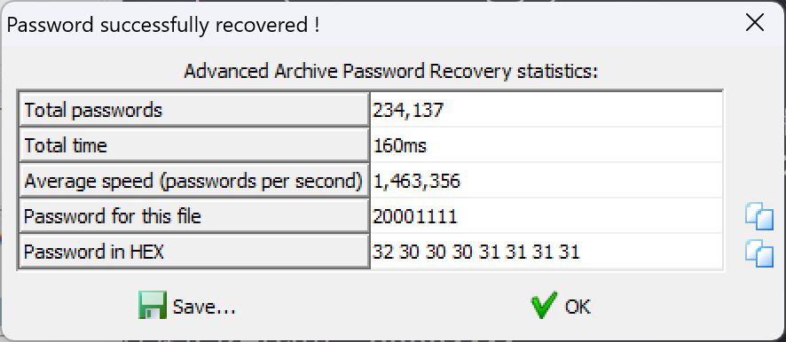
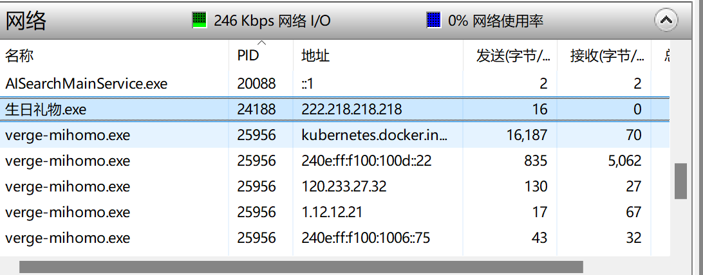
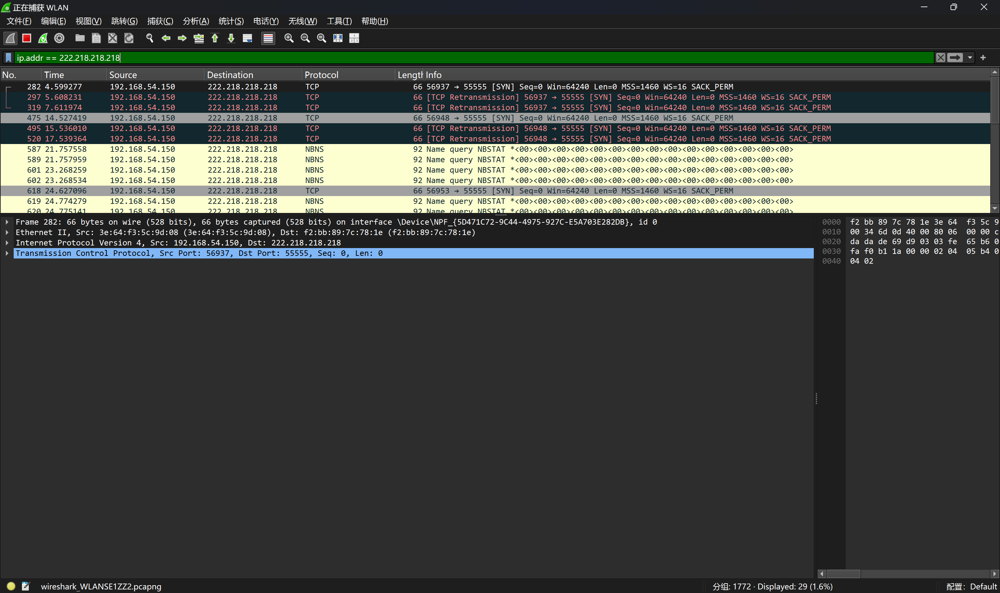

## 本周学习内容

* [ ] 初步了解了misc涉及的各个领域：https://ctf-wiki.org/misc/
* [ ] 从原理上了解了各种编码的编码方式、用处和特性
* [ ] 学习研究了wireshark的用法过滤器、协议及如何看内容等等

#### 钓鱼网站WP

eml文件里面藏有一个附件，base64解密写入文件得压缩包。

```
import base64

def decode_base64_file(input_file, output_file):
    try:
        # 读取输入文件内容
        with open(input_file, 'rb') as file:
            encoded_data = file.read()
  
        # Base64 解码
        decoded_data = base64.b64decode(encoded_data)
  
        # 将解码后的数据写入输出文件
        with open(output_file, 'wb') as file:
            file.write(decoded_data)
  
        print(f"解码完成，结果已写入 {output_file}")
    except Exception as e:
        print(f"发生错误: {e}")

# 使用示例
input_file = 'input.txt'  # 替换为你的输入文件名
output_file = 'output.bin'  # 替换为你的输出文件名
decode_base64_file(input_file, output_file)

```

爆破压缩包得密码：20001111


解压得到木马程序。

通过抓包得到木马的回连地址和端口。

先运行木马程序，从Resource Monitor中查看木马程序与哪个IP进行通讯。



然后使用Wireshark进行抓包，过滤条件为ip.addr == 222.218.218.218



得到端口。
