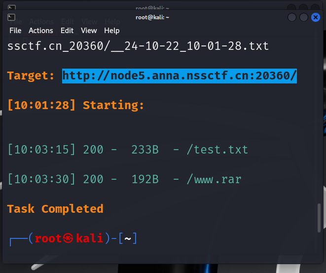

# 10.21~10.27 WEEK2

[TOC]

## 概况

- dirsearch的安装及使用
- php伪协议的学习：php://fitler;data://;file://;php://input
- 刷了nss上php伪协议，文件上传，rce类的题（ctfhub没有金币了，嗯呢）
- 搭建了sqli-labs，并尝试写了两道（sql注入语句仍然有些不理解，遂决定先学习php）
- php与mysql程序设计，进度到第四章

------

## 学到的新知

#### 1.ez_upload（Apache）

打开网站发现要求上传一个文件，上传php，phtml等格式都行不通

所以上传一个jpg格式的木马，打开bp进行抓包

在bp上将jpg的后缀改为php，发现仍然行不通，并不前端绕过

但发现了使用的是Apache

所以将muma(cmd).jpg改为muma(cmd).jpg.php，发现上传成功，得到上传路径

<font color=red>//Apache对文件名后缀的识别是从后往前进行的，当遇到不认识的后缀时，继续往前，直到识别</font>

<font color=red>//因为这里php被过滤，所以被跳过，直接读前面的后缀jpg

蚁剑连接，文件管理得到flag</font>

------

#### 2.easyupload3.0（.htaccess)

打开网站发现要求上传一个文件，尝试了php，phtml，等格式，发现都没有用

猜测php和phtml被过滤了，在bp抓包，更改jpg后缀为phtml，果然行不通

但是发现使用了Apache服务，于是右键查看源码，得到提示：试试和某些文件配合呢

经过搜索，想到了.htaccess文件

上传一个.htaccess文件后，再次上传一个jpg格式文件

用蚁剑连接，文件管理得到flag

<font color=red>考点：.htaccess

htaccess文件是Apache服务中的一个配置文件，它负责相关目录下的网页配置。

通过htaccess文件，可以帮助我们实现：网页301重定向、自定义404错误页面，改变文件扩展名、允许/阻止特定的用户或者目录的访问，禁止目录列表，配置默认文档等功能

其中.htaccess文件内容：SetHandler application/x-http-php的意思是设置当前目录所有文件都使用php解析，那么无论上传任何文件，只要符合php语言代码规范，就会被当做PHP执行，不符合规则则报错</font>

```
.htaccess文件内容：

<FilesMatch "\.jpg">

 SetHandler application/x-httpd-php

</FilesMatch>
```

------

#### 3.PING(js禁用)

打开网址，发现一个输入框，要求我们试着ping一下

输入：127.0.0.1;ls发现提示：

敢于尝试已经是很厉害了，如果是这样的话，就只能输入ip哦

右键查看源码，发现启用了js，之后对输入的ip地址进行判断，是否为1-255的数字：

<script type="text/javascript">   
    function check_ip(){     
        let ip = document.getElementById('command').value;    
        let re = /^(25[0-5]|2[0-4]\d|[0-1]\d{2}|[1-9]?\d)\.(25[0-5]|2[0-4]\d|[0-1]\d{2}|[1-9]?\d)\.(25[0-5]|2[0-4]\d|[0-1]\d{2}|[1-9]?\d)\.(25[0-5]|2[0-4]\d|[0-1]\d{2}|[1-9]?\d)$/;
        if(re.test(ip.trim())){
    return true;
   }
   alert('敢于尝试已经是很厉害了，如果是这样的话，就只能输入ip哦');
   return false;
  }

F12打开开发者工具，点击右上角的… ,在高级设置中禁用JavaScript

在输入框输入：127.0.0.1;ls /

发现根目录有一个flag的文件

输入：127.0.0.1;cat /flag

得到flag

------

#### 4.MyDoor(非法参数名)

打开网站发现什么都没有，看到url上的提示index.php?file=

输入：php://filter/read=convert.base64-encode/resource=index.php

Base64解码得到一段代码：

```
<?php

error_reporting(0);

if (isset($_GET['N_S.S'])) {

  eval($_GET['N_S.S']);

}

if(!isset($_GET['file'])) {

  header('Location:/index.php?file=');

} else {

  $file = $_GET['file'];

  if (!preg_match('/\.\.|la|data|input|glob|global|var|dict|gopher|file|http|phar|localhost|\?|\*|\~|zip|7z|compress/is', $file)) {

​    include $file;

  } else {

​    die('error.');

  }

}
```

阅读代码可知，要以get方式上传N_S.S和file两个参数，且过滤了la,data,input等

因为N_S.S参数使用了eval（）函数，所以可以用该参数执行一些参数，发现phpinfo没有被屏蔽，所以输入:?N[S.S=phpinfo();

<font color=red>//_在做php参数时是非法字符，所以要替换成[

//当PHP版本小于8时，如果参数中出现中括号[，中括号会被转换成下划线_，但是会出现转换错误导致接下来如果该参数名中还有非法字符并不会继续转换成下划线_</font>

Ctrl+f搜索flag，得到flag

------

#### 5.泄露的伪装（dirsearch的使用）

打开网站看到一句话：

you can not see me but you can see me

ls和index.php都查不到东西，所以打开虚拟机，dirsearch扫描一下：

输入：dirsearch -u 网址

回车开始扫描，得到两个文件



打开test.txt,得到一段代码：

```
<?php
 error_reporting(0);
 if(isset($_GET['cxk'])){
   $cxk=$_GET['cxk'];
   if(file_get_contents($cxk)=="ctrl"){
     echo $flag;
   }else{
     echo "洗洗睡吧";
   }
 }else{
   echo "nononoononoonono";
 }
 ?>
```

打开www.rar,下载了一个压缩包，解压得到提示：

恭喜你

turn to

/orzorz.php

打开/ororz.php得到一段代码，发现和test.txt中的一样，

审计代码，发现要以get方式上传cxk，且cxk读入的要为ctrl

输入：/ororz.php?cxk=data://text/plain,ctrl

得到flag

------

## 下周目标

1. 继续学习php与mysql程序设计，进度到第四章
2. 攒两天金币，开始做ctfhub的ssrf类题型
3. 找找灵感，继续挑战1024ctf的web题目
4. *有时间再试试sql注入类题目


