# 2024-第一周周报-王宇忻

## 本周概况
## 每日所学：

### 周二：
学习github的使用，以及markdown的语法

### 周三：
开始刷BUUCTF上的crypto中的题目    
**1.一眼就解密**   
猜测是Base64,得到flag

**2.MD5**   
在网上搜索MD5解密在线工具
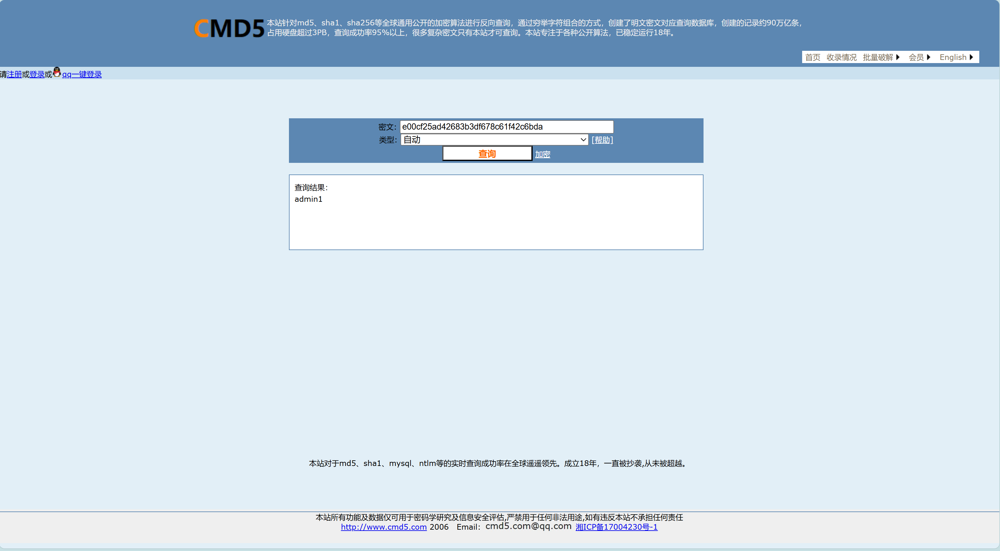
包上flag并提交

**3.Url编码**   
应用随波逐流

**4.看我回旋踢**   
使用随波逐流得到结果，得到两个flag进行尝试发现是Rot13加密
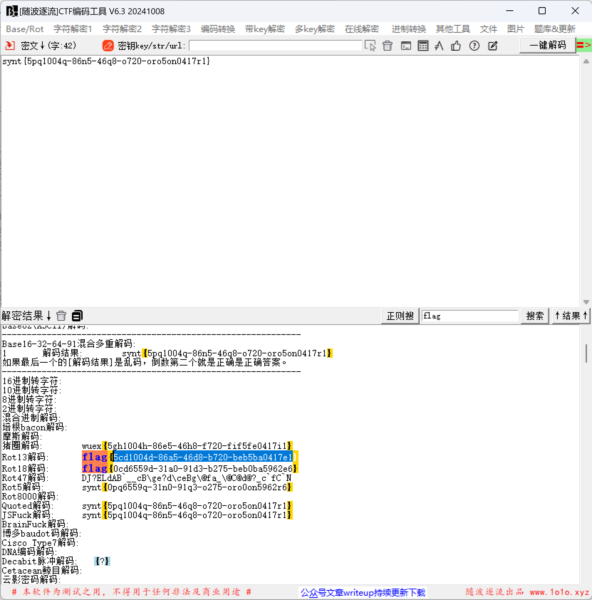

**5.摩丝1**   
使用随波逐流进行莫斯密码进行解密
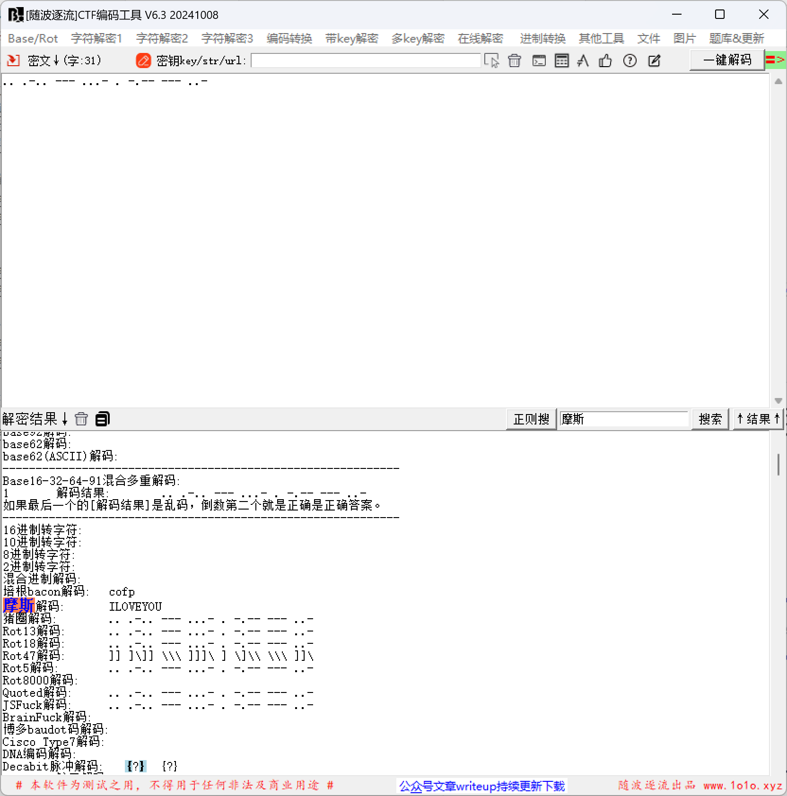
包上flag并提交

**6.password**   
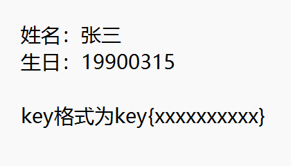                                                               
得到这样的提示，进行猜测flag,猜测的flag正确
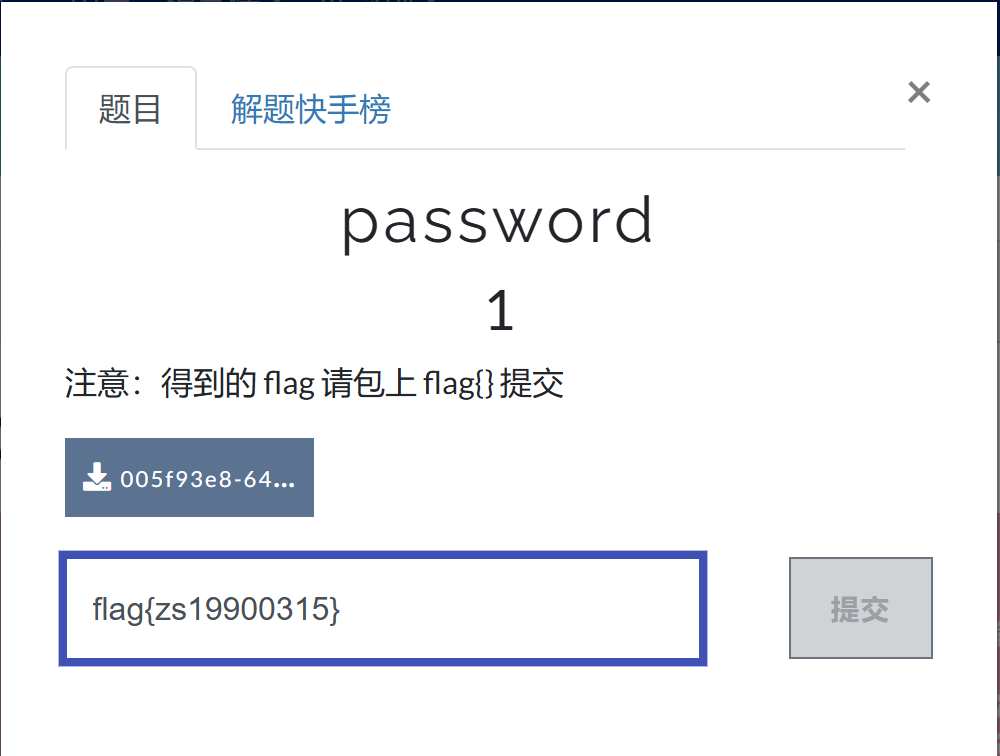 

**7.变异凯撒1**   
用随波逐流进行凯撒解密
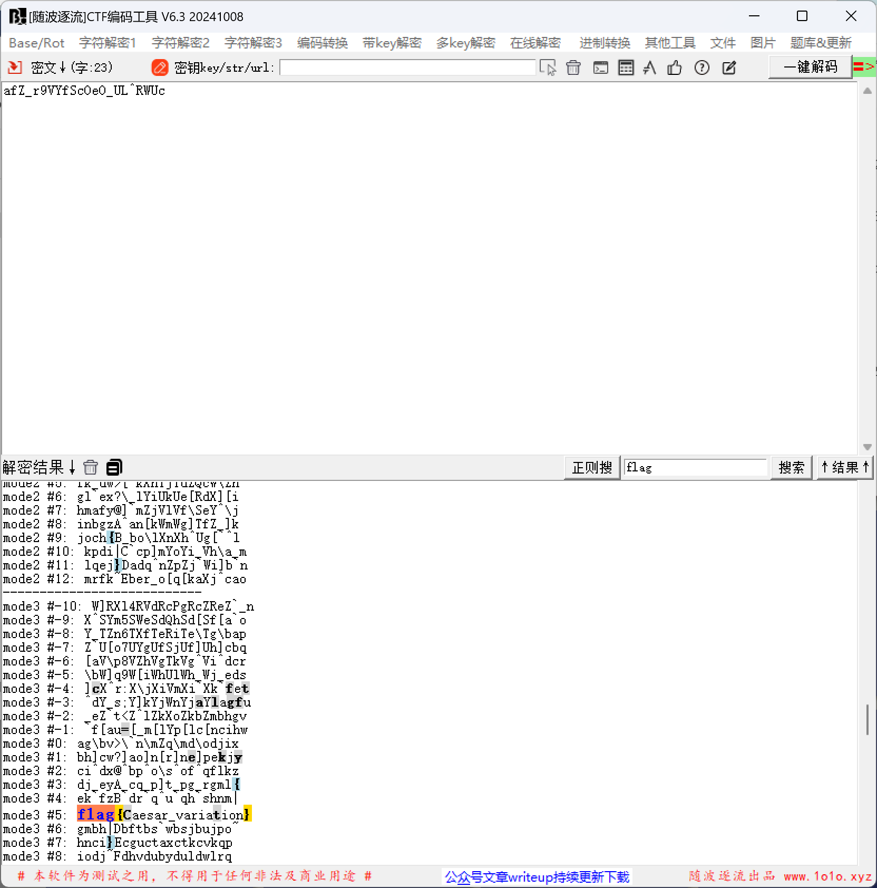 
 
**8.Quoted-printable 1**   
上网查找Quoted-printable编码在线工具
 
包上flag并提交 

**9.篱笆墙的影子1**   
用随波逐流，栅栏解码分为13栏时
  

**10.Rabbit 1**
提示rabbit,用rabbit在线工具进行解密
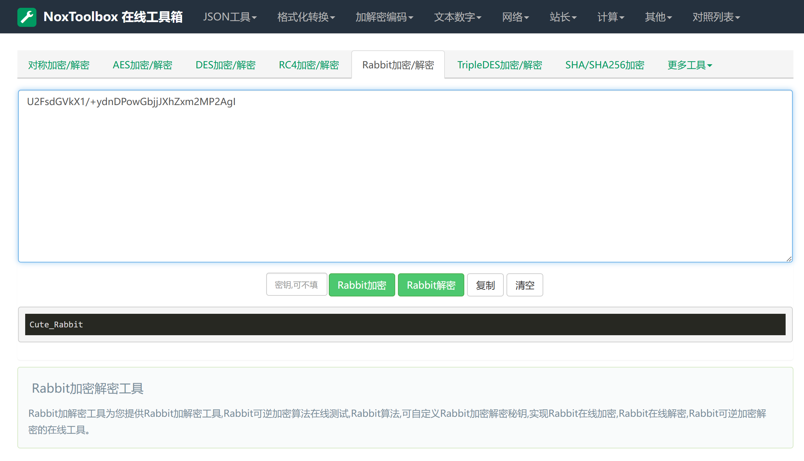
包上flag并提交

### 周四
继续刷BUUCTF上的题   
**11.RSA 1**
在网上查找到破解RSA的神器  
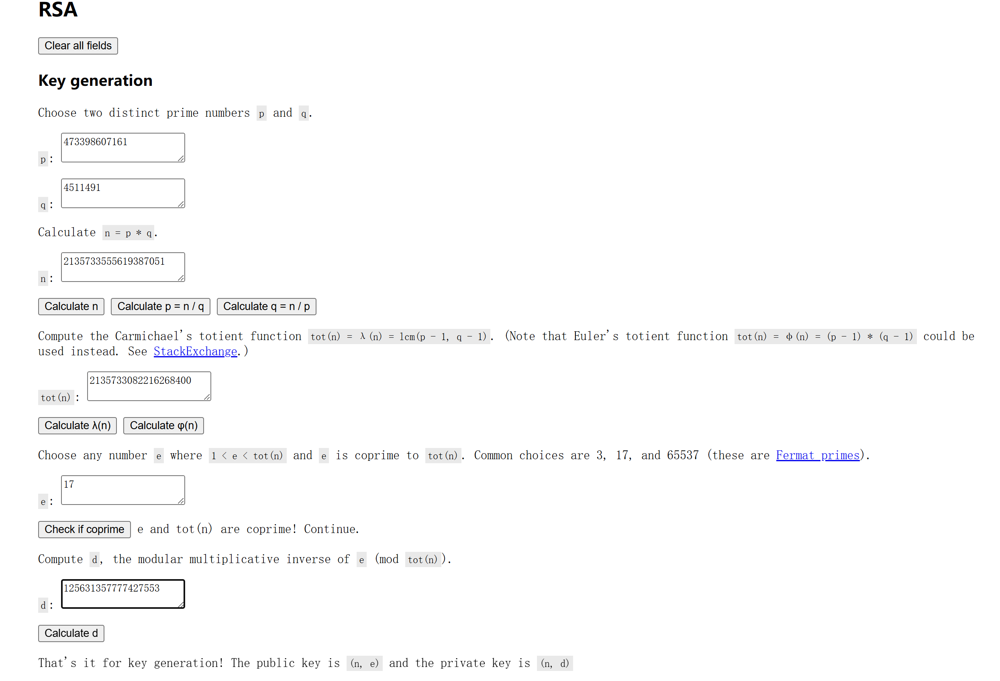  
包上flag并提交

**12.丢失的MD5 1**    
将给出的代码进行修改     
import hashlib

for i in range(32, 127):    
    for j in range(32, 127):
        for k in range(32, 127):
            m = hashlib.md5()
            m.update(('TASC'+chr(i)+'O3RJMV'+chr(j)+'WDJKX'+chr(k)+'ZM').encode())
            des = m.hexdigest()
            if 'e9032' in des and 'da' in des and '911513' in des:
                print(des)
                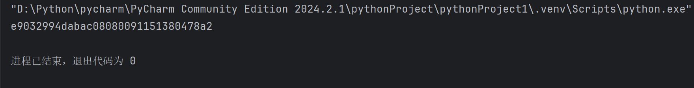    

### 周五
学习RSA并继续刷题    
**13.Alice与Bob 1**    
98554799767,请分解为两个素数，编写代码进行分解    
def is_prime(n):
    if n < 2:
        return False
    for i in range(2, int(n**0.5)+1):
        if n % i == 0:
            return False
    return True

def prime_factorization(n):
    factors = []
    i = 2
    while i * i <= n:
        if n % i:
            i += 1
        else:
            n //= i
            factors.append(i)
    if n > 1:
        factors.append(n)
    return factors

num = int(input("请输入一个正整数："))
result = prime_factorization(num)
print(f"{num}分解为素数乘积为：{' * '.join(map(str, result))}")           
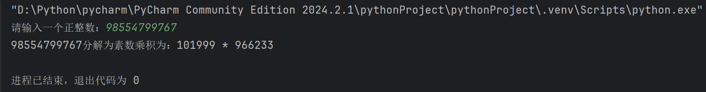     
分解后，小的放前面，大的放后面，合成一个新的数字     
新数字为：101999966233      
进行md5的32位小写哈希       
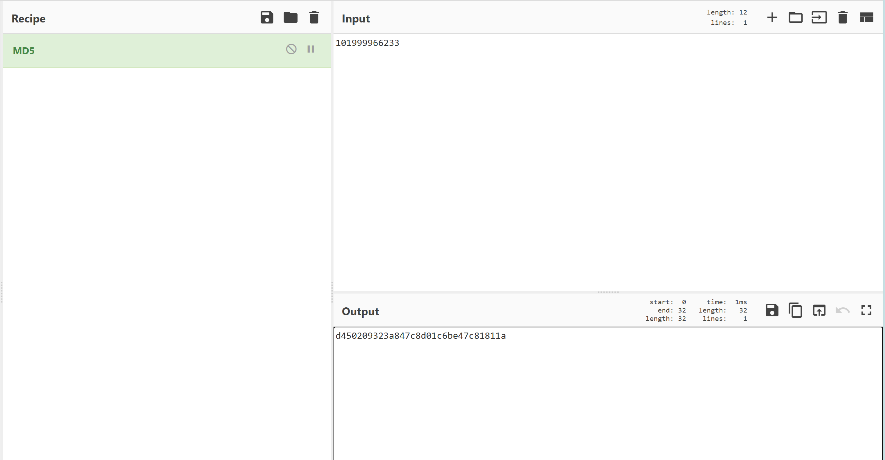    
包上flag并提交     

**14.大帝的密码武器 1**   
下载得到文件，修改文件后缀名
并进行解压处理，得到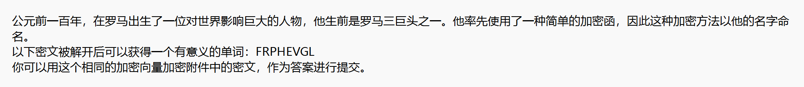
    
猜测是凯撒加密，尝试发现是ROT13，解开密文得到有意义的单词SECURITY
，用这个相同的加密向量加密附件中的密文ComeChina，得出PbzrPuvan，包上flag并提交
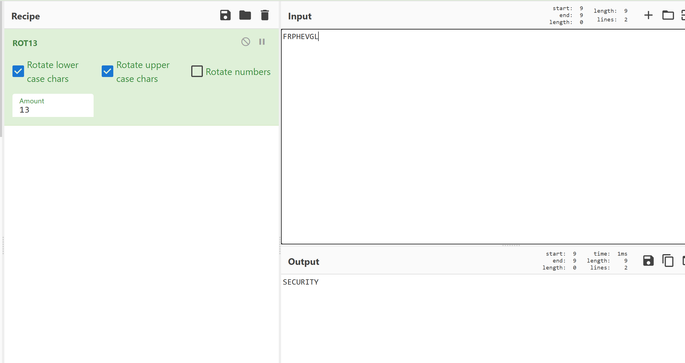
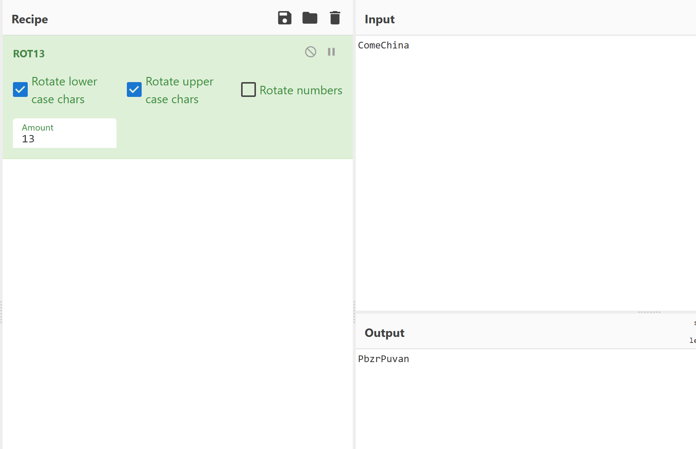

### 周六、周天 
两眼一睁，接着刷BUUCTF   
**15.rsarsa 1**      
在网上搜素RSA在线解码   
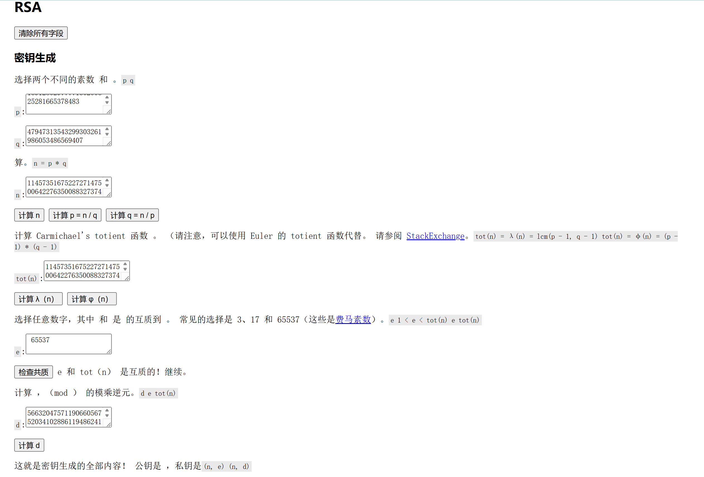
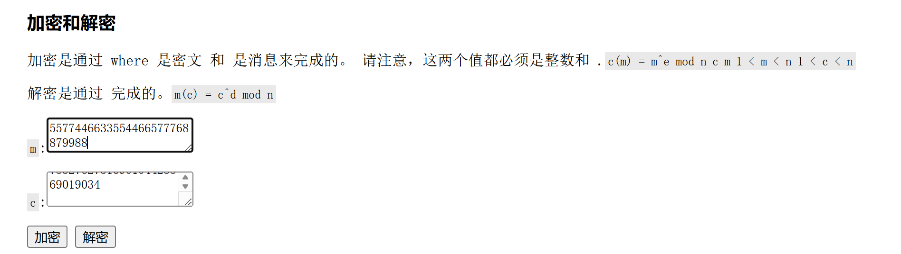   
解密得出m的值，包上flag并提交    

**16.Windows系统密码 1**   
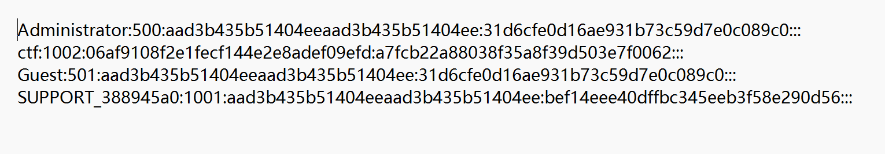
第一个用户
用户名：Administrator
用户RID：500	用于标识用户账号
LM哈希：aad3b435b51404eeaad3b435b51404ee	LM（LAN Manager）哈希，用于表示空密码或 LM 哈希被禁用的情况，我们解密得到的值为空
NT哈希：31d6cfe0d16ae931b73c59d7e0c089c0	NT（NTLM）哈希，用于表示实际密码的NT哈希值，我们解密得到的值为空
综上所述，这是一个Administrator账户密码为空的情况

第二个用户
用户名：ctf
用户RID：1002
LM哈希：06af9108f2e1fecf144e2e8adef09efd	解密得到的值为GooD-LucK或Good-Luck或good-luck或GOOD-LUCK或Good-LucK或Good-luck
NT哈希：a7fcb22a88038f35a8f39d503e7f0062	解密得到的值为good-luck
综上所述，这是一个ctf账户密码为good-luck的情况

第三个用户第四个用户同第一个用户     

猜测flag为ctf用户的密码，包上flag提交正确

## 总结     
学会了几种新的加密解密方式，再接再厉！
