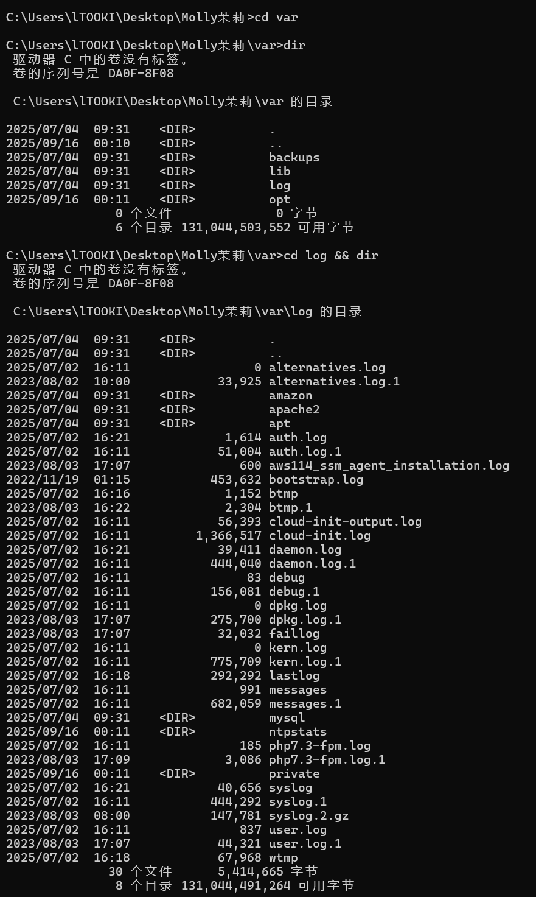
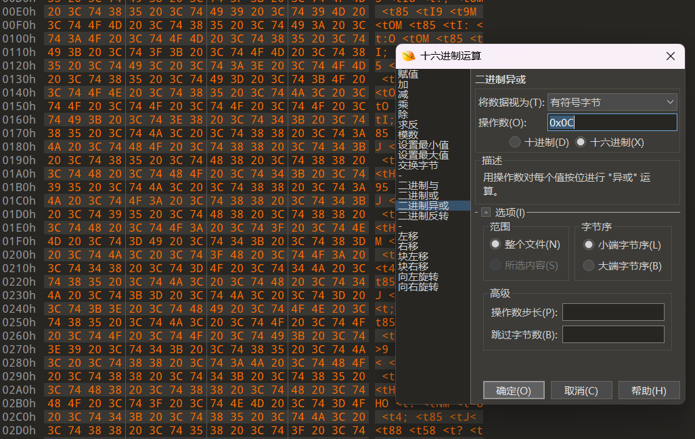
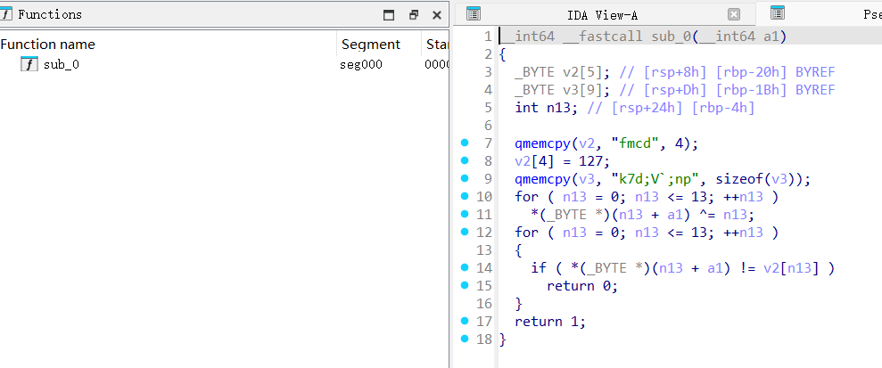
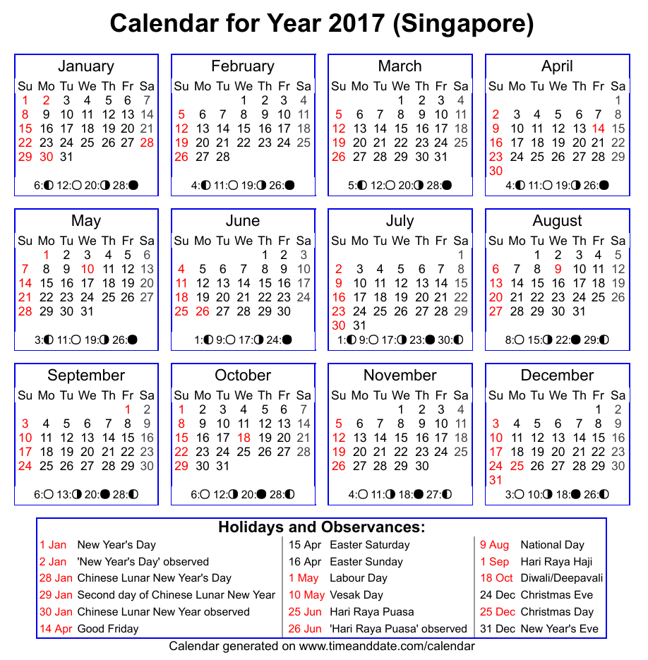
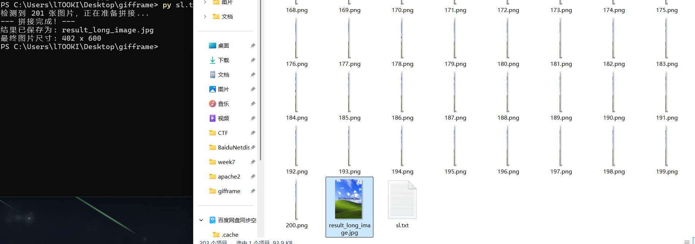
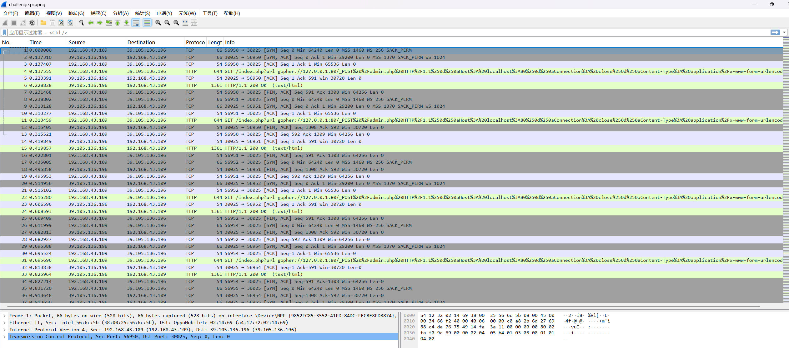
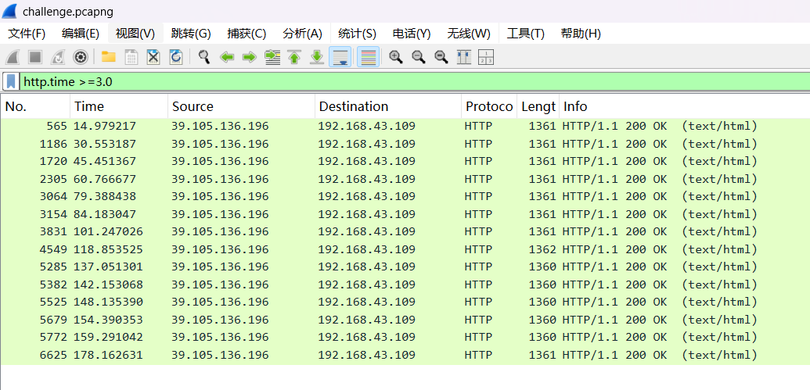

# 完成事项</font>
+ 每日music题
+ 练习逆向
+ 研究汇编
+ 响应实习要求,做了一个关于ip的ppt,查了好多东西,拓展了一堆,但是最后感觉不够紧扣主题,又删了多半,最后做成的效果还是字数很多,关键是不知道需不需要演讲,所以尽量把知识点体现在里面了,感觉算是学了好久web?
+ 和同事一起监控网络(这个前辈不让我说具体内容,所以我就不在周报里写了,但确实搞了好久,所以我周报短也是情有可原的!!)
# 下周待做事项</font>
+ 每日music题
+ 练习逆向
+ 学习真实取证
# 本周学习的知识分享</font>
## 小东西
+ 栈帧是活动记录，是操作系统在调用栈上给函数分配的内存区，每一个函数被调用都会在栈顶形成栈帧，在执行完毕返回时被销毁
+ esp是栈顶指针,始终指向栈顶,随着每一步的进行而改变,向低地址进行增长,ebp是栈底指针,作为固定标志方便定位,通常在同一个函数中不会改变
+ 如果你在分析的时候，发现一个函数返回地址被恶意覆盖了，原本应该跳转回ebp指向的上一层栈帧，结果却飞向了完全不认识的恶意代码区,这就是在CTF里最经典的攻击手段,栈溢出攻击
+ 异或交换律——“A ^ B = C” ==> “A ^ A ^ B = A ^ C” ==> “B = A ^ C”
+ 
## 茉莉molly
+ 这是一个浏览器指纹分析题目
+ 真是太奇妙了,我前两天刚刚研究到了这里,就给我来了一个浏览器指纹分析题目
+ 话不多说,直接启动,题干描述:
+ 小wu发现一个特定的浏览器指纹在多个攻击事件中频繁出现，甚至出现了上千次，小wu可以成功构建出攻击者的独特浏览器指纹。为了确认是否有多个入侵事件与这个指纹相关，请将这个浏览器指纹进行哈希处理，生成一个 32 位的 MD5 小写值作为 flag 提交。

+ 为了减少图片数量,我直接一图流展示
+ backups：备份文件。除非管理员把攻击日志备份了(笑)，否则通常不是第一目标
+ lib：库文件。程序运行依赖的东西
+ opt：可选应用软件包。一般是放第三方软件的
+ log：日志文件
+ 直接造访日志文件
+ auth.log / wtmp / btmp：这些是管用户登录、SSH 连接的，跟浏览器指纹没关系。
+ syslog / kern.log / messages：这些是系统内核和通用消息
+ dpkg.log / apt：装软件的日志。
+ apache2：这是世界上最常用的 Web 服务器之一 这里面装的才是 Web 访问日志
```
Mode                 LastWriteTime         Length Name

----                 -------------         ------ ----
-a----          2025/7/2     16:11              0 access.log

-a----         2025/9/15     23:47        1355381 access.log.1

-a----          2025/7/2     16:11              0 error.log

-a----          2025/7/2     16:11          88794 error.log.1

-a----          2023/8/2      9:39              0 other_vhosts_access.log
```
+ access.log.1 的大小是 1355381。这才是我们要找的目标。
+ 日志文件通常会进行轮转（Log Rotation），旧的日志会被重命名为 .1,.2，新的日志文件access.log刚生成还没内容呢
+ Apache 的日志格式通常是这样的： IP地址 - - [时间] "请求方法 路径 协议" 状态码 大小 "Referer" "User-Agent"
```PowerShell
Get-Content .\access.log.1 | ForEach-Object { $_.Split('"')[5] } | Group-Object | Sort-Object Count -Descending | Select-Object -First 5
```
1. Get-Content：读取文件内容。
2. Split('"')[5]：按照双引号切割每一行，取第6部分（通常是 User-Agent）。如果格式不对，可能需要调整这个数字，但对付这种简单题足够了。
3. Group-Object：把相同的 User-Agent 归类。
4. Sort-Object Count -Descending：按出现次数从多到少排序。
5. Select-Object -First 5：只看前5名。
```ps1
PS C:\Users\lTOOKI\Desktop\Molly茉莉\var\log\apache2> Get-Content .\access.log.1 | ForEach-Object { $_.Split('"')[5] } | Group-Object | Sort-Object Count -Descending | Select-Object -First 5


Count Name                      Group

----- ----                      -----

 6543 Mozilla/5.0 (Windows N... {Mozilla/5.0 (Windows NT 10.0; Win64; x64) AppleWebKit/537.36 (KHTML, like Gecko) Ch...

   29 Apache/2.4.38 (Debian)... {Apache/2.4.38 (Debian) (internal dummy connection), Apache/2.4.38 (Debian) (interna...

   12 Mozilla/5.0 (Macintosh... {Mozilla/5.0 (Macintosh; Intel Mac OS X 10.15; rv:109.0) Gecko/20100101 Firefox/115....

    5 curl/7.29.0               {curl/7.29.0, curl/7.29.0, curl/7.29.0, curl/7.29.0...}

    1 curl/7.68.0               {curl/7.68.0}
```
+ 发现一个夸张的6543次,不过它后面被省略号隐藏了指纹
```powershell
Get-Content .\access.log.1 | ForEach-Object { $_.Split('"')[5] } | Group-Object | Sort-Object Count -Descending | Select-Object -First 1 | Select-Object -ExpandProperty Name

# Mozilla/5.0 (Windows NT 10.0; Win64; x64) AppleWebKit/537.36 (KHTML, like Gecko) Chrome/87.0.4280.88 Safari/537.36
```
+ 这一整条信息就是浏览器指纹,转md5就行了
## liniteMe
+ 攻防世界1难度题已经做完了,现在开始顺序向下做2了,不得不说这个难度分配还是很奇怪的,有些1的题难做的钥匙,有些3的题都大概能做出来
+ 这个一个c嘎嘎逆向,但是由于我c逆向也看得不是非常懂,只是大概能知道逻辑,所以c嘎嘎也影响不大
```cpp
int __cdecl main(int argc, const char **argv, const char **envp)
{
  size_t i; 
  char EIS__[8];    // 存储前缀 "EIS{"
  char Str[128];    // 存储用户输入的缓冲区

  // 1. 打印提示信息 (相当于 std::cout << "Give me your flag:")
  sub_402B30(&unk_446360, "Give me your flag:");
  sub_4013F0(sub_403670); // 相当于 std::endl (刷新缓冲区并换行)

  // 2. 获取用户输入 (相当于 std::cin >> Str)
  sub_401440(Str, 127);

  // 3. 长度校验：Flag 总长度必须在 5 到 29 之间
  if ( strlen(Str) < 0x1E && strlen(Str) > 4 )
  {
    strcpy(EIS__, "EIS{"); // 初始化前缀
    
    // 4. 前缀校验：逐字符比对 Str[0-3] 是否为 "EIS{"
    for ( i = 0; i < strlen(EIS__); ++i )
    {
      if ( Str[i] != EIS__[i] )
        goto LABEL_7; // 如果前 4 位不对，直接跳到错误提示
    }

    // 5. 后缀校验：Str[28]（第29个字符）必须是 '}' (ASCII 125)
    if ( Str[28] != 125 )
    {
LABEL_7:
      sub_402B30(&unk_446360, "Sorry, keep trying! ");
      sub_4013F0(sub_403670);
      return 0;
    }

    // 6. 核心校验：调用加密/算法函数 sub_4011C0 进行深入检查
    if ( (unsigned __int8)sub_4011C0(Str) )
      sub_402B30(&unk_446360, "Congratulations! "); // 校验通过
    else
      sub_402B30(&unk_446360, "Sorry, keep trying! ");
      
    sub_4013F0(sub_403670);
    return 0;
  }
  else { /* 长度不合规处理 */ }
}
```
+ 由于是第一(?)次c嘎嘎逆向,所以我具体地研究了每一个函数,最后发现简直就是在浪费时间,不过浪费都浪费了,就写出来巩固一下吧
+ 依旧是熟悉的"if(sub_xxx),congratulations",肯定又要检查内部函数
```cpp
bool __cdecl sub_4011C0(char *Str)
{
  int v2; 
  char Str2[32];      // 用于存储处理后的结果（密文空间）
  int v4; 
  int v5; 
  size_t n4; 
  char v7[128];       // 用于存储去掉前缀后缀后的中间部分

  // 1. 安全检查：如果长度小于等于 4（只有前缀），直接失败
  if ( strlen(Str) <= 4 )
    return 0;

  // 2. 提取核心内容：将 "EIS{xxxxx}" 中的 xxxxx 复制到 v7 中
  n4 = 4;             // 跳过前 4 位 "EIS{"
  v5 = 0;
  while ( n4 < strlen(Str) - 1 ) // 循环直到倒数第二个字符（避开最后的 '}'）
    v7[v5++] = Str[n4++];
  v7[v5] = 0;         // 字符串打断，v7 现在是 Flag 的核心内容

  v4 = 0;
  v2 = 0;
  memset(Str2, 0, sizeof(Str2));  //

  // 3. 核心算法循环：遍历提取出来的每一个字符
  for ( n4 = 0; n4 < strlen(v7); ++n4 )
  {
    // --- 大小写翻转 ---
    // 如果是小写字母 (a-z: 97-122)，转为大写 (-32)
    // 'Z' (90) 到 'a' (97) 之间有 6 个位置（91-96），包含字符如 '['、''、']'、'^'、'_'、'`',所以是32的差值
    if ( v7[n4] >= 97 && v7[n4] <= 122 )
    {
      v7[n4] -= 32;
      v2 = 1;         // 设置标记，表示已经处理过
    }
    // 如果不是小写且是大写字母 (A-Z: 65-90)，转为小写 (+32)
    if ( !v2 && v7[n4] >= 65 && v7[n4] <= 90 )
      v7[n4] += 32;

    // --- 异或加密 ---
    // byte_4420B0 是一个预设的字节数组（Key）
    // sub_4013C0 可能是某种变换
    // 将翻转大小写后的字符与 Key 进行异或 (XOR) 运算
    Str2[n4] = byte_4420B0[n4] ^ sub_4013C0(v7[n4]);
    
    v2 = 0; // 重置标记，处理下一个字符
  }

  // 4. 最终比对：将计算结果 Str2 与硬编码的字符串进行比对
  // 目标字符串是 "GONDPHyGjPEKruv{{pj]X@rF"
  return strcmp("GONDPHyGjPEKruv{{pj]X@rF", Str2) == 0; //这里的==0是一种标准化,避免返回-1变成真值
}
```
+ 分别跟进
```cpp
int __cdecl sub_4013C0(int a1)
{
  return (a1 ^ 0x55) + 72;
}
```
```
shift+E提取
0xD,0x13,0x17,0x11,0x2,0x1,0x20,0x1D,0xC,0x2,0x19,0x2F,0x17,0x2B,0x24,0x1F,0x1E,0x16,0x9,0xF,0x15,0x27,0x13,0x26,0xA,0x2F,0x1E,0x1A,0x2D,0xC,0x22,0x4
```

+ 这里的bool是怎么回事?
+ 一般情况下bool和普通的int函数来判断是否符合条件没有区别,所以这里不用特别注意
+ IDA 经常会根据函数被调用的上下文，自动把 int 优化显示为 bool，以便让人类读起来更自然
+ 感觉是我肘得动的解密过程,那就自己写脚本试试
```python
key = [0xD,0x13,0x17,0x11,0x2,0x1,0x20,0x1D,0xC,0x2,0x19,0x2F,0x17,0x2B,0x24,0x1F,0x1E,0x16,0x9,0xF,0x15,0x27,0x13,0x26,0xA,0x2F,0x1E,0x1A,0x2D,0xC,0x22,0x4]
cry = 'GONDPHyGjPEKruv{{pj]X@rF'
flag = ""
for i in range(len(cry)):
    # & 0xFF 是为了处理减法可能出现的负数，模拟 C 语言的 8 位溢出
    val = ((ord(cry[i]) ^ key[i]) - 72) ^ 0x55
    char_val = val & 0xFF
    c = chr(char_val)
    if 'A' <= c <= 'Z':
        flag += c.lower()
    elif 'a' <= c <= 'z':
        flag += c.upper()
    else:
        flag += c
print(f"EIS{{{flag}}}")
#{{的意思是转义{,当作符号输出的意思,三层在()中的意思就是输出用{}包裹的变量
```
+ EIS{wadx_tdgk_aihc_ihkn_pjlm}
+ 异或的定理： “A ^ B = C” ==> “A ^ A ^ B = A ^ C” ==> “B = A ^ C”
## BABYRE
+ 依旧是经典未命名文件起手,稍微看看类型查查壳,就直接扔进ida
+ 程序不长,看main
```c
int __fastcall main(int argc, const char **argv, const char **envp)
{
  char s[24]; // [rsp+0h] [rbp-20h] BYREF
  int n14; // [rsp+18h] [rbp-8h]
  int n181; // [rsp+1Ch] [rbp-4h]

  for ( n181 = 0; n181 <= 181; ++n181 )
    judge[n181] ^= 0xCu;
  printf("Please input flag:");
  __isoc99_scanf("%20s", s);
  n14 = strlen(s);
  if ( n14 == 14 && (*(unsigned int (__fastcall **)(char *))judge)(s) )
  // 长度同为14且....?
    puts("Right!");
  else
    puts("Wrong!");
  return 0;
}
```
+ 可以看到程序其实非常简单,但是if后面那里怎么有些看不懂呢?
+ 而且前面的judge有182位,怎么看也和14不沾边,这是什么情况?
+ 其实这道题是SMC逆向
+ 具体操作是程序在执行 judge 函数之前，先运行了一个 for 循环，将 judge 数组中的每个字节都与 0x0C 进行了异或,这意味着我们在静态分析工具中直接看到的 judge 数据是加密的，不能直接分析
+ 那么怎么办呢?
+ 首先我想到的就是动态调试,正当我准备启动时突然发现
+ 这玩意是个linux文件,意味着我需要用虚拟机远程调试
+ 由于我的vm有bug,装了vm_tool也没办法拖入文件,所以我还得额外启动vscode输入文件,而且我的vscode也有bug,每次连接虚拟机都需要在两端重新下载服务器,所以我的linux调试就非常的麻烦
+ 那还说啥了,直接启动第二条路吧
+ 直接进行异或操作之后保存十六进制文件,再放回IDA分析
+ 我一开始想到的是用010操作

+ 但是出来之后的内容是无法被ida识别的
+ 只能利用python脚本生成文件来进行分析
```python
import struct

judge = [
    0x59, 0x44, 0x85, 0xE9, 0x44, 0x85, 0x71, 0xD4, 0xCA, 0x49, 0xEC, 0x6A, 0xCA, 0x49, 0xED, 0x61, 
    0xCA, 0x49, 0xEE, 0x6F, 0xCA, 0x49, 0xEF, 0x68, 0xCA, 0x49, 0xE8, 0x73, 0xCA, 0x49, 0xE9, 0x67, 
    0xCA, 0x49, 0xEA, 0x3B, 0xCA, 0x49, 0xEB, 0x68, 0xCA, 0x49, 0xE4, 0x37, 0xCA, 0x49, 0xE5, 0x5A, 
    0xCA, 0x49, 0xE6, 0x6C, 0xCA, 0x49, 0xE7, 0x37, 0xCA, 0x49, 0xE0, 0x62, 0xCA, 0x49, 0xE1, 0x7C, 
    0xCB, 0x49, 0xF0, 0x0C, 0x0C, 0x0C, 0x0C, 0xE7, 0x24, 0x87, 0x49, 0xF0, 0x44, 0x6F, 0xDC, 0x44, 
    0x87, 0x49, 0xD4, 0x44, 0x0D, 0xDC, 0x87, 0x59, 0xF0, 0x44, 0x6F, 0xC6, 0x44, 0x87, 0x59, 0xD4, 
    0x44, 0x0D, 0xC6, 0x03, 0xBA, 0x1E, 0x87, 0x41, 0xF0, 0x3D, 0xC6, 0x84, 0x1C, 0x8F, 0x49, 0xF0, 
    0x0D, 0x8F, 0x71, 0xF0, 0x01, 0x72, 0xDE, 0xCB, 0x49, 0xF0, 0x0C, 0x0C, 0x0C, 0x0C, 0xE7, 0x25, 
    0x87, 0x49, 0xF0, 0x44, 0x6F, 0xDC, 0x44, 0x87, 0x49, 0xD4, 0x44, 0x0D, 0xDC, 0x03, 0xBA, 0x1C, 
    0x87, 0x49, 0xF0, 0x44, 0x94, 0x03, 0xBA, 0x48, 0x09, 0xEC, 0x34, 0xCE, 0x78, 0x0B, 0xB4, 0x0C, 
    0x0C, 0x0C, 0x0C, 0xE7, 0x03, 0x8F, 0x49, 0xF0, 0x0D, 0x8F, 0x71, 0xF0, 0x01, 0x72, 0xDD, 0xB4, 
    0x0D, 0x0C, 0x0C, 0x0C, 0x51, 0xCF
]
# 执行异或解密
judge_decrypted = bytearray([b ^ 0x0C for b in judge])

# 写入文件
output_file = "jiami.bin"
with open(output_file, "wb") as f:
    f.write(judge_decrypted)
```
### 这里还得被迫学一下关于文件的python用法
+ 其实和c语言的很接近,但是语法依旧是经典的对元素语法
+ open(output_file, "wb") 是核心入口-------open(文件路径, 模式)
+ with的作用是自动关闭,当离开代码块(缩进结束)时会自动f.close(),并且with可以确保文件在发生错误时也可以正确保存
+ as f对变量f,我的理解是类似于for i in range()里的i一样,作为一个承载体
+ f.write(文件)就可以完成落盘
#### 打开模式汇总表
| 模式 | 名称 | 描述 | 文件不存在时 | 指针初始位置 | 是否清空原文件 |
| :--- | :--- | :--- | :--- | :--- | :--- |
| **`'r'`** | **只读** | 默认模式。只能读取，不能写入。 | **报错 (FileNotFound)** | 文件开头 | 否 |
| **`'w'`** | **只写** | 覆盖写入。用于创建新文件或重写旧文件。 | 创建新文件 | 文件开头 | **是** |
| **`'a'`** | **追加** | 在文件末尾添加内容，不会覆盖原有数据。 | 创建新文件 | 文件末尾 | 否 |
| **`'x'`** | **排他性创建** | 创建新文件并写入。如果文件已存在则报错。 | 报错 (FileExistsError) | 文件开头 | 否 |
| **`'b'`** | **二进制** | 处理非文本文件（如图片、.bin、加密数据）。 | - | - | - |
| **`'+'`** | **更新** | 赋予文件同时读写的能力（如 `r+`, `w+`）。 | 视组合模式而定 | 视组合模式而定 | 视组合模式而定 |
+ 和c语言的确实很像
+ 成功得到一个文件,拖入ida分析

+ 得到一个单函数,但这就是我们需要的验证逻辑了
+ 根据前面if内逻辑的分析,我们发现这个函数被创建了指针,可以通过将我们的s传入进行验证,通过就是同为1,成功
+ 仔细读一下发现v2和v3被分三步定义,连起来就是['f', 'm', 'c', 'd', 0x7F, 'k', '7', 'd', ';', 'V', '', ';', 'n', 'p']
+ a1是我们的传入值,被进行了与下标自异或,最后和拼好的字符组进行比较
```py
target = "fmcd"+chr(127)+"k7d;V`;np"
flag = ""
for i in range(len(target)):
    flag += chr(ord(target[i]) ^ i)
print(flag) 
#flag{n1c3_j0b}
```
## parallel-comparator-200
+ 下载后得到了一个c程序,我们用dev打开
```c
#include <stdlib.h>
#include <stdio.h>
#include <pthread.h>

#define FLAG_LEN 20

void * checking(void *arg) {
    char *result = malloc(sizeof(char));
    char *argument = (char *)arg;
    *result = (argument[0]+argument[1]) ^ argument[2];
    return result;
}
// (爆破的?+数值)^输入=0,意思就是爆破的输入正好等于?+已知值
//这就破案了,Flag的第i个字符,就是随机字母加上differences数组里的第i个数字
// 那还说啥了,吃我一脚本吧
int highly_optimized_parallel_comparsion(char *user_string)
{
    int initialization_number;
    int i;
    char generated_string[FLAG_LEN + 1];
    generated_string[FLAG_LEN] = '\0';

    while ((initialization_number = random()) >= 64);
    // 这里是当一个随机生成的数大于64时进行下面的计算
    int first_letter;
    first_letter = (initialization_number % 26) + 97;
    // 数学告诉我们,当数字随机时,我们应该寻找算法中可以固定下来的内容
    // 就像这里,对26进行取余,意味着留下的数字一定在0-25之间,加上97,那就是在97-122之间,那不就是a到z?
    // 所以这道题应该是可以爆破的
    pthread_t thread[FLAG_LEN];
    char differences[FLAG_LEN] = {0, 9, -9, -1, 13, -13, -4, -11, -9, -1, -7, 6, -13, 13, 3, 9, -13, -11, 6, -7};
    char *arguments[20];
    for (i = 0; i < FLAG_LEN; i++) {
        arguments[i] = (char *)malloc(3*sizeof(char));
        arguments[i][0] = first_letter;
        arguments[i][1] = differences[i];
        arguments[i][2] = user_string[i];
    // 这里大概就是在对arguments进行赋值了,一维有i组,二维有三组,first就是我们需要爆破的内容,differences值上面有,user_string是我们的输入
    // 仔细看来不就是个填入程序吗
        pthread_create((pthread_t*)(thread+i), NULL, checking, arguments[i]);// 把数值交给checking
    }

    void *result;
    int just_a_string[FLAG_LEN] = {115, 116, 114, 97, 110, 103, 101, 95, 115, 116, 114, 105, 110, 103, 95, 105, 116, 95, 105, 115};
    for (i = 0; i < FLAG_LEN; i++) {
        pthread_join(*(thread+i), &result);
        generated_string[i] = *(char *)result + just_a_string[i];
        free(result);
        free(arguments[i]);
    }

    int is_ok = 1;
    for (i = 0; i < FLAG_LEN; i++) {
        if (generated_string[i] != just_a_string[i])
            return 0;
    }
//推导数学公式： 要赢，必须满足：generated_string[i] == just_a_string[i] 把上面的赋值代入进来： (result + just_a_string[i]) == just_a_string[i]
//等号两边都有 just_a_string[i]!直接消掉! 也就是说result 必须等于0
//所以那个叫 "strange_string_it_is" 的数组完全是用来忽悠人的，它根本不参与真正的验证
    return 1;
}

int main()
{
    char *user_string = (char *)calloc(FLAG_LEN+1, sizeof(char));
    fgets(user_string, FLAG_LEN+1, stdin);
    // 上面是个麻烦的定义,下面是fgets的标准语法
    int is_ok = highly_optimized_parallel_comparsion(user_string);
    // 这里调用了high函数
    // 下面直接开始判断了,估计接下来的函数都在high函数里调用
    if (is_ok)
        printf("You win!\n");
    else
        printf("Wrong!\n");
    return 0;
}
```
+ 看得我头皮发麻,好久没见过味这么正的c程序了
+ 莫慌莫慌,其实我们从ida的分析中寻找灵感,ida就是进行了函数分离,帮助我们整理思路,那么我们在看的时候也先看main函数
## **为了节省篇幅我就把分析一起嵌入到函数里了 **
```py
differences = [0, 9, -9, -1, 13, -13, -4, -11, -9, -1, -7, 6, -13, 13, 3, 9, -13, -11, 6, -7]

for i in range(97, 123): 
    first_letter = i  
    flag = "" 
    for d in differences:
        char_code = first_letter + d
        char = chr(char_code)
        flag = flag + char
    print("尝试字母", chr(i), ":", flag)
```
+ 当字母为l的时候有了人话lucky_hacker_you_are
+ 最后,这题还是让我挺震惊的,难分析就算了,竟然还有这种干扰
+ 不过这倒是给了我启示,我们很多逆向过程,数学的定律都是可以用的,而且特殊的新计算也都有对应的定律,就像那个异或定律
+ 善于使用这些定律,不仅数学会好算得多,哪怕在计算机领域也会轻松一大截
# 杂项</font>
## can_has_stdio?
+ 得到一个无后缀文件,打开后
```brainfuck
                                                                              
                                                                              
                                      +                                       
                                     ++                                       
                                     +++                                      
                                    ++[>                                      
                                    +>++>                                     
                                   +++>++                                     
                                   ++>++++                                    
                                  +>++++++                                    
                                  >+++++++>                                   
                                 ++++++++>+                                   
                                 ++++++++>++                                  
                                ++++++++>+++                                  
                                ++++++++>++++                                 
          ++++++++>+++++++++++++>++++++++++++++>+++++++++++++++>++            
            ++++++++++++++<<<<<<<<<<<<<<<<-]>>>>>>>>>>>>>--.++<<              
              <<<<<<<<<<<>>>>>>>>>>>>>>----.++++<<<<<<<<<<<<<<                
                >>>>>>>>>>>>+.-<<<<<<<<<<<<>>>>>>>>>>>>>-.+<                  
                  <<<<<<<<<<<<>>>>>>>>>>>>>>>+++.---<<<<<<                    
                    <<<<<<<<<>>>>>>>>>>>>>---.+++<<<<<<<                      
                      <<<<<<>>>>>>>>>>>>>>+++.---<<<<<                        
                        <<<<<<<<<>>>>>>>>>>>>>>-.+<<                          
                          <<<<<<<<<<<<>>>>>>>>>>>>                            
                          >>----.++++<<<<<<<<<<<<<                            
                          <>>>>>>>>>>>>+.-<<<<<<<<                            
                         <<<<>>>>>>>>>>>>>>--.++<<<                           
                         <<<<<<<<<<<>>>>>>>>>>>>>-.                           
                        +<<<<<<<<<<<<<>>>>>>>>>>>>>>                          
                        +++.---<<<<<<   <<<<<<<<>>>>                          
                       >>>>>>>>-.+<       <<<<<<<<<<<                         
                       >>>>>>>>>>           >>>--.++<                         
                      <<<<<<<<<               <<<>>>>>                        
                      >>>>>>                    >>>-.+                        
                     <<<<<                        <<<<<                       
                     <<<                            <>>                       
                    >>                                >>                      
                                                                              
                                                                              
                                                                              
>>>>>>>>++.--<<<<<<<<<<<<<<>>>>>>>>>>>>-.+<<<<<<<<<<<<>>>>>>>>>>>>>--.++<<<<<<<<<<<<<>>>>>>>>>>>>>>>---.+++<<<<<<<<<<<<<<<>>>>>>>>>>>>>>--.++<<<<<<<<<<<<<<>>>>>>>>>>>>-.+<<<<<<<<<<<<>>>>>>>>>>>>+.-<<<<<<<<<<<<>>>>>>>>>>>>>>--.++<<<<<<<<<<<<<<>>>>>>>>>>>>>----.++++<<<<<<<<<<<<<>>>>>>>>>>>>-.+<<<<<<<<<<<<>>>>>>>>>>>>>>.<<<<<<<<<<<<<<>>>>>>>>>>>>>>++.--<<<<<<<<<<<<<<>>>>>>>>>>>>>>-.+<<<<<<<<<<<<<<>>>>>>>>>>>>>--.++<<<<<<<<<<<<<>>>>>>>>>>>>>+.-<<<<<<<<<<<<<>>>>>>>>>>>>>>>----.++++<<<<<<<<<<<<<<<>>>>>>>>>>>>>>>>---.+++<<<<<<<<<<<<<<<<.
```
+ ............这集我好像看过
  - https://www.bilibili.com/video/BV1JDn8zpETf/?spm_id_from=333.337.search-card.all.click&vd_source=5c93c6b2d223439d50d8048d4f70a805
+ 你说这扯不扯?我几个月前看的视频让我今天碰到题了?!
+ 视频里有关于这一门语言的介绍,brainfuck语言,这个语言只有8个符号,分别是 > < + - . , [ ]
+ 这个语言的运行原理是通过一个指针在内存数组上移动,对指针所指向的内存单元进行增减操作,并通过循环和输入输出实现复杂的逻辑
+ 这个语言的设计就是为了fuck brain的吧?
+ 解密网站上常常把这门语言和ok解密放在一起
  - https://ctf.bugku.com/tool/brainfuck
  - flag{esolangs_for_fun_and_profit}
+ 为了避免下次遇到解不出来,我留了一份本地解密代码
## 2017_Dating_in_Singapore

+ 题干描述:2017_Dating_in_Singapore
01081522291516170310172431-050607132027262728-0102030209162330-02091623020310090910172423-02010814222930-0605041118252627-0203040310172431-0102030108152229151617-04050604111825181920-0108152229303124171003-261912052028211407-04051213192625
+ 这是何意味?
+ 希腊奶,先观察一下吧
+ 重大发现!用-分割出来的数字组刚好是12组!
+ 01 08 15 22 29 15 16 17.......

+ HITB{CTFFUN}
## reverseMe
+ 一道翻转图片的题,唯一有用的就是告诉我自带的画图软件是可以用来翻转的
## hit-the-core
+ 与上一周的.core一模一样
## normal_png
+ 一道改宽高的题目,重点在于要认出来特征
+ 但是由于我拿到图片都习惯先扔进随波逐流一把梭,所以对我没啥用,但是我还是查了一下正确思路
1. 首先下载附件，解压出来之后得到的是一个png图片，看上去应该是9:16比例，但长度又不够
2. 于是查看了一下它的属性，宽高比是620:875。但是按照9:16计算，宽620的话，高应该是1102
3. 所以直接丢进010 Editor，修改高度03 6B中的03为04，然后保存并打开
## glance-50
+ gif快速动捕,先进随波逐流抓帧
+ 得到一堆碎图片,还是命名好的,那就上周用过的碎纸机的脚本启动

+ 打开拼好的图片

  
## 流量分析
+ 依旧是开局经典的pcng起手,不同的是这次没有提示词,只问我能不能找到flag
+ 那还说啥了,把开屏页面发给ai问问怎么个事呗

1. 流量特征分析：SSRF + Gopher 协议
  - 看第 4、11、22 等数据包的 Info 栏
  - 请求路径：/index.php?url=gopher://...
  - 攻击载荷：url 参数后面跟着一长串经过 URL 编码 的字符串。
  - 关键协议：gopher://127.0.0.1:80/_POST%20...
  - 这说明攻击者正在利用 index.php 上的 SSRF 漏洞。
  - 他在尝试向本地（127.0.0.1）的 80 端口发送 POST 请求。
  - 目标文件看起来是 /admin.php。
2. 我需要做什么？
+ 我的目标是提取并解码这些 Gopher 协议中的 payload。
+ Flag 通常隐藏在这些请求发送的数据中，或者由于这是多次重复的请求，可能是在进行某种 布尔盲注 或 逐位爆破
+ 接下来需要提取payload,找到full request url,然后进行解码拿到关键词
3. 我们直接进入提到的第四条内容,将完整url发送给ai,让它判断
4. 果然如哈基米大人所料，这是一场利用 SSRF + Gopher 协议 进行的 时间盲注
+ 这串 payload 经过二次 URL 解码后，真实面目是这样的：
```http
HTTP
POST /admin.php HTTP/1.1
Host: localhost:80
Connection: close
Content-Type: application/x-www-form-urlencoded
Content-Length: 78

id=1) and if((ascii(substr((select flag from flag),1,1))='40'),sleep(3),0) -- 
```
+ 关键点解析
+ 注入语句：if((ascii(substr((select flag from flag),1,1))='40'),sleep(3),0)

+ 它的意思是：如果 flag 的第 1 个字符的 ASCII 码等于 40（即字符 (），则让服务器 sleep(3)（延迟 3 秒响应）；否则立即返回。
+ 时间盲注特征：
在这时的分析中，不能看返回的内容（因为盲注返回的内容通常是一样的），必须看时间差
  + 需要注意 Wireshark 截图中的 Time 列。
5. 到这里我就已经会做了
+ 既然他设定if ture就延迟三秒返回
+ 那么正确的字符必然是响应时间在三秒以上的,那么填入过滤词
+ http.time>=3.0

+ 这下看懂了
+ 第一个解码两次的结果是f,第二个是l,跳过345,接下来依次就是
+ 3154
1
3831
q
4549
w
5285
y
5382
2
5525
7
5679
8
5772
1
+ flag{}包起来,bingo
### 回顾一下我们会发现这是个晶碘牢饭
1. 核心漏洞链：SSRF（服务端请求伪造）
+ 题目中的 index.php?url=... 是一个明显的 SSRF 入口。
+ 攻击目标：外部无法直接访问服务器内网的 admin.php（通常有 IP 限制，只允许 127.0.0.1 访问）
+ 手段：攻击者通过 url 参数，让服务器“自攻自受”，去请求自己本地的 admin.php
2. 秘密载体：Gopher 协议
+ 为什么 URL 里那一串看起来乱七八糟？因为攻击者使用了 Gopher 协议
+ 作用：Gopher 是一个万金油协议，它可以构造出原始的 TCP 流量。在 SSRF 中，它是最强的武器，因为它可以用来发送 POST 请求
+ 双重编码：
+ 第一层：为了让 Gopher 协议能正确传达换行符（%0d%0a）
+ 第二层：为了让这些特殊字符能作为 url 参数传给 PHP
+ 结果：在 Wireshark 里看到的是编码后的字符串，解码两次后才能看到真正的 HTTP POST 报文。
3. 获取数据的方法：SQL 时间盲注
+ 这确实是一个非常智慧的漏洞利用。由于 SSRF 之后，攻击者看不见 admin.php 返回的具体内容（或者返回内容固定），他就想出来了利用自己已知自己发送内容的漏洞来逐位尝试,这是一个需要想象力和耐心的攻击
+ 具体 Payload：if((ascii(substr((select flag from flag),1,1))='102'),sleep(3),0)
+ substr(..., 1, 1)：我在看 flag 的第 1 个字。
+ ascii(...)='102'：这个字是不是 'f'？
+ sleep(3)：如果是，服务器会卡住 3 秒才给 Wireshark 回包。
## Let_god_knows
+ 逆天注意力,要在黑白的lsb隐写查看中发现一个糊成炭的二维码,然后修复并扫描
+ 唯一的作用就是让我下了个QRresearch(二维码处理工具)
