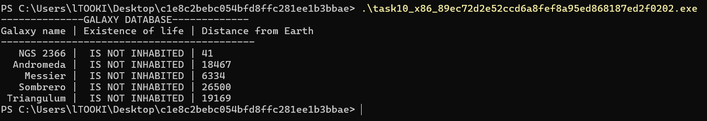
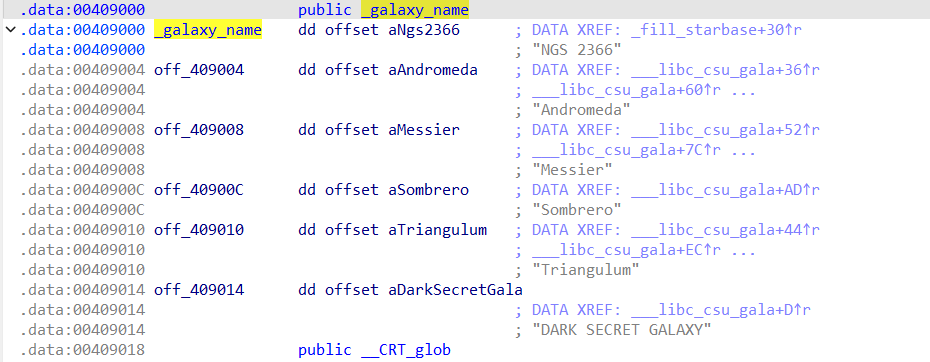
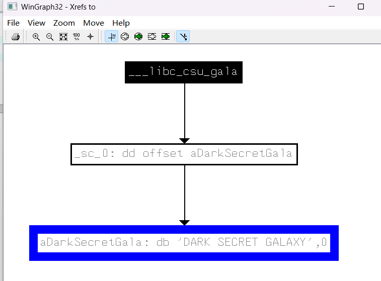
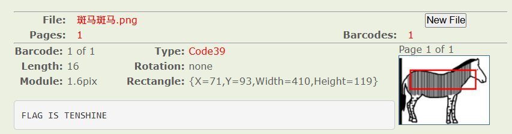
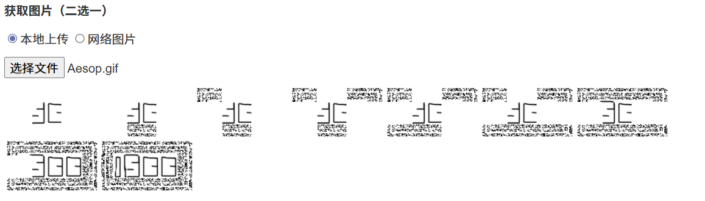

# 完成事项</font>
+ 网络溯源,线下拷问,开庭
+ 每日musci
+ 逆向练习
+ 汇编学习
# 下周待做事项</font>
+ 真实取证学习 (因为本周单位工作繁忙,所以被推到下一周了)
# 本周学习的知识分享</font>
## 汇编
### CPU
+ 我在往后学的时候看见ALU突然忘了是什么东西,赶紧去搜了一下,发现其实是运算器,这才想起来似乎应该去复习一下CPU了
1. 运算器 (ALU - Arithmetic Logic Unit)
+ 负责所有的算术运算和逻辑运算。
+ 算术运算： 加、减、乘、除
+ 逻辑运算： 与（AND）、或（OR）、非（NOT）、异或（XOR）以及比较大小
+ 地位： 它是工厂里的加工车间。所有数据都要拉到这里来“过一遍”才能得出结果。
2. 控制器 (CU - Control Unit)
+ 它是 CPU 的大脑
+ 职责： 它负责从内存里取出指令，告诉运算器该做什么（是加还是减？），并指挥数据在各个寄存器之间流动
+ 地位: 它是调度中心，确保整个工厂按程序设定的逻辑运行
3. 寄存器 (Registers)
+ 它们是 CPU 内部的临时工作台
+ 职责： 内存（RAM）虽然很大，但离 CPU 相对较远，存取速度太慢。所以 CPU 内部自带了少量的寄存器，用来存放当前正在处理的数据或指令。
+ 特点： 速度极快，但容量小
### 8086
1. x86是基于8086的后时代cpu的统称,各种位数都有
2. 8086的16位结构指一次最多处理十六位的数据,寄存器的最大宽度为16,寄存器和运算器之间的通路为16
3. 具体来讲有以下体现
   - 它的基本运算指令（如 ADD、SUB、AND 等）可以直接对一个 16 位的二进制数进行操作
   - 8086 内部所有的通用寄存器（如 AX, BX, CX, DX）以及段寄存器（如 CS, DS）、指针寄存器（如 SP, IP）全部都是 16 位的
   - 为了匹配 16 位的运算能力和 16 位的存储能力，连接它们的总线也必须是 16 根导线,这样 CPU 才能在一次脉冲下，把 16 位的数据从寄存器瞬间传送到 ALU 进行加减乘除
4. 8086的寻址方法
+ 8086在8080之后,当时的社会条件处于一种中间态,大量软件都是为 16 位寻址（$2^{16}=64KB$）编写的,Intel 既想让处理器升级到能访问 1MB 内存（因为 64KB 在 1978 年已经快不够用了），又不想让程序员们把旧代码全部扔掉重写
+ 加入继续使用十六位寄存器进行工作,那么老程序只需要改改段基址就能无缝运行
+ 在这样的条件下--20 位地址线（1MB 空间） 在当时被认为是一个“未来十年都用不完”的黄金平衡点
+ Intel 不想为了 4 位地址专门设计一个“奇怪”的寄存器。由于内部数据通路都是 16 位的，他们决定：用两个 16 位寄存器叠在一起计算。
+ $$Physical\_Address = (Segment \times 2^4) + Offset$$
+ 这种左移 4 位再相加的做法，用硬件实现起来极其简单（只需要一个 20 位的加法器），却能让 16 位的 CPU 强行吃下 1MB 的内存
+ 你以为这只是历史？在逆向老式的 DOS 程序或复杂的 Bootloader 时，如果你不懂这种“重叠寻址”，你会被同一个物理地址却有 4096 种不同表达方式（因为段地址和偏移地址可以互相补偿）给玩死
### 寄存器
+ 在 8086 中，为了让 CPU 知道它处理的是什么，它把内存分成了不同的“职能部门”
+ 寄存器名称,全称和职能
```
CS, Code Segment, 代码段。存放要执行的指令

DS, Data Segment, 数据段。存放变量和常数

SS, Stack Segment, 堆栈段。存放临时数据和返回地址，逆向中的缓冲区溢出就看它

ES, Extra Segment, 附加段。当你需要额外空间（比如字符串拷贝）时用的“备胎”
```
#### CS和IP(Code Segment)和(Instruction Pointer)
+ 在8086中
+ CS是代码段寄存器,存储指令所在段的基地址
+ IP是指令指针寄存器,存储下一条指令的偏移地址
+ 即 物理地址 = CS * 16 + IP
+ 执行过程(任意时刻,CPU将CS:IP指向的内容当作指令执行)如下
```
CPU 从 CS:IP 指向的物理地址读取指令
指令进入指令缓冲区
关键点:IP自动增加，指向下一条紧邻的指令 (IP+=指令长度)
执行指令
重复第 1 步
```
+ 所以CS和IP的内容提供了CPU要执行的命令的地址
#### 修改CS和IP
+ 在CPU中,程序员能读写的程序只有寄存器,所以常常通过改变寄存器内容实现对CPU的控制,而CPU的执行取决于CSIP,那么我们要做的就是修改CSIP
+ mov是不能动CS和IP的,因为没有权限,而能改变的转移指令中,本章讲的是jmp
+ jmp 段地址:偏移地址
+ 用指令中的段地址修改CS, 偏移地址修改IP
+ 正好对应了段地址*16+偏移地址和CS*16+IP
+ jmp ax
+ 仅仅修改ip内的内容,有点类似于mov IP,ax
### 代码段
+ 算是一个概念吧,假如存在一组地址连续,起始地址是16的倍数的内存单元,我们就可以认为这片单元是用来存放代码的,从而定义其为代码段
### 寄存器的内存访问
+ 新概念--字
+ 8086中,位是最小单元,只有0或1的存在,字节是8个位组成的单元,是内存寻址的基本单位i
+ 字,是由两个字节(16位)组成的
+ 但是其实字的定义取决于CPU的字长,8086是16位,所以一个字才是16位,而在64位电脑中,一个字却又指64位(8字节)
+ 定义它的原因在于一个字刚好可以储存一个整数
## secret-galaxy-300
+ 打开后得到了三个文件,经过检查之后发现是同一个文件的三个不同版本,一个windows32位exe，另外两个分别是32位和64位的ELF的linux可执行文件,那咱肯定来看一下exe
+ 打开发现会立刻闪退,那就用上刚好最近学的终端语言命令行打开

+ 发现打印了一些看不懂的东西
+ 我查了一下,发现这些东西就是仙女座星系,草帽星系,三角座星系之类的东西
+ 打开后的main很简单
```cpp
int __cdecl main(int argc, const char **argv, const char **envp)
{
  __main();
  fill_starbase(&starbase);
  print_starbase(&starbase);
  return 0;
}
```
+ 看名字就知道是一个填充,一个打印
+ 跟进print函数
```cpp
int __cdecl print_starbase(_DWORD *p__starbase)
{
  int result; // eax
  const char *p_IS_NOT_INHABITED; // edx
  int n4; // [esp+1Ch] [ebp-Ch]

  puts("--------------GALAXY DATABASE-------------");
  printf("%10s | %s | %s\n", "Galaxy name", "Existence of life", "Distance from Earth");
  result = puts("-------------------------------------------");
  for ( n4 = 0; n4 <= 4; ++n4 )
  {
    if ( p__starbase[6 * n4 + 2] == 1 )
      p_IS_NOT_INHABITED = "INHABITED";
    else
      p_IS_NOT_INHABITED = "IS NOT INHABITED";
    result = printf(
               "%11s | %17s | %d\n",
               (const char *)p__starbase[6 * n4],
               p_IS_NOT_INHABITED,
               p__starbase[6 * n4 + 1]);
  }
  return result;
}
```
+ 我们读一下发现是个结构体遍历打印,作用不大,看一下填充函数
```cpp
void __cdecl fill_starbase(_DWORD *p__starbase)
{
  int n4; // [esp+8h] [ebp-10h]
  _DWORD *v2; // [esp+Ch] [ebp-Ch]

  v2 = 0;
  for ( n4 = 0; n4 <= 4; ++n4 )
  {
    p__starbase[6 * n4] = galaxy_name[n4];      // "NGS 2366"
    p__starbase[6 * n4 + 1] = rand();
    p__starbase[6 * n4 + 2] = 0;
    p__starbase[6 * n4 + 3] = 0;
    p__starbase[6 * n4 + 4] = &p__starbase[6 * n4 + 6];
    p__starbase[6 * n4 + 5] = v2;
    v2 = &p__starbase[6 * n4];
    //用来记录上一个元素的地址
  }
}
```
+ 这里看清填充规律,n4=0,<=4,++n4,说明最多执行5次
+ 跟进galaxyname看到内容

+ 我们发现看到了熟悉的东西,就是命令行执行看到的信息,不过多了一个
+ 或者不如说是print里少了一个"DARK SECRET GALAXY"
+ 我们接下来去找一下引用,直接使用X

+ 这张图告诉你：函数 __libc_csu_gala 正在操作这个名为 DARK SECRET GALAXY 的字符串。 它把这个字符串的地址赋给了 sc 变量
+ 那么我们去找一下那个函数
```cpp
int __libc_csu_gala()
{
  int result; // eax

  sc = sc_0;                                    // "DARK SECRET GALAXY"
  unk_40DAA4 = &byte_40DAC0;
  n31337 = 31337;
  unk_40DAA0 = 1;
  byte_40DAC0 = off_409004[0][8];               // "Andromeda"
  byte_40DAC1 = off_409010[0][7];               // "Triangulum"
  byte_40DAC2 = off_409008[0][4];               // "Messier"
  byte_40DAC3 = off_409004[0][6];               // "Andromeda"
  byte_40DAC4 = off_409004[0][1];               // "Andromeda"
  byte_40DAC5 = off_409008[0][2];               // "Messier"
  n95 = 95;
  byte_40DAC7 = off_409004[0][8];               // "Andromeda"
  byte_40DAC8 = off_409004[0][3];               // "Andromeda"
  byte_40DAC9 = off_40900C[0][5];               // "Sombrero"
  n95_0 = 95;
  byte_40DACB = off_409004[0][8];               // "Andromeda"
  byte_40DACC = off_409004[0][3];               // "Andromeda"
  byte_40DACD = off_409004[0][4];               // "Andromeda"
  byte_40DACE = off_409010[0][6];               // "Triangulum"
  byte_40DACF = off_409010[0][4];               // "Triangulum"
  byte_40DAD0 = off_409004[0][2];               // "Andromeda"
  n95_1 = 95;
  byte_40DAD2 = off_409010[0][6];               // "Triangulum"
  result = *((unsigned __int8 *)off_409008[0] + 3);// "Messier"
  byte_40DAD3 = off_409008[0][3];               // "Messier"
  byte_40DAD4 = 0;
  return result;
}
```
+ oh,no!! 竟然还要自己写flag,那没办法了
```cpp
andromeda = "Andromeda"
triangulum = "Triangulum"
messier = "Messier"
sombrero = "Sombrero"
 //记得索引是从 0 开始的
flag_chars = [
    andromeda[8],   # byte_40DAC0 -> 'a'
    triangulum[7],  # byte_40DAC1 -> 'm'
    messier[4],     # byte_40DAC2 -> 's'
    andromeda[6],   # byte_40DAC3 -> 'e'
    andromeda[1],   # byte_40DAC4 -> 'n'
    messier[2],     # byte_40DAC5 -> 's'
    chr(95),        # n95 -> '_'
    andromeda[8],   # byte_40DAC7 -> 'a'
    andromeda[3],   # byte_40DAC8 -> 'r'
    sombrero[5],    # byte_40DAC9 -> 'e'
    chr(95),        # n95_0 -> '_'
    andromeda[8],   # byte_40DACB -> 'a'
    andromeda[3],   # byte_40DACC -> 'r'
    andromeda[4],   # byte_40DACD -> 'o'
    triangulum[6],  # byte_40DACE -> 'u'
    triangulum[4],  # byte_40DACF -> 'n'
    andromeda[2],   # byte_40DAD0 -> 'd'
    chr(95),        # n95_1 -> '_'
    triangulum[6],  # byte_40DAD2 -> 'u'
    messier[3],     # byte_40DAD3 -> 's'
]

flag = "".join(flag_chars)
print(f"flag：{flag}")
```
+ aliens_are_around_us
# 每日杂项</font>
## Banmabanma
+ 打开是一只斑马


+ https://online-barcode-reader.inliteresearch.com/

## Aesop_secret
+ 得到一个gif,直接分解

+ 看到显形了一个ISCC
+ 在010中查看,在底部发现密文
```
U2FsdGVkX19QwGkcgD0fTjZxgijRzQOGbCWALh4sRDec2w6xsY/ux53Vuj/AMZBDJ87qyZL5kAf1fmAH4Oe13Iu435bfRBuZgHpnRjTBn5+xsDHONiR3t0+Oa8yG/tOKJMNUauedvMyN4v4QKiFunw==
```
+ 一个看着像base64的东西,但是解码之后发生错误
+ 这个时候才想起来密文都没用过
+ 查阅之后才知道这是AES加密,在文件名称里有提示
+ 用ISCC作为密钥解密两次之后得到flag
+ flag{DugUpADiamondADeepDarkMine}
## Ditf
+ png和rar起手
+ rar要密码,依旧是png随波逐流一把梭
+ 立刻发现高度被改过,找到密码StRe1izia
+ 打开压缩包内是老朋友pcapng
+ 在里面搜索关键词找到一个kiss.png,追踪http流量发现base64
+ ZmxhZ3tPel80bmRfSGlyMF9sb3YzX0ZvcjN2ZXJ9
+ 解码flag{Oz_4nd_Hir0_lov3_For3ver}